# 3D 격투 액션 게임

|||
|:--:|--|
|작업 기간|2022.12.04 ~ 2023.01.24|
|인력 구성|1인 개발|
|프로젝트 목적|3D 격투 액션 게임과 온라인 멀티 플레이 게임을 개발하기 위한 능력을 향상시키기 위해 진행된 프로젝트.|
|프로젝트 내용|나루토 얼티밋스톰4를 모작한 3D 격투 액션 게임으로, 게임성보다는 기존 격투 게임에서 요구하는 기본적인 기능들을 구현하였고, 온라인 멀티플레이를 위해 스팀서버를 통해 친구와 플레이 가능하도록 구현 |
|사용언어 및 개발 환경|C++, Unreal Engine(5.1), Visual Studio Community 2022, Window10|
|참조링크|[Preview Video](https://www.youtube.com/watch?v=2C6ssRUDKPg), [DevLog](https://github.com/Goaway-1/Naruto/blob/master/DevLog.md)|

# 플레이 방식
  스팀 계정을 통해 온라인 멀티플레이가 가능하며, 흐름은 아래와 같다.

1. 세션 열기/참여
    - Host : 세션을 열고 메인레벨로 이동하고, 다른 플레이어의 참가를 기다린다. 
    - Client : 존재하는 세션을 탐색하고 참여하며,호스트의 메인레벨로 이동한다.
    - 공통 : 메인레벨로 이동과 동시에 플레이어의 무기가 랜덤으로 지정되며, 라운드가 시작하기 전까지 공격할 수 없다.

2. 게임 룰
    - 최대 3라운드까지 플레이 가능하며, 한 플레이어가 이동불가 상태가 되면 라운드가 종료된다. 2회의 라운드를 먼저 승리한 플레이어가 승리하게된다.
    - 새로운 라운드를 시작할때 이전 이동불가 상태였던 플레이어는 모든 상태(체력, 차크라등..)을 회복하고, 라운드에 참여한다.

# 미디어 및 스크린샷

## 시연영상

[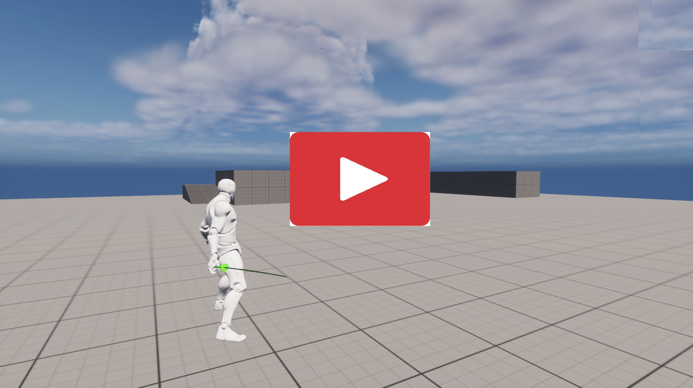](https://www.youtube.com/watch?v=2C6ssRUDKPg)

## 스크린샷

|||
|:--:|:--:|
|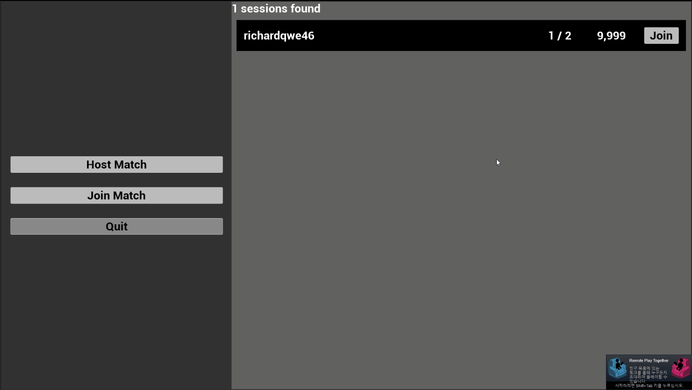|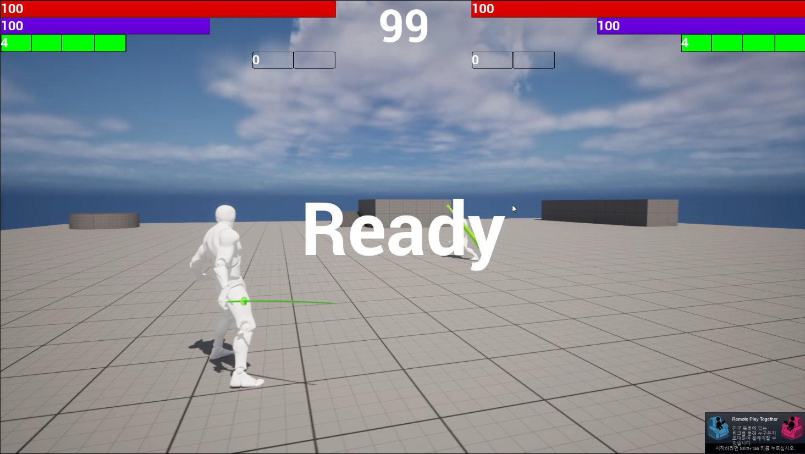|
|__세션 입장__|__라운드 시작__|
|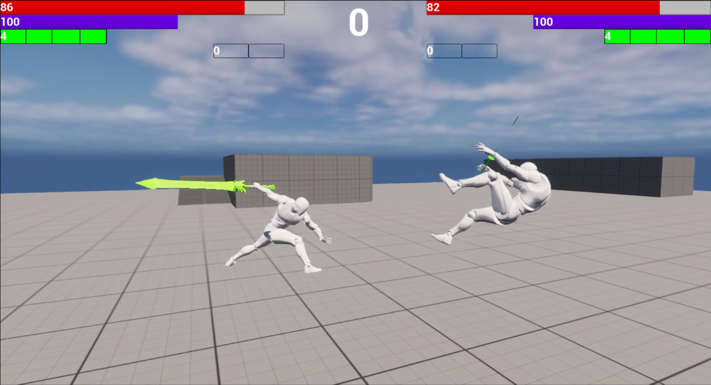|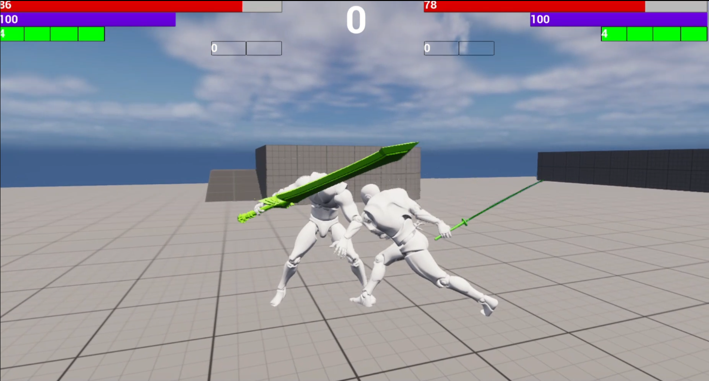|
|__공격_1__|__공격_2__|
|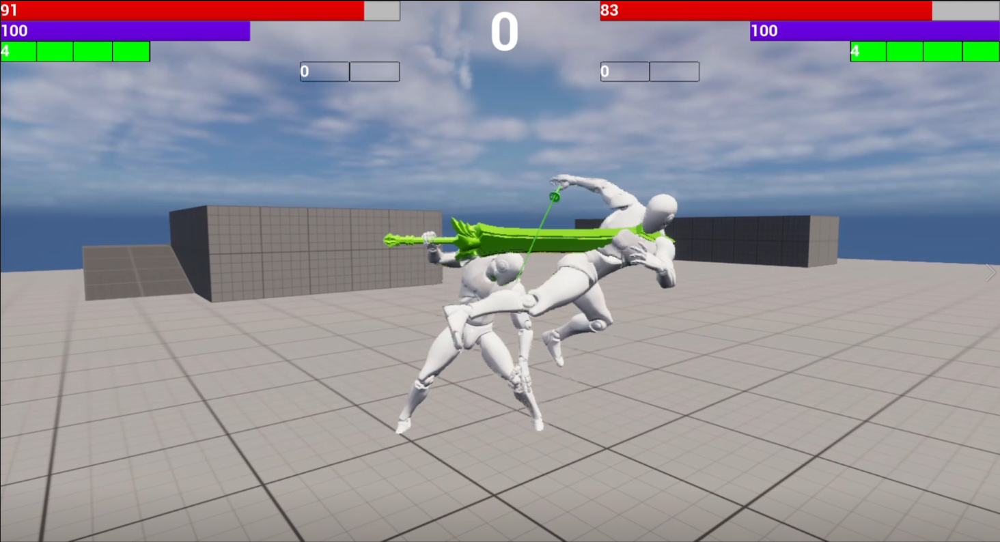|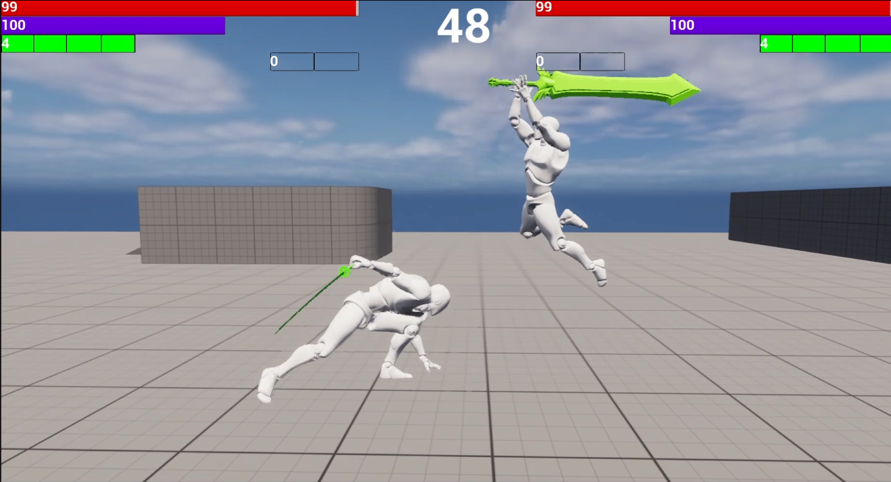|
|__공격_3__|__잡기__|
|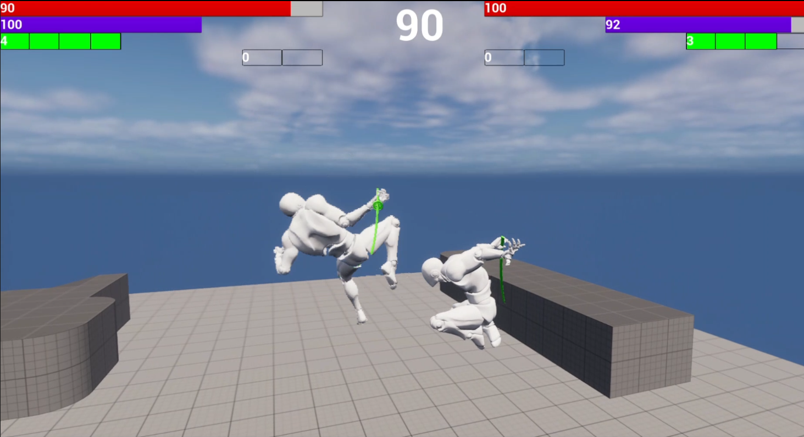|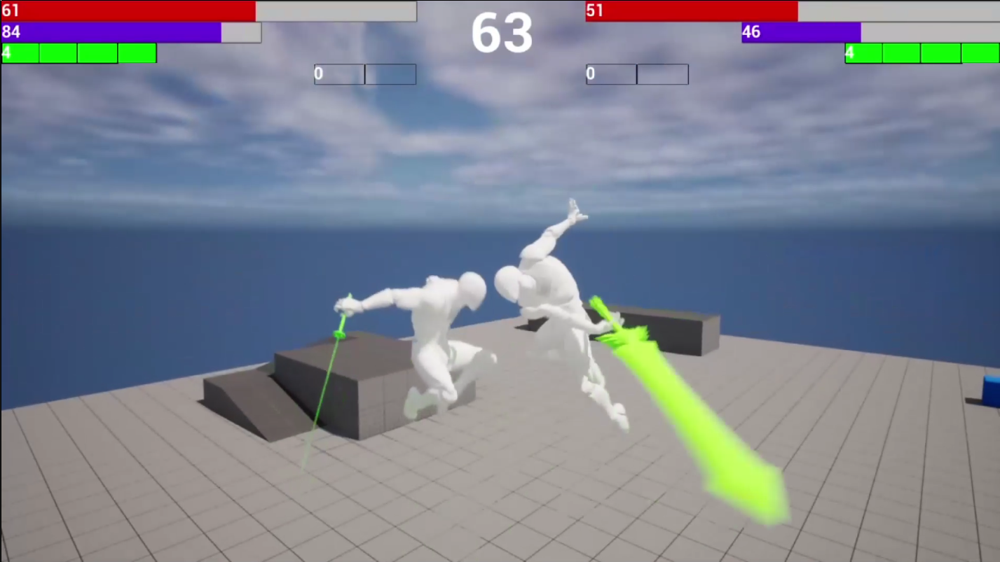|
|__공격_1 (공중)__|__공격_2 (공중)__|
|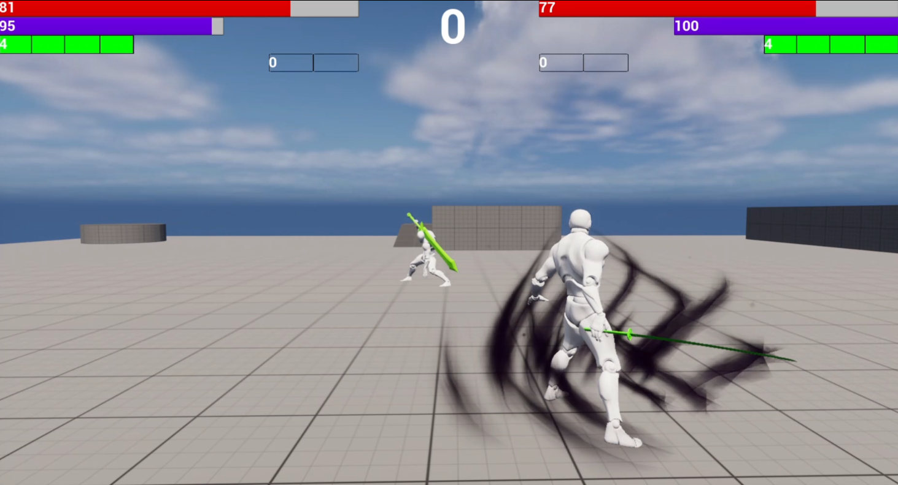|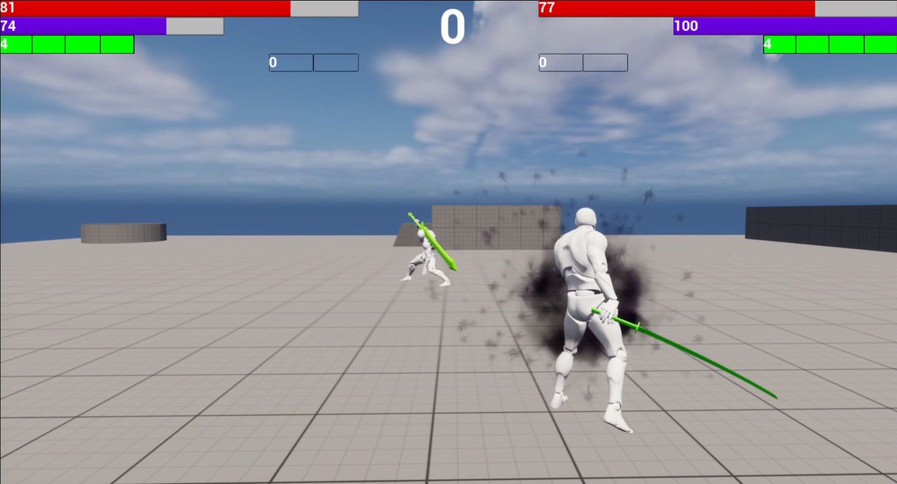|
|__차크라 차징__|__차크라 사용__|
|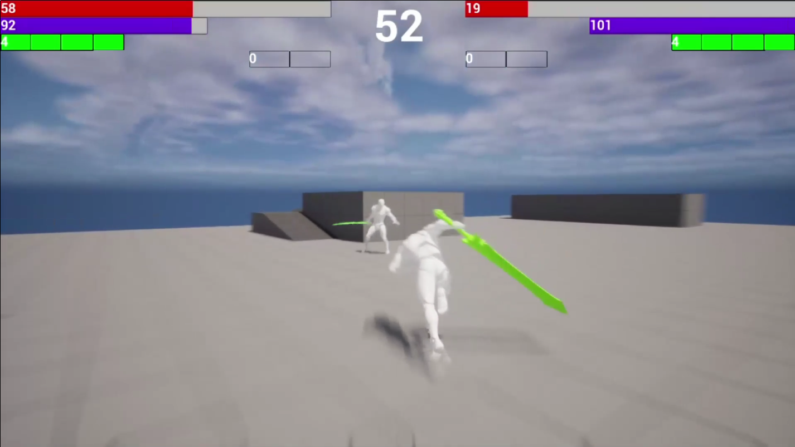|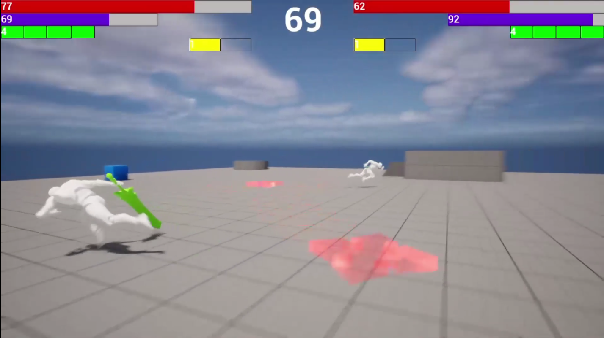|
|__대쉬__|__표창__|
|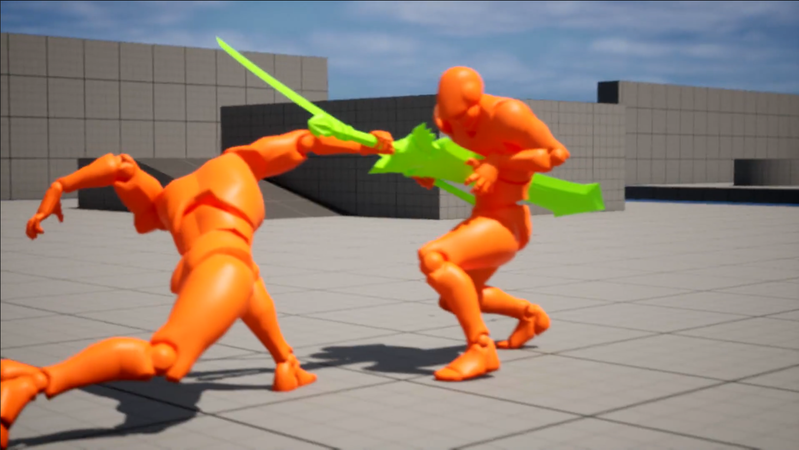|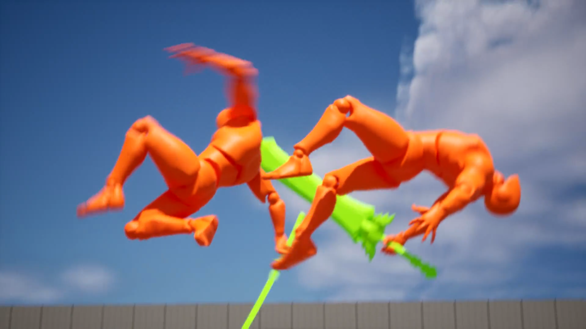|
|__스킬_1__|__스킬_2__|
|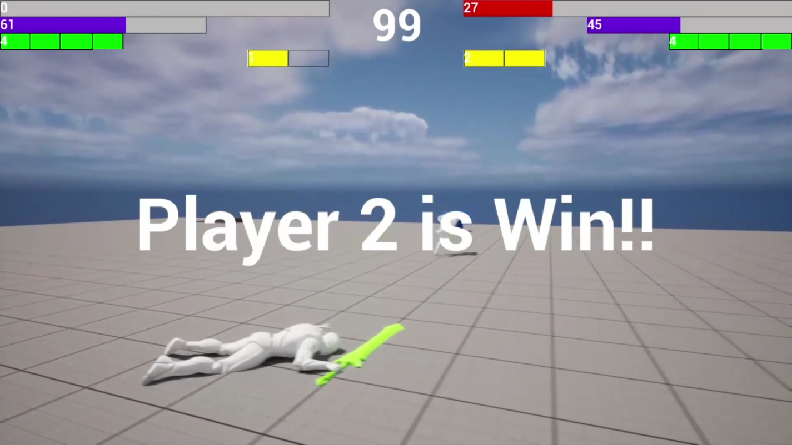||
|__게임 종료__||

## GIF

|||
|:--:|:--:|
|||
|__세션 입장__|__공격 (하단)__|
|||
|__공격 (상단)__|__공격 (공중)__|
||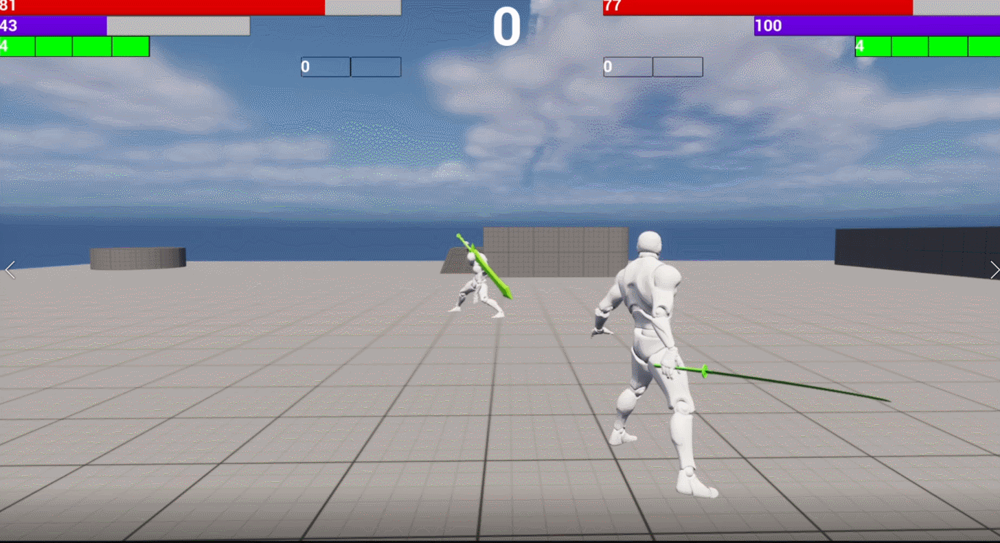|
|__차크라 차징__|__차크라 사용__|
|||
|__대쉬__|__대쉬 연계__|
|||
|__잡기__|__표창__|
|||
|__스킬_1__|__스킬_2__|