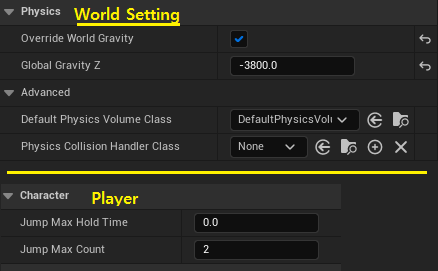
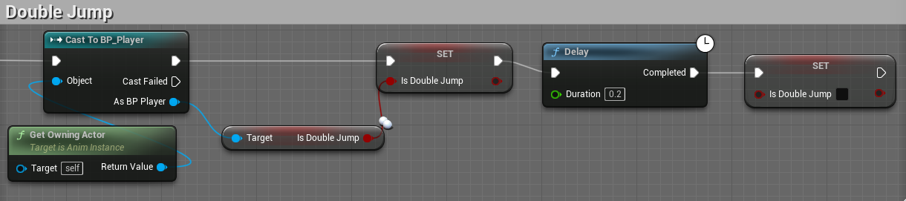
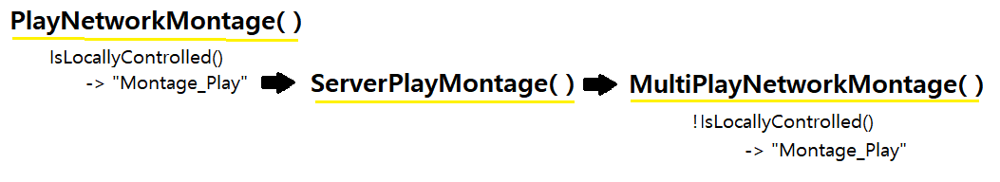
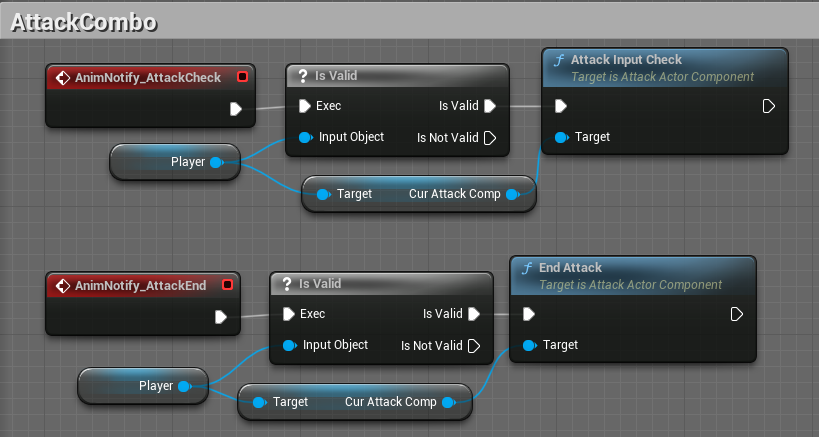
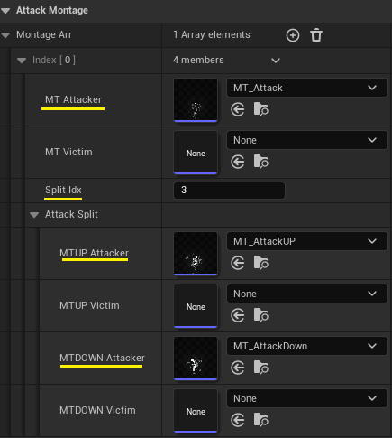
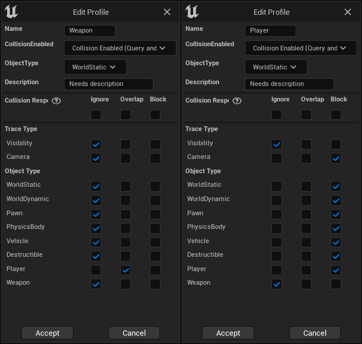
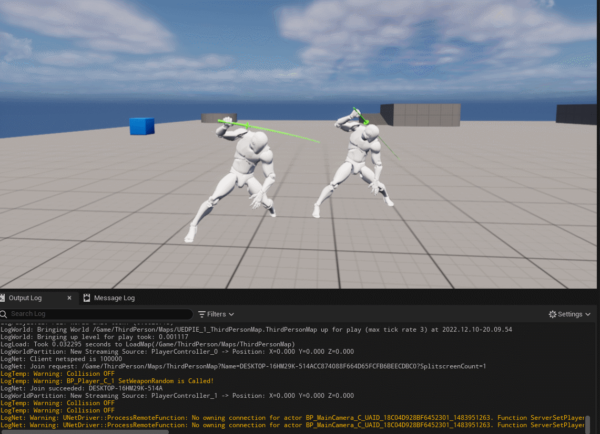
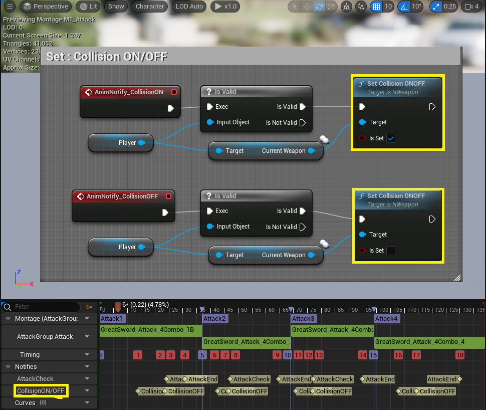
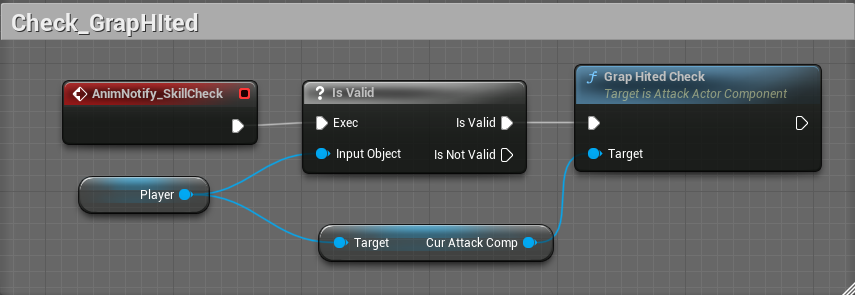

# 3D Fighting Game
- 3D Fighting Game (reproduction of Naruto Shippuden)
- 나루토 얼티밋스톰4를 기준으로 모작

## **Day_1**
> **<h3>Today Dev Story</h3>**
- ## <span style = "color:yellow;">메인 카메라의 이동</span>
  - 
  - 기존 본인이 제작한 "CameraManager" plugin을 서버 멀티플레이에서도 동작하도록 수정 및 개선
  - __플레이어__
    - 월드 상의 NcameraManager를 찾아 __"ClientSetViewTarget"하여__ 컨트롤러의 타겟을 카메라로 변경
    - CameraManager의 SetPlayer()메서드를 통해, 본인 객체를 __CamerManager가 참고하도록 설정__
  - __메인 카메라__
    - Player들의 정보가 저장되는 Players라는 TArray를 __Replicated하여__ 변경되면 서버에도 똑같이 반영
    - 그를 위해 __SetPlayer()메서드가__ Server에서 실행되는 __ServerSetPlayer()메서드__ 선언 후 구현
  - __문제점__
    - Server모드에서만 적용되는 문제 존재
    - 반응 속도가 느리다는 문제 (쉽게 해결 가능)

    <details><summary>C++ File</summary> 

    ```c++
    //NPlayer.cpp
    void ANPlayer::BeginPlay() {
      Super::BeginPlay();
      
      /** Find MainCameraManager & Set */
      if (CameraManagerClass) {
        ANCameraManager* TargetCamera = Cast<ANCameraManager>(UGameplayStatics::GetActorOfClass(this, ANCameraManager::StaticClass()));

        if (TargetCamera) {
          CameraManager = TargetCamera;
          APlayerController* ControllComp = Cast<APlayerController>(GetController());
          if (ControllComp) {
            PlayerControlComp = ControllComp;
            PlayerControlComp->bAutoManageActiveCameraTarget = false;
            PlayerControlComp->ClientSetViewTarget(CameraManager);
          }
        }
        else GEngine->AddOnScreenDebugMessage(-1, 5.0f, FColor::Red, TEXT("Error! MainCameraManager does not exist in the world!"));
      }

      if (CameraManager) CameraManager->SetPlayer(this);
    }
    ```
    ```c++
    //NCameraManager.cpp
    #include "Net/UnrealNetwork.h"

    ANCameraManager::ANCameraManager() {  
      SetReplicates(true);
      SetReplicateMovement(true);
    }
    void ANCameraManager::SetPlayer(AActor* Player) {
      if (!HasAuthority()) ServerSetPlayer(Player);

      UE_LOG(LogTemp, Warning, TEXT("New Player : %s"), *Player->GetName());
      Players.Push(Player);
    }
    void ANCameraManager::ServerSetPlayer_Implementation(AActor* Player) {
      SetPlayer(Player);
    }
    bool ANCameraManager::ServerSetPlayer_Validate(AActor* Player) {
      return true;
    }
    void ANCameraManager::GetLifetimeReplicatedProps(TArray< FLifetimeProperty >& OutLifetimeProps) const{
      Super::GetLifetimeReplicatedProps(OutLifetimeProps);

      DOREPLIFETIME(ANCameraManager, Players);
    }
    ```
    
    </details>

    <details><summary>Header File</summary> 

    ```c++
    //NCameraManager.h	
    public:
      void SetPlayer(AActor* Player);

      UFUNCTION(Server, Reliable, WithValidation)
      void ServerSetPlayer(AActor* Player);
    protected:
    	UPROPERTY(Replicated, EditInstanceOnly, Category = "Setting")
	    TArray<AActor*> Players;
    ```
    </details>

**<h3>Realization</h3>**
  - 메인카메라가 Server모드에서만 적용되는 문제 존재, 수정 필요..!
  - 반응 속도가 느리다는 문제 (쉽게 해결 가능)

## **Day_2**
> **<h3>Today Dev Story</h3>**
- ## <span style = "color:yellow;">애니메이션</span>
  - 
  - 애니메이션의 구성은 모두 Blueprint에서 제작했고, 점프, 속도등 관련해서 제작
  - 모든 애니메이션은 RootMotion을 사용하지 않음

- ## <span style = "color:yellow;">더블 점프</span>
  - 
  - 
  - 현재 개발한 것은 제자리에서의 이중 점프에 한정
  - __플레이어__
    - 더블 점프는 단순히 JumpMaxCount의 수를 변경하면 단순히 점프의 개수를 정할 수 있음
    - 또한 공중제어를 불가능하게 하고, 점프 높이 또한 변경
  - __월드__
    - 월드의 중력을 "-3800"으로 변경하여, 나루토 게임과 유사하게 제작
  - __문제점__
    - 점프는 방향키의 입력에 따라 이동하도록 해야 함
      - 즉, 이동속도에 따른 점프 거리가 정해지는것이 아닌, 방향키 입력에 따른 일정한 거리의 이동이 이루어져야함

    <details><summary>C++ File</summary> 

    ```c++
    ANPlayer::ANPlayer() {
      ...
      /* Jump Setting */
      JumpMaxCount = 2;
      GetCharacterMovement()->JumpZVelocity = 1400.f;
      GetCharacterMovement()->AirControl = 0.f;
    }
    ```
    </details>

## **Day_3**
> **<h3>Today Dev Story</h3>**
- ## <span style = "color:yellow;">더블 점프_2</span>
  - 
  - 방향키가 입력되어 있다면 방향으로의 점프를 하기 위해서 LaunchCharacter()메서드를 사용하였고, 현재 눌려있는 방향키를 표시하기 위해서 Enum 클래스 사용. 
    - 이는 현재 굳이 필요없지만 추후 공격의 콤보에도 사용하기에 미리 제작
  - 서버와 클라이언트 모두 LaunchCharacter()메서드를 처리하기 위해서 Server 함수 생성하여 해결

    <details><summary>C++ File</summary> 

    ```c++
    ANPlayer::ANPlayer() {
      ...
    	/* Jump Setting */
	    GetCharacterMovement()->JumpZVelocity = 1400.f;

      /* Impressed Keys */
      SetKeyUpDown(EKeyUpDown::EKUD_Default);
      SetKeyLeftRight(EKeyLeftRight::EKLR_Default);
    }
    void ANPlayer::MoveForward(float Value) {
      FRotator Rot = FRotator(0.f, GetControlRotation().Yaw, 0.f);
      AddMovementInput(UKismetMathLibrary::GetForwardVector(Rot), Value);

      if (Value > 0) SetKeyUpDown(EKeyUpDown::EKUD_Up);
      else if (Value < 0) SetKeyUpDown(EKeyUpDown::EKUD_Down);
      else SetKeyUpDown(EKeyUpDown::EKUD_Default);
    }
    void ANPlayer::MoveRight(float Value) {
      FRotator Rot = FRotator(0.f, GetControlRotation().Yaw, 0.f);
      AddMovementInput(UKismetMathLibrary::GetRightVector(Rot), Value);

      if (Value > 0) SetKeyLeftRight(EKeyLeftRight::EKLR_Right);
      else if (Value < 0) SetKeyLeftRight(EKeyLeftRight::EKLR_Left);
      else SetKeyLeftRight(EKeyLeftRight::EKLR_Default);
    }
    void ANPlayer::Jump() {
      if(!HasAuthority()) {
        ServerJump();
        return;
      }

      if (JumpCurrentCount < 2) {
        FVector ForceVec = (GetActorUpVector() * (JumpMovementForce - GetVelocity().Size())) + (GetActorForwardVector() * (JumpMovementForce - GetVelocity().Size()));
        ForceVec.Z = 1400.f;
        LaunchCharacter(ForceVec, false, false);
        JumpCurrentCount++;
      }
    }
    void ANPlayer::ServerJump_Implementation() {
      Jump();
    }
    bool ANPlayer::ServerJump_Validate() {
      return true;
    }
    ```
    </details>
    <details><summary>Header File</summary> 

    ```c++
    UENUM(BlueprintType)
    enum class EKeyUpDown : uint8 {
      EKUD_Up				UMETA(DisplayName = "Up"),
      EKUD_Down			UMETA(DisplayName = "Down"),

      EKUD_Default		UMETA(DisplayName = "Default")
    };

    UENUM(BlueprintType)
    enum class EKeyLeftRight : uint8 {
      EKLR_Right			UMETA(DisplayName = "Right"),	
      EKLR_Left			UMETA(DisplayName = "Left"),
      
      EKLR_Default		UMETA(DisplayName = "Default")
    };
    protected:
      /* Inpressed Keys */
      UPROPERTY(VisibleAnywhere, Category="Movement")
      EKeyUpDown Key_UD;

      UPROPERTY(VisibleAnywhere, Category = "Movement")
      EKeyLeftRight Key_LR;

      UPROPERTY(EditDefaultsOnly, Category = "Movement|Jump")
      float JumpMovementForce;

    	/* Jump */
      UFUNCTION(Server, Reliable, WithValidation)
      void ServerJump();
      
      FORCEINLINE void SetKeyUpDown(EKeyUpDown newKey) { Key_UD = newKey; }
      FORCEINLINE void SetKeyLeftRight(EKeyLeftRight newKey) { Key_LR = newKey; }

      FORCEINLINE EKeyUpDown GetKeyUpDown() { return Key_UD; }
      FORCEINLINE EKeyLeftRight GetKeyLeftRight() { return Key_LR; }
    public:
      virtual void Jump() override;
    ```
    </details>
    
- ## <span style = "color:yellow;">잡다한것</span>
  - 제자리 점프와 달려가면서 하는 점프간의 속도 차이가 발생
    - 기존 점프 Force에서 현재 이동 속도를 빼서 계산한 만큼 점프
      ```cpp
      ForceVec = FVector(0, -(JumpMovementForce - GetVelocity().Size()), 1400.f);
      ```
  - 기존에는 카메라가 움직이지 않았지만, 멀티에서는 움직이기 때문에 점프 방향의 문제 발생
    - 방향을 __"GetActorUpVector() + GetActorForwardVector()"로__ 처리
      ```cpp
      FVector ForceVec = (GetActorUpVector() * (JumpMovementForce - GetVelocity().Size())) + (GetActorForwardVector() * (JumpMovementForce - GetVelocity().Size()));
      ```

**<h3>Realization</h3>**
  - 제자리 점프와 달려가면서 하는 점프간의 속도 차이가 발생
    - 기존에는 움직임을 멈추고, Jump(), 하지만 이 방법은 너무 개발자답지 못한 방식이였기 때문에 기존 점프 Force에서 현재 이동 속도를 빼서 계산한 만큼 점프하도록 변경

  - 기존에는 카메라가 움직이지 않았지만, 멀티에서는 움직이기 때문에 점프 방향의 문제가 발생
    - 방향을 __"GetActorUpVector() + GetActorForwardVector()"로__ 처리

  - 
  - __개선점__ : 클라이언트는 점프를 3번하는 문제와 애니메이션이 실행되지 않는 문제

## **Day_4**
> **<h3>Today Dev Story</h3>**
- ## <span style = "color:yellow;">무기에 따른 애니메이션</span>
  - 
  - 추가로 weapon에 따라 애니메이션이 달라지는 "KindOfWeapon"제작
  - 이를 위해서 Weapon클래스를 제작해야하고, Player에 장착된 Weapon의 종류에 따라 애니메이션을 다르게 처리해야한다.
    - 아직 애니메이션 처리를 하지 않았음
  - NWeapon클래스를 만들고 이를 NPlayer에서 호출하여 생성. 이때 무기는 랜덤으로 지정 (SetWeaponRandom())
    - 또한 서버에서 공유되어야 하기때문에 Replicates설정
  - NPlayer에서의 Weapon 생성은 BeginPlay()에서 진행되며 서버일때만 생성되도록 설정

    <details><summary>C++ File</summary> 

    ```c++
    //NWeapon.cpp
    ANWeapon::ANWeapon(){
      MeshComp = CreateDefaultSubobject<UStaticMeshComponent>(TEXT("MeshComp"));
      SetRootComponent(MeshComp);
      if(WeaponMeshType.Num() >= 2) MeshComp->SetStaticMesh(WeaponMeshType[0]);

      SetReplicates(true);
    }
    void ANWeapon::BeginPlay(){
      Super::BeginPlay();

      SetWeaponRandom();
    }
    void ANWeapon::SetWeaponRandom() {
      if (WeaponMeshType.Num() >= 2) {
        int32 WeaponTmp = FMath::RandRange(0, 1);
        if (WeaponTmp == 0) {
          MeshComp->SetStaticMesh(WeaponMeshType[WeaponTmp]);
          WeaponType = EWeaponType::EWT_Sword;
        }
        else {
          MeshComp->SetStaticMesh(WeaponMeshType[WeaponTmp]);
          WeaponType = EWeaponType::EWT_Blade;
        }
    }
    ```
    ```cpp
    //NPlayer.cpp
    ANPlayer::ANPlayer() {
      ...

    	WeaponAttachSocketName = "WeaponSocket";
    }
    void ANPlayer::BeginPlay() {
      ...

      /** Spawn Weapon */
      if (HasAuthority()) {
        FActorSpawnParameters SpawnParams;
        SpawnParams.SpawnCollisionHandlingOverride = ESpawnActorCollisionHandlingMethod::AlwaysSpawn;

        if (StarterWeaponClass) CurrentWeapon = GetWorld()->SpawnActor<ANWeapon>(StarterWeaponClass, FVector::ZeroVector, FRotator::ZeroRotator, SpawnParams);
        if (CurrentWeapon) {
          CurrentWeapon->SetOwner(this);
          CurrentWeapon->AttachToComponent(GetMesh(), FAttachmentTransformRules::SnapToTargetNotIncludingScale, WeaponAttachSocketName);
        }
      }
    }
    ```
    </details>

    <details><summary>Header File</summary> 

    ```c++
    //NWeapon.h
    protected:
      UPROPERTY(EditDefaultsOnly,Category = "Weapon")
      EWeaponType WeaponType;

      /* Please Set Weapons Mesh */
      UPROPERTY(EditDefaultsOnly, Category = "Weapon")
      TArray<UStaticMesh*> WeaponMeshType;

      UPROPERTY(EditDefaultsOnly,Category = "Weapon")
      UStaticMeshComponent* MeshComp;

      /* Set Player's Weapon for Random */
      UFUNCTION()
      void SetWeaponRandom();
    public:	
      FORCEINLINE EWeaponType GetWeaponType() { return WeaponType; }
    ```
    ```c++
    //NPlayer.h
    UPROPERTY(EditDefaultsOnly, Category = "Weapon")
    TSubclassOf<AActor> StarterWeaponClass;

    UPROPERTY(VisibleAnywhere, Category = "Weapon")
    class ANWeapon* CurrentWeapon;

    UPROPERTY(VisibleDefaultsOnly, Category = "Weapon")
    FName WeaponAttachSocketName;
    ```
    </details>

**<h3>Realization</h3>**
  - 무기 클래스는 생성했으나 무기에 따른 애니메이션은 생성 X 
  - ### 또한 무기를 생성했을때, 호환되지 않는 문제 발생

## **Day_5**
> **<h3>Today Dev Story</h3>**
- ## <span style = "color:yellow;">점프 수정</span>
  - 
  - __더블 점프가 3번 되는 문제 해결__
    - 로그를 띄워보니 JumpCurrentCount가 클라이언트에만 적용된다고 판단
    - Server를 통한 호출은 따로 JumpCurrentCount++ 처리하여 해결
  - __점프 애니메이션 문제 해결__
    - 
    - bIsDubleJump라는 bool을 DOREPLIFETIME처리하여 동기화를 유지한다. 이 값에 따라 애니메이션이 달라진다.

    <details><summary>Cpp File</summary> 

    ```c++
    //NPlayer.cpp
    #include "Net/UnrealNetwork.h"
    ANPlayer::ANPlayer() {
      ...
      bIsDoubleJump = false;
    }
    void ANPlayer::Jump() {
      if (!HasAuthority()) {
        NServerJump();
        return;
      }

      if (JumpCurrentCount++ < 2) {
        /** for Animation */
        if (JumpCurrentCount == 2) bIsDoubleJump = true;
		    else bIsDoubleJump = false;
        
        FVector ForceVec = (GetActorUpVector() * (JumpMovementForce - GetVelocity().Size())) + (GetActorForwardVector() * (JumpMovementForce - GetVelocity().Size()));
        ForceVec.Z = 1400.f;
        LaunchCharacter(ForceVec, false, false);
      }
    }
    void ANPlayer::ServerJump_Implementation() {
      /** resolved triple jump! */
      JumpCurrentCount++;
      Jump();
    }
    void ANPlayer::ResetJumpState() {
      ...
      if (GetCharacterMovement() && !GetCharacterMovement()->IsFalling()) bIsDoubleJump = false;
    }
    void ANPlayer::GetLifetimeReplicatedProps(TArray< FLifetimeProperty >& OutLifetimeProps) const {
      ...
      DOREPLIFETIME(ANPlayer, bIsDoubleJump);
    }
    ```
    </details>

    <details><summary>Header File</summary> 

    ```c++
    //NPlayer.h
    private:
    	UPROPERTY(Replicated, BlueprintReadWrite, Category = "Movement|Jump")
	    bool bIsDoubleJump;
    ```
    </details>

**<h3>Realization</h3>**
  - 로그를 띄워서 확인하는 습관을 지니자

## **Day_6**
> **<h3>Today Dev Story</h3>**
- ## <span style = "color:yellow;">더블 점프를 공중에서 조금 더 유연하도록 수정</span>
  - 
  - 기존 방향으로 점프는 구성되어 있었지만, 반대 방향으로의 속도 때문에 적용되지 않았다.
    - 단순히 속도를 멈추는 방식으로 진행하였으나, 애니메이션으로 처리한다면 지금까지의 과정이 필요없을 것으로 예상된다.

    <details><summary>Cpp File</summary> 

    ```cpp
    //NPlayer.cpp
    void ANPlayer::Jump() {
      ...
      if (JumpCurrentCount++ < 2) {
        if (JumpCurrentCount == 2) {
          GetMovementComponent()->StopMovementImmediately();
          bIsDoubleJump = true;
        }
        ...
        LaunchCharacter(ForceVec, false, false);
      }
    }
    ```
    </details>

**<h3>Realization</h3>**
  - null

  
## **Day_5**
> **<h3>Today Dev Story</h3>**
- ## <span style = "color:yellow;">점프 수정</span>
  - 
  - __더블 점프가 3번 되는 문제 해결__
    - 로그를 띄워보니 JumpCurrentCount가 클라이언트에만 적용된다고 판단
    - Server를 통한 호출은 따로 JumpCurrentCount++ 처리하여 해결
  - __점프 애니메이션 문제 해결__
    - 
    - bIsDubleJump라는 bool을 DOREPLIFETIME처리하여 동기화를 유지한다. 이 값에 따라 애니메이션이 달라진다.

    <details><summary>Cpp File</summary> 

    ```c++
    //NPlayer.cpp
    #include "Net/UnrealNetwork.h"
    ANPlayer::ANPlayer() {
      ...
      bIsDoubleJump = false;
    }
    void ANPlayer::Jump() {
      if (!HasAuthority()) {
        NServerJump();
        return;
      }

      if (JumpCurrentCount++ < 2) {
        /** for Animation */
        if (JumpCurrentCount == 2) bIsDoubleJump = true;
		    else bIsDoubleJump = false;
        
        FVector ForceVec = (GetActorUpVector() * (JumpMovementForce - GetVelocity().Size())) + (GetActorForwardVector() * (JumpMovementForce - GetVelocity().Size()));
        ForceVec.Z = 1400.f;
        LaunchCharacter(ForceVec, false, false);
      }
    }
    void ANPlayer::ServerJump_Implementation() {
      /** resolved triple jump! */
      JumpCurrentCount++;
      Jump();
    }
    void ANPlayer::ResetJumpState() {
      ...
      if (GetCharacterMovement() && !GetCharacterMovement()->IsFalling()) bIsDoubleJump = false;
    }
    void ANPlayer::GetLifetimeReplicatedProps(TArray< FLifetimeProperty >& OutLifetimeProps) const {
      ...
      DOREPLIFETIME(ANPlayer, bIsDoubleJump);
    }
    ```
    </details>

    <details><summary>Header File</summary> 

    ```c++
    //NPlayer.h
    private:
    	UPROPERTY(Replicated, BlueprintReadWrite, Category = "Movement|Jump")
	    bool bIsDoubleJump;
    ```
    </details>

**<h3>Realization</h3>**
  - 로그를 띄워서 확인하는 습관을 지니자

## **Day_7**
> **<h3>Today Dev Story</h3>**
- ## <span style = "color:yellow;">공격 클래스 작성</span>
  - 
  - 
  - 플레이어의 공격들을 담당하는 'ActorComponent'인 'AttackActorComponent'클래스 생성
    - 기본 공격, 콤보, 특정 공격등과 관련된 모든 것을 관리
    - 현재는 테스트용으로 "몽타주"를 Replicated하게만 했음

    <details><summary>Cpp File</summary> 

    ```cpp
    //UAttackActorComponent.cpp
    #include "Net/UnrealNetwork.h"  
    void UAttackActorComponent::Attack() {
      PlayNetworkMontage(AttackMontage, 1.f);
    }

    void UAttackActorComponent::PlayNetworkMontage(UAnimMontage* Mongtage, float PlayRate) {
      if (Cast<ACharacter>(GetOwner())->IsLocallyControlled()) {
        if (MainAnimInstance) MainAnimInstance->Montage_Play(Mongtage, PlayRate);

        ServerPlayMontage(Mongtage,PlayRate);
      }
    }
    void UAttackActorComponent::MultiPlayNetworkMontage_Implementation(UAnimMontage* Mongtage, float PlayRate) {
      if (!Cast<ACharacter>(GetOwner())->IsLocallyControlled()) {
        if (MainAnimInstance) MainAnimInstance->Montage_Play(Mongtage, PlayRate);
      }
    }
    bool UAttackActorComponent::MultiPlayNetworkMontage_Validate(UAnimMontage* Mongtage, float PlayRate) {
      return true;
    }
    void UAttackActorComponent::ServerPlayMontage_Implementation(UAnimMontage* Mongtage, float PlayRate) {
      MultiPlayNetworkMontage(Mongtage, PlayRate);
    }
    bool UAttackActorComponent::ServerPlayMontage_Validate(UAnimMontage* Mongtage, float PlayRate) {
      return true;
    }
    ```
    ```cpp
    //NPlayer.cpp
    ANPlayer::ANPlayer() {
      ...
	    CurAttackComp = CreateDefaultSubobject<UAttackActorComponent>(TEXT("AttackComponent"));
    }
    void ANPlayer::BeginPlay() {
      ...
      CurAttackComp->SetAnimInstance(GetMesh()->GetAnimInstance());
    }
    void ANPlayer::Attack() {
      CurAttackComp->Attack();
    }
    ```
    </details>
    <details><summary>Header File</summary> 

    ```cpp
    //UAttackActorComponent.h
    public:
      UPROPERTY(EditDefaultsOnly, BlueprintReadOnly, Category = "Anims")
      class UAnimMontage* AttackMontage;

      void Attack();	

      void PlayNetworkMontage(UAnimMontage* Mongtage, float PlayRate);

      UFUNCTION(NetMulticast, Reliable, WithValidation)
      void MultiPlayNetworkMontage(UAnimMontage* Mongtage, float PlayRate);

      UFUNCTION(Server, Reliable, WithValidation)
      void ServerPlayMontage(UAnimMontage* Mongtage, float PlayRate);
      FORCEINLINE void SetAnimInstance(UAnimInstance* AnimInst) { MainAnimInstance = AnimInst; }
    ```
    </details>

> **<h3>Realization</h3>**
  - 오랜만에 하니 네트워크 관련해서 다 잊었다. 다시 시작하자. 

## **Day_8**
> **<h3>Today Dev Story</h3>**
- ## <span style = "color:yellow;">무기 생성 문제 해결</span>
  - 
  - 기존 [Day4](#또한-무기를-생성했을때,-호환되지-않는-문제-발생)의 문제를 해결하기 위해서 원인을 판단 
    - 초기에는 생성에 오류가 있는듯 했으나, 클라이언트에 생성은 되지만 Mesh에 NULL값이 들어가있는 것을 확인 -> 즉, Mesh에 Replicated가 적용 X

    ---
    <details><summary>Cpp File</summary> 

    ```cpp
    //NPlayer.cpp
    void ANPlayer::BeginPlay() {
      ...
	    SetWeapon();
    }
    void ANPlayer::SetWeapon() {
      if (HasAuthority()) {
        FActorSpawnParameters SpawnParams;
        SpawnParams.SpawnCollisionHandlingOverride = ESpawnActorCollisionHandlingMethod::AlwaysSpawn;

        if (StarterWeaponClass) CurrentWeapon = GetWorld()->SpawnActor<ANWeapon>(StarterWeaponClass, FVector::ZeroVector, FRotator::ZeroRotator, SpawnParams);
        if (CurrentWeapon) {
          CurrentWeapon->SetOwner(this);
          CurrentWeapon->SetWeaponRandom();
          CurrentWeapon->AttachToComponent(GetMesh(), FAttachmentTransformRules::SnapToTargetNotIncludingScale, WeaponAttachSocketName);
        }
      }
    }
    ```
    ```cpp
    //NWeapon.cpp
    ANWeapon::ANWeapon(){
      ...
      MeshComp->SetIsReplicated(true);
    }
    ```
    </details>
    
- ## <span style = "color:yellow;">공격의 콤보 구조체</span>
  -  Actor클래스를 상속받은 새로운 구조체 클래스(AttackStruct)를 생성
  - __"AttackStruct"는__ 행동에 맞는 각 몽타주를 위해서 2개의 몽타주(Attacker,Victim), 콤보의 최대 카운트(ComboCnt), 거리(distance)로 구성
    - 이때 거리는 특정 스킬을 사용할때 사용할 예정
    ---
    <details><summary>Header File</summary> 

    ```cpp
    //AttackStruct.h
    USTRUCT(Atomic, BlueprintType)
    struct FAttackMontageStruct
    {
      GENERATED_BODY()
    public:
      UPROPERTY(EditAnywhere, BlueprintReadWrite)
      class UAnimMontage* MT_Attacker;
      UPROPERTY(EditAnywhere, BlueprintReadWrite)
      class UAnimMontage* MT_Victim;
      UPROPERTY(EditAnywhere, BlueprintReadWrite)
	    int ComboCnt;
      UPROPERTY(EditAnywhere, BlueprintReadWrite)
      float distance;
    };
    ```
    ```cpp
    // AttackActorComponent.cpp
    UPROPERTY(EditDefaultsOnly, Category = "AttackMontage")
    TArray<FAttackMontageStruct> MontageArr;
    ```
    </details>


- ## <span style = "color:yellow;">공격의 콤보</span>
  - 
  - 
  - 이전 프로젝트에서 구현한 코드하여 제작했으며, 콤보를 위해서 기존 Montage 관련 메서드에 몽타주 idx번호를 추가
    - __"AttackInputCheck()"__ 노티파이전에 입력이 들어왔다면, Attack()하여 콤보를 진행하고, 그렇지 않다면 __"EndAttack()"__ 메서드 실행하여 콤보를 종료

    ---
    <details><summary>CPP File</summary> 

    ```cpp
    //AttackActorComponent.cpp
    void UAttackActorComponent::DefaultAttack_KeyDown() {
      bLMBDown = true;

      if (!bAttacking) Attack();
      else bIsAttackCheck = true;
    }
    void UAttackActorComponent::Attack() {
      bAttacking = true;

      if (MainAnimInstance) {
        if (!MainAnimInstance->Montage_IsPlaying(MontageArr[0].MT_Attacker)) {	
          ComboCnt = 1;
          PlayNetworkMontage(MontageArr[0].MT_Attacker, 1.f, 1);    //초기 공격
        }
        else PlayNetworkMontage(MontageArr[0].MT_Attacker, 1.f, ComboCnt);
      }
    }
    void UAttackActorComponent::EndAttack() {
      bAttacking = false;
    }
    void UAttackActorComponent::AttackInputCheck() {
      if (bIsAttackCheck) {
        ComboCnt++;
        if (ComboCnt > MontageArr[0].ComboCnt) ComboCnt = 1;
        bIsAttackCheck = false;
        Attack();
      }
    }
    FName UAttackActorComponent::GetAttackMontageSection(int32 Section) {
      return FName(*FString::Printf(TEXT("Attack%d"), Section));
    }
    ```
    </details>
    <details><summary>Header File</summary> 

    ```cpp
    //AttackActorComponent.h
    void DefaultAttack_KeyDown();
    void Attack();	

    UFUNCTION(BlueprintCallable)
    void EndAttack();

    UFUNCTION(BlueprintCallable)
    void AttackInputCheck();

    FName GetAttackMontageSection(int32 Section);

    int16 ComboCnt = 0;
    bool bAttacking = false;
    bool bLMBDown = false;
    bool bIsAttackCheck = false;

    /** Montage 관련 메서드 -> 매개변수 idx의 추가 */
    void PlayNetworkMontage(UAnimMontage* Mongtage, float PlayRate, int idx);
	  void MultiPlayNetworkMontage(UAnimMontage* Mongtage, float PlayRate, int idx);
	  void ServerPlayMontage(UAnimMontage* Mongtage, float PlayRate, int idx);
    ```
    </details>

> **<h3>Realization</h3>**
  - 현재 콤보를 진행할때, 하나의 콤보만 진행되는데 키 입력에 따른 다양화를 할 생각
    - 즉, MontageArr 배열에 추가하고, 조건 변경..

## **Day_9**
> **<h3>Today Dev Story</h3>**
- ## <span style = "color:yellow;">입력에 따른 공격 모션</span>
  -   
  - 기존 'NPlayer.h'에서 움직임을 위해 상하좌우 키를 저장하는 ENUM클래스 __"EKeyUpDown, EKeyLeftRight"를__ 'AttackStruct.h'로 이동
  - 'NPlayer'에서 Attack()을 호출할때, __입력된 상하키의 입력 정보를 전달__ 
    - 이 정보에 따라 'AttackActorComponent'에서 공격 중 몽타주를 전환
  - 콤보 시전 중에 일정 타이밍에 '상하'버튼이 눌려있다면, 다음 콤보 시 몽타주를 변경
    - 전환은 구조체(FAttackMontageStruct)에 저장된 __"SplitIdx"의__ 값과 콤보의 번호가 일치할때, 키보드의 입력 정보에 따라 몽타주를 실행

    <details><summary>CPP File</summary> 
   
    ```cpp
    //NPlayer.cpp
    void ANPlayer::Attack() {
      CurAttackComp->DefaultAttack_KeyDown(GetKeyUpDown()); // 상하정보 전달
    }
    ```
    ```cpp
    void UAttackActorComponent::DefaultAttack_KeyDown(EKeyUpDown KeyUD){
      TmpKeyUD = KeyUD;
      ...
    }
    void UAttackActorComponent::Attack() {
      ...
      if (MainAnimInstance) {
        ...
        else {
          // 직전 입력된 "상하"키에 따라 전환되는 몽타주
          if (CurKeyUD == EKeyUpDown::EKUD_Up) PlayNetworkMontage(MontageArr[0].AttackSplit.MTUP_Attacker, 1.f, ComboCnt);
          else if (CurKeyUD == EKeyUpDown::EKUD_Down) PlayNetworkMontage(MontageArr[0].AttackSplit.MTDOWN_Attacker, 1.f, ComboCnt);
          else PlayNetworkMontage(MontageArr[0].MT_Attacker, 1.f, ComboCnt);
        }
      }
    }
    void UAttackActorComponent::EndAttack() {
      ...
      CurKeyUD = EKeyUpDown::EKUD_Default;      //초기화
    }
    void UAttackActorComponent::AttackInputCheck() {
      if (bIsAttackCheck) {
        ...
        if (MontageArr[0].splitIdx == ComboCnt) CurKeyUD = TmpKeyUD;
      }
    }
    ```
    </details>
    <details><summary>Header File</summary> 

    ```cpp
    //AttackActorComponent.h
    UPROPERTY(VisibleAnyWhere)
    EKeyUpDown CurKeyUD;			// 특정 콤보횟수에 저장되며, 이에 따라 다음 몽타주가 구분

    UPROPERTY(VisibleAnyWhere)
    EKeyUpDown TmpKeyUD;			// 현재 입력된 상하버튼의 정보를 저장
    ```
    </details>
    
    ---
  - 추가적으로 AttackStruct클래스에 상하키 입력에 따른 새로운 구조체를 만들고, 기존 구조체에 추가하는 과정을 진행
    - __FAttackSplitMontageStruct__ : UP & DOWN 콤보로 변환되는 몽타주의 저장
    - __FAttackMontageStruct__ : 기존 구조체

    <details><summary>Header File</summary> 
   
    ```cpp
    //AttackStruct.h
    USTRUCT(Atomic, BlueprintType)
    struct FAttackSplitMontageStruct  // UP & DOWN 콤보로 변환되는 몽타주의 저장
    {
      GENERATED_BODY()
    public:
      UPROPERTY(EditAnywhere, BlueprintReadWrite)
      class UAnimMontage* MTUP_Attacker;
      UPROPERTY(EditAnywhere, BlueprintReadWrite)
      class UAnimMontage* MTUP_Victim;
      UPROPERTY(EditAnywhere, BlueprintReadWrite)
      class UAnimMontage* MTDOWN_Attacker;
      UPROPERTY(EditAnywhere, BlueprintReadWrite)
      class UAnimMontage* MTDOWN_Victim;
    };

    USTRUCT(Atomic, BlueprintType)
    struct FAttackMontageStruct   //기존 구조체
    {
      ...
      UPROPERTY(EditAnywhere, BlueprintReadWrite)   // Split할 콤보의 인덱스
      int splitIdx;

      UPROPERTY(EditAnywhere, BlueprintReadWrite)
      FAttackSplitMontageStruct AttackSplit;  
    };
    ```
    </details>

> **<h3>Realization</h3>**
  - 이제는 Victim이 몽타주를 실행하도록 해야함...

## **Day_10**
> **<h3>Today Dev Story</h3>**
- ## <span style = "color:yellow;">Attack Check</span>
  -  
  -  
  - 위 그림과 같이 객체에 맞게 콜리전을 정의 및 설정
    - 무기 액터에는 <ins>__"OnComponentBeginOverlap"에 함수를 AddDynamic하여 충돌처리 추가__</ins>

  1. 무기가 플레이어와 오버랩되면 Actor가 소유한 AttackComponent의 배열(OverlapActors)에 저장
      - 서버에서만 진행
  2. __'Set/Get/IsAlreadyOverlap'을__ 하고, 이미 존재한다면 추가 X

    <details><summary>CPP File</summary> 
   
    ```cpp
    //AttackActorComponent.cpp
    UAttackActorComponent::UAttackActorComponent(){
      SetIsReplicated(true);
      ...
    }
    void UAttackActorComponent::SetOverlapActors(AActor* actor) {
      OverlapActors.Add(actor);
    }
    TArray<AActor*> UAttackActorComponent::GetOverlapActors() {
      return OverlapActors;
    }
    bool UAttackActorComponent::IsAlreadyOverlap(AActor* actor) { 
      for (int i = 0; i< OverlapActors.Num();i++) { 
        if (OverlapActors[i] == actor) return true;
      } 
      return false;
    }
    void UAttackActorComponent::GetLifetimeReplicatedProps(TArray< FLifetimeProperty >& OutLifetimeProps) const {
      Super::GetLifetimeReplicatedProps(OutLifetimeProps);

      DOREPLIFETIME(UAttackActorComponent, OverlapActors);
    }
    ```
    ```cpp
    //NWeapon.cpp
    ANWeapon::ANWeapon(){
      ...
      MeshComp->OnComponentBeginOverlap.AddDynamic(this, &ANWeapon::OnAttackBoxOverlapBegin);
    }
    void ANWeapon::SetWeaponRandom() {
      ...
      /** Set AttackController */
      ANPlayer* OwnPlayer = Cast<ANPlayer>(GetOwner());
      AttackController = OwnPlayer->GetCurAttackComp();
    }
    void ANWeapon::OnAttackBoxOverlapBegin(UPrimitiveComponent* OverlappedComponent, AActor* OtherActor, UPrimitiveComponent* OtherComp, int32 OtherBodyIndex, bool bFromSweep, const FHitResult& SweepResult) {
      // 서버일때만 진행하며, 이미 배열에 존재하면 추가하지 않음
      if (HasAuthority() && OtherActor != this->GetOwner() && !AttackController->IsAlreadyOverlap(OtherActor)) {
        AttackController->SetOverlapActors(OtherActor);
        UE_LOG(LogTemp, Warning, TEXT("Attack!!! %s"), *OtherActor->GetName());
      }
    }
    ```
    </details>
    <details><summary>Header File</summary> 
   
    ```cpp
    //AttackActorComponent.h
    public:
      /** Get/Set Overlap Actors Method */
      UFUNCTION()
      void SetOverlapActors(AActor* actor);

      UFUNCTION()
      TArray<AActor*> GetOverlapActors();

      UFUNCTION()
      bool IsAlreadyOverlap(AActor* actor);
    private:
      UPROPERTY(Replicated, VisibleAnyWhere)
      TArray<AActor*> OverlapActors;	// OverlapActor's Array
    ```
    ```cpp
    //NWeapon.h
    protected:
    	/** If Overlap other Actor */
      UFUNCTION()
      void OnAttackBoxOverlapBegin(UPrimitiveComponent* OverlappedComponent, AActor* OtherActor, UPrimitiveComponent* OtherComp, int32 OtherBodyIndex, bool bFromSweep, const FHitResult& SweepResult);

      UPROPERTY(EditDefaultsOnly, Category = "Attack")
      class UAttackActorComponent* AttackController;
    ```
    </details>
  
> **<h3>Realization</h3>**
  - NULL

## **Day_10**
> **<h3>Today Dev Story</h3>**
- ## <span style = "color:yellow;">Weapon Collision ON/OFF</span>
  -  
  -  
  - 위 그림과 같이 특정타임에서 노티파이를 실행하여 Weapon의 Collision을 컸다끄며, 끄는 시점에는 OverlapActors 배열을 초기화한다.
    - <ins>이게 지금 맞는지 확인이 안되네...?  서버에만 실행하는게 맞나?</ins>
    
    <details><summary>CPP File</summary> 
    
    ```cpp
    //NWeapon.cpp
    void ANWeapon::SetCollisionONOFF(bool isSet) {
      if (HasAuthority()) {
        if (!isSet) {
          MeshComp->SetCollisionEnabled(ECollisionEnabled::NoCollision);
          UE_LOG(LogTemp, Warning, TEXT("Collision OFF"))
        }
        else {
          MeshComp->SetCollisionEnabled(ECollisionEnabled::QueryAndPhysics);
          AttackController->ClearOverlapActors();
          UE_LOG(LogTemp, Warning, TEXT("Collision ON"));
        }
      }
    }
    ```
    ```cpp
    //AttackActorComponent.cpp
    void UAttackActorComponent::ClearOverlapActors() { 
      OverlapActors.Reset(); 
    }
    ```
    </details>
    <details><summary>Header File</summary> 
    
    ```cpp
    //NWeapon.h
    public:
    UFUNCTION(BlueprintCallable)
	    void SetCollisionONOFF(bool isSet);
    ```
    ```cpp
    //AttackActorComponent.h
    public:
    	// ResetOverlapActors..
      UFUNCTION()
      void ClearOverlapActors();
    ```
    </details>

> **<h3>Realization</h3>**
  - AttackCollision의 Reset을 서버에서만 하는게 맞나? 다음 Health Down할때 확인하자.

## **Day_11**
> **<h3>Today Dev Story</h3>**
- ## <span style = "color:yellow;">Victim Montage</span>
  -  
  - Overlap된 Actor에게 <ins>__"Montage, ComboCnt"__</ins> 정보를 넘겨서 몽타주를 실행하도록 한다.
    - 이때 서버에서만 실행된다.

    <details><summary>Cpp File</summary> 
    
    ```cpp
    //NWeapon.cpp
    void ANWeapon::OnAttackBoxOverlapBegin(UPrimitiveComponent* OverlappedComponent, AActor* OtherActor, UPrimitiveComponent* OtherComp, int32 OtherBodyIndex, bool bFromSweep, const FHitResult& SweepResult) {
      if (HasAuthority() && OtherActor != this->GetOwner() && !AttackController->IsAlreadyOverlap(OtherActor)) {
        AttackController->SetOverlapActors(OtherActor);

        // 피격 몽타주 실행 :  AttackActorComponent의 MontageArr와 ComboCnt만 넘긴다.
        ANPlayer* vitcim = Cast<ANPlayer>(OtherActor);
        UAnimMontage* mon = OwnPlayer->GetCurAttackComp()->GetActionMontage().MT_Victim;
        vitcim->GetCurAttackComp()->PlayNetworkMontage(mon,1.f, OwnPlayer->GetCurAttackComp()->GetComboCnt());
        UE_LOG(LogTemp, Warning, TEXT("%s attack %s"), *this->GetOwner()->GetName(), *OtherActor->GetName());
      }
    }
    ```
    </details>
    <details><summary>Header File</summary> 
    
    ```cpp
    //AttackActorComponent.h
    public:
    	/** For Access from NWeapon*/
      UFUNCTION()
      FORCEINLINE int16 GetComboCnt() { return ComboCnt; }

      UFUNCTION()
	    FORCEINLINE FAttackMontageStruct GetActionMontage() { return ActionMontage; }
    ```
    </details>

> **<h3>Realization</h3>**
  - Day 10의 AttackCollision의 Reset을 서버에서만 하는게 맞나? -> 맞는듯
  - 공격할때, 사용자에게 자동으로 Rotate되도록 해야될듯하다.
    - 단 상대의 좌표를 알아야하는데, 그러면 각 플레이어에게 상대 플레이를 할당해야하는가?

## **Day_12**
> **<h3>Today Dev Story</h3>**
- ## <span style = "color:yellow;">Rotate to another Player (Attacker)</span>
  -  
  - 공격 시 일정 범위내의 플레이어를 판단하고, 가장 가까운 플레이어를 향해 회전
    - Player의 __"UCapsuleComponent(CheckOverlapActorsCollision)"를__ 통해서 일정범위 내의 다른 플레이어를 판단하고, 존재한다면 각 AttackActorComponent의 __"AActor(InRangeActor)"에__ 할당한다.
      - 이때 InRangeActor는 Replicated...
    - Attack()메서드가 호출될때마다 타플레이어를 향해 회전하며, 이때 Pitch와 Roll은 고정된다.
      - SetActorRotation()메서드를 사용하는데, 이는 Local에서만 적용되기 때문에 Multi/Server 메서드를 추가로 생성하여 호출한다.

    <details><summary>Cpp File</summary> 
    
    ```cpp
    //AttackActorComponent.cpp
    void UAttackActorComponent::Attack() {
      /** Rotate to another Actor.. (Network & MutiCast) 	*/
      RotateToActor();
      ...
    }
    void UAttackActorComponent::RotateToActor() {
      if (Cast<ACharacter>(GetOwner())->IsLocallyControlled() && InRangeActor != nullptr) {
        UE_LOG(LogTemp, Warning, TEXT("%s is Exist so Attack Roate"), *InRangeActor->GetName());

        /** Rotate (Fixed Roll & Pitch) */
        FRotator RotateVal = UKismetMathLibrary::FindLookAtRotation(GetOwner()->GetActorLocation(), InRangeActor->GetActorLocation());
        RotateVal.Roll = GetOwner()->GetActorRotation().Roll;
        RotateVal.Pitch = GetOwner()->GetActorRotation().Pitch;
        GetOwner()->SetActorRotation(RotateVal);
        ServerRotateToActor(RotateVal);
      }
    }
    void UAttackActorComponent::MultiRotateToActor_Implementation(FRotator Rot){
      if (!Cast<ACharacter>(GetOwner())->IsLocallyControlled()) {
        GetOwner()->SetActorRotation(Rot);		
      }
    }
    bool UAttackActorComponent::MultiRotateToActor_Validate(FRotator Rot) {
      return true;
    }
    void UAttackActorComponent::ServerRotateToActor_Implementation(FRotator Rot) {
      MultiRotateToActor(Rot);
    }
    bool UAttackActorComponent::ServerRotateToActor_Validate(FRotator Rot) {
      return true;
    }
    ```
    ```cpp
    //ANPlayer.cpp
    ANPlayer::ANPlayer() {
      /** Check Overlap Anthor Actor */
      CheckOverlapActorsCollision = CreateDefaultSubobject<UCapsuleComponent>(TEXT("CheckOverlapActorsCollision"));
      CheckOverlapActorsCollision->SetupAttachment(GetRootComponent());
      CheckOverlapActorsCollision->SetCapsuleHalfHeight(300.f);
      CheckOverlapActorsCollision->SetCapsuleRadius(300.f);
      CheckOverlapActorsCollision->SetVisibility(true);
      CheckOverlapActorsCollision->OnComponentBeginOverlap.AddDynamic(this, &ANPlayer::OnActorOverlapBegin);
      CheckOverlapActorsCollision->OnComponentEndOverlap.AddDynamic(this, &ANPlayer::OnActorOverlapEnd);
    }
    void ANPlayer::OnActorOverlapBegin(UPrimitiveComponent* OverlappedComponent, AActor* OtherActor, UPrimitiveComponent* OtherComp, int32 OtherBodyIndex, bool bFromSweep, const FHitResult& SweepResult) {
      if (OtherActor != this) {
        CurAttackComp->SetInRangeActor(OtherActor);
        UE_LOG(LogTemp, Warning, TEXT("%s is overlap"), *OtherActor->GetName());
      }
    }
    void ANPlayer::OnActorOverlapEnd(UPrimitiveComponent* OverlappedComponent, AActor* OtherActor, UPrimitiveComponent* OtherComp, int32 OtherBodyIndex) {
      if (OtherActor != this) {
        CurAttackComp->SetInRangeActor(nullptr);
        UE_LOG(LogTemp, Warning, TEXT("%s is overlap END"), *OtherActor->GetName());
      }
    }
    ```
    </details>
    <details><summary>Header File</summary> 
    
    ```cpp
    //AttackActorComponent.h
    protected:
      UPROPERTY(Replicated, VisibleAnyWhere)
      AActor* InRangeActor;	// OverlapActor's Array

    public:
      UFUNCTION()
      FORCEINLINE void SetInRangeActor(AActor* Actor) { InRangeActor = Actor; }

      /** Rotate to another Actor.. (Network & MutiCast) 	*/
      UFUNCTION()
      void RotateToActor();

      UFUNCTION(NetMulticast, Reliable, WithValidation)
      void MultiRotateToActor(FRotator Rot);

      UFUNCTION(Server, Reliable, WithValidation)
      void ServerRotateToActor(FRotator Rot);
    ```
    ```cpp
    //ANPlayer.h
    protected:
      UPROPERTY(EditAnywhere, Category = "CheckOverlap", Meta = (AllowPrivateAccess = true))
      class UCapsuleComponent* CheckOverlapActorsCollision;

    public:
      UFUNCTION()
      void OnActorOverlapBegin(UPrimitiveComponent* OverlappedComponent, AActor* OtherActor, UPrimitiveComponent* OtherComp, int32 OtherBodyIndex, bool bFromSweep, const FHitResult& SweepResult);

      UFUNCTION()
      void OnActorOverlapEnd(UPrimitiveComponent* OverlappedComponent, AActor* OtherActor, UPrimitiveComponent* OtherComp, int32 OtherBodyIndex);
    ```
    </details>

- ## <span style = "color:yellow;">Rotate to another Player (Victim)</span>
  - 공격자가 피격자를 향해 회전할 수 있다면, 피격자도 범위내에 공격자가 있다는 뜻이기에 단순히 RoateToActor()메서드 실행하여 회전한다.

    <details><summary>Cpp File</summary> 
    
    ```cpp
    //NWeapon.cpp
    void ANWeapon::OnAttackBoxOverlapBegin(UPrimitiveComponent* OverlappedComponent, AActor* OtherActor, UPrimitiveComponent* OtherComp, int32 OtherBodyIndex, bool bFromSweep, const FHitResult& SweepResult) {
	    ...
		  vitcim->GetCurAttackComp()->RotateToActor();
    }
    ```
    </details>

> **<h3>Realization</h3>**
  - Rotate to another Player (Attacker) : 추후 플레이어가 여러명인 경우에는 가장 근접한 객체로 바꾸어야함. 

## **Day_13**
> **<h3>Today Dev Story</h3>**
- ## <span style = "color:yellow;">차크라 (Chacra)</span>
  - 차크라는 대쉬, 공격, 원거리 무기에 추가적인 효과를 준다.
  - 차크라는 2번 중첩이 가능하며, 사용 후 일정 시간이 지나면 소멸된다.
    - TimerManager를 사용해서 Delay를 제작하여 리셋

    <details><summary>Cpp File</summary> 
    
    ```cpp
    //ChacraActorComponent.cpp
    UChacraActorComponent::UChacraActorComponent(){
      PrimaryComponentTick.bCanEverTick = false;
      SetIsReplicated(true);

      ChacraCnt = 0;
    }
    void UChacraActorComponent::UseChacra() {
      if (ChacraCnt < 2) {
        ChacraCnt++;
        UE_LOG(LogTemp, Warning, TEXT("Chacra : %d"), ChacraCnt);
        GetWorld()->GetTimerManager().ClearTimer(ResetChacraHandle);
        GetWorld()->GetTimerManager().SetTimer(ResetChacraHandle, this, &UChacraActorComponent::ResetChacraCnt, 3.f,false);
      }
    }
    void UChacraActorComponent::ResetChacraCnt() {
      ChacraCnt = 0;
      UE_LOG(LogTemp, Warning, TEXT("Reset Chacra"));
    }
    void UChacraActorComponent::GetLifetimeReplicatedProps(TArray< FLifetimeProperty >& OutLifetimeProps) const {
      Super::GetLifetimeReplicatedProps(OutLifetimeProps);

      DOREPLIFETIME(UChacraActorComponent, ChacraCnt);
    }
    ```
    ```cpp
    //NPlayer.cpp
    ANPlayer::ANPlayer() {
      /* Chacra Component */
      CurChacraComp = CreateDefaultSubobject<UChacraActorComponent>(TEXT("ChacraComponent"));
    }
    void ANPlayer::SetupPlayerInputComponent(UInputComponent* PlayerInputComponent) {
      PlayerInputComponent->BindAction("Chacra", IE_Pressed,this, &ANPlayer::Chacra);
    }
    void ANPlayer::Chacra() {
      CurChacraComp->UseChacra();
    }
    ```
    </details>
    <details><summary>Header File</summary> 
    
    ```cpp
    //ChacraActorComponent.cpp
    protected:
      UPROPERTY(Replicated, VisibleAnywhere)
      int8 ChacraCnt;

      UPROPERTY()
      FTimerHandle ResetChacraHandle;

    public:
      UFUNCTION()
      void UseChacra();

      UFUNCTION()
      void ResetChacraCnt();

      UFUNCTION()
      FORCEINLINE int8 GetChacraCnt() {return ChacraCnt;}
    ```
    ```cpp
    //NPlayer.h
    protected:
      UPROPERTY(VisibleDefaultsOnly, BlueprintReadOnly, Category = "Chacra")
      class UChacraActorComponent* CurChacraComp;

      /** if D Key Down */
      void Chacra();
    public:
      UFUNCTION()
      FORCEINLINE UChacraActorComponent* GetCurChacraComp() { return CurChacraComp; }
    ```
    </details>

- ## <span style = "color:yellow;">점프/차크라 공격&대쉬</span>
  -  
  - 점프중이거나 차크라가 켜진 상태로 공격이나 차크라가 켜진 상태로 대쉬를 누를때 특별한 행동을 위한 처리

    <details><summary>Cpp File</summary> 

    ```cpp
    //UAttkackActorComponent.cpp
    void UAttackActorComponent::Attack() {
      ...
      /** Play Animation Montage */
      if (MainAnimInstance) {
        if (Cast<ANPlayer>(GetOwner())->GetMovementComponent()->IsFalling()) {
          UE_LOG(LogTemp, Warning, TEXT("Air Attack"));
          bAttacking = false; 
        }
        else if (Cast<ANPlayer>(GetOwner())->GetCurChacraComp()->GetChacraCnt() > 0) {
          UE_LOG(LogTemp, Warning, TEXT("Chacra Attack"));
          bAttacking = false; 
        }
        else {
          UE_LOG(LogTemp, Warning, TEXT("Nomal Attack"));
          ...
        }
      }
    }
    ```
    ```cpp
    // ANPlayer.cpp
    void ANPlayer::Jump() {
      if (CurChacraComp->GetChacraCnt() > 0 && IsLocallyControlled()) {
        // @TODO : Chacra Dash
      }
      else{ ... }
    }
    ```
    </details>
  
> **<h3>Realization</h3>**
  - 스킬 사용 고민...
    1. 컷씬 : 상대방이 맞았을때, 이후 콤보를 애니메이션으로 처리
    2. 콤보 : 맞았을때, 이후 그냥 두 놈의 애니메이션으로 처리
 
## **Day_14**
> **<h3>Today Dev Story</h3>**
- ## <span style = "color:yellow;">차크라 (Chacra) 점프</span>
  - GameState에서 PlayerArray를 받아와 상대 액터를 받아온다. 그 후 그 액터로 Rotate하고 대쉬한다.
    - 본래는 애니메이션으로 처리하고 싶었지만 불가능... (제작X)

    <details><summary>Cpp File</summary>

    ```cpp
    // ANPlayer.cpp
    void ANPlayer::Jump() {
      if (CurChacraComp->GetChacraCnt() > 0) {
        // @TODO : 로컬은 성공했으나 서버 실패 && 점프후 대쉬 또한 가능하니 상대를 바라보고 대쉬..

        for (auto x : GetWorld()->GetGameState()->PlayerArray){
          if (this != x->GetPawn()) {
            UE_LOG(LogTemp, Warning, TEXT("Chacra Dash to %s"), *x->GetPawn()->GetName());	

            FRotator RotateVal = UKismetMathLibrary::FindLookAtRotation(GetActorLocation(), x->GetPawn()->GetActorLocation());
            RotateVal.Roll = GetActorRotation().Roll;
            RotateVal.Pitch = GetActorRotation().Pitch;
            SetActorRotation(RotateVal);

            FVector ForceVec = GetActorForwardVector() * 10000.f;
            LaunchCharacter(ForceVec, false, false);

            break;
          }
        } 
      }
    }
    ```  
    </details>

- ## <span style = "color:yellow;">캐릭터의 상태 구분</span>
  - 캐릭터의 현재 상태나 공격횟수, 막기 등등을 하나의 오브젝트에서 관리했으면 좋겠다라는 생각이 들어 PlayerState에 새롭게 추가
    - 이때 상태는 아래와 같으며, 이는 Player을 거쳐 수정하거나 확인할 수 있도록 구현하였다.
  - 하지만 서버 관련 문제인지... 알 수 없는 문제로 자꾸 nullptr이 반환되는 것을 확인하여서 조치중에서 있다.
    - 해결 1번 : Player에 접근하지 않고, 자기 자신을 바로 접근하면 되지 않나..?

      |상태들...||||
      |:--:|:--:|:--:|:--:|
      |피격|일반 공격|스킬 공격(2개)|막기|
      |정지|이동|차크라 대쉬|차크라 회복|

    <details><summary>Cpp File</summary>

    ```cpp
    //NPlayerState.cpp
    #include "NPlayerState.h"
    #include "Net/UnrealNetwork.h"

    ANPlayerState::ANPlayerState() {
      SetPlayerCondition(EPlayerCondition::EPC_Idle);
    }

    void ANPlayerState::GetLifetimeReplicatedProps(TArray< FLifetimeProperty >& OutLifetimeProps) const{
      Super::GetLifetimeReplicatedProps(OutLifetimeProps);

      DOREPLIFETIME(ANPlayerState, PlayerCondition);
    }
    ```  
    ```cpp
    // AttackActorComponent.cpp
    // Owner의 PlayerState를 불러와 사용... 
    void UAttackActorComponent::Attack() {
      ...
      if (MainAnimInstance) {
        ...
        if (isFalling) {
          CurOwner->GetPlayerCondition()->SetPlayerCondition(EPlayerCondition::EPC_Attack); //ERROR

          EndAttack(); // 임시 (삭제)
        }
        else if (ChacraCom->GetChacraCnt() > 0) {
          CurOwner->GetPlayerCondition()->SetPlayerCondition(EPlayerCondition::EPC_Skill); //ERROR
          ...
        }
        else {
          CurOwner->GetPlayerCondition()-> SetPlayerCondition(EPlayerCondition::EPC_Attack); //ERROR
          ...
        }
      }
    }
    void UAttackActorComponent::EndAttack() {
      CurOwner->GetPlayerCondition()->SetPlayerCondition(EPlayerCondition::EPC_Idle); //ERROR
      ...
    }
    ```
    </details>
    <details><summary>Header File</summary>

    ```cpp
    //NPlayerState.h
    UENUM(BlueprintType)
    enum class EPlayerCondition : uint8 {
      EPC_Idle			UMETA(DisplayName = "Idle"),
      EPC_Hited			UMETA(DisplayName = "Hited"),
      EPC_Parry			UMETA(DisplayName = "Parry"),
      EPC_Charge			UMETA(DisplayName = "Charge"),
      EPC_Dash			UMETA(DisplayName = "Dash"),
      EPC_Attack			UMETA(DisplayName = "Attack"),

      EPC_Skill			UMETA(DisplayName = "Skill")
    };

    UCLASS()
    class NARUTO_API ANPlayerState : public APlayerState
    {
      GENERATED_BODY()

    public:
      ANPlayerState();

      virtual void GetLifetimeReplicatedProps(TArray< FLifetimeProperty >& OutLifetimeProps) const override;

      UFUNCTION()
      FORCEINLINE void SetPlayerCondition(EPlayerCondition NewCondition) { PlayerCondition = NewCondition;}

      UFUNCTION()
      FORCEINLINE EPlayerCondition GetPlayerCondition() {return PlayerCondition; }
    protected:
      UPROPERTY(Replicated, VisibleAnywhere, Category="State")
      EPlayerCondition PlayerCondition;
    };
    ```  
    </details>

> **<h3>Realization</h3>**
  - 서버에서는 상대 컨트롤러를 얻어올 수 없다는 것을 명심!
  - 스킬은 상대방이 피격 여부에 따라 이후 콤보는 자동으로 진행
    - 피격자도 마찬가지

## **Day_15**
> **<h3>Today Dev Story</h3>**
- ## <span style = "color:yellow;">캐릭터의 상태 구분 (수정)</span>
  - 이전 PlayerState에서 캐릭터의 상태를 관리했는데, 서버 관련해서 어려움을 겪어서 그냥 Player클래스에서 선언하도록 수정하고 Replicated선언..!

    <details><summary>Cpp File</summary>

    ```cpp
    //NPlayer.cpp
    void UAttackActorComponent::EndAttack(ANPlayer* player) {
      CurOwner->SetPlayerCondition(EPlayerCondition::EPC_Idle);   // 이처럼 사용한다.
      ...
    }
    ```
    </details>    
    <details><summary>Header File</summary>

    ```cpp
    //NPlayer.h
    public:
      UFUNCTION()
      FORCEINLINE EPlayerCondition GetPlayerCondition() { return PlayerCondition; }

      UFUNCTION()
      FORCEINLINE void SetPlayerCondition(EPlayerCondition NewCondition) { PlayerCondition = NewCondition; }

    protected:
      UPROPERTY(Replicated,VisibleAnywhere, Category = "Condition")
      EPlayerCondition PlayerCondition;
    ```
    </details>

- ## <span style = "color:yellow;">바꿔치기(SideStep)</span>
  -  
  - 상대방의 공격에 의해 피격중일때, 사용할 수 있는 회피로 상대방의 뒤쪽으로 순간이동한다.
    - 뒤로 이동하기 위해서 <ins>상대방의 '위치 벡터' - '방향(후면) 벡터'을 사용하여 좌표를 지정하였다.</ins>
  - 현재는 시연 및 사용을 위해서 일정 범위 내에 상대가 있을때 사용할 수 있도록 설계하였으며, 추후 피격시에만 사용 가능하도록 수정할 것이다.
  - 이때 회피기의 사용횟수는 최대 4번으로 고정되며, 사용후 일정시간이 지나면 "RecoverSideStepCnt()"메서드에 타이머를 적용하여 회복하도록한다.

    <details><summary>Cpp File</summary>

    ```cpp
    //NPlayer.cpp
    void ANPlayer::SideStep() {
      if(!HasAuthority()){
        ServerSideStep();
      }
      else{	
        AActor* Other = CurAttackComp->GetInRangeActor();
        /* TODO: 맞고 있을때만 사용 가능하도록 조정
        *if(!IsPlayerCondition(EPlayerCondition::EPC_Hited) || OtherA->GetInRangeActor() == nullptr || SideStepCnt < 0) return; */
        if (Other == nullptr || SideStepCnt <= 0) return;

        FVector VecVal = Other->GetActorLocation() - (Other->GetActorForwardVector() * 100.f);
        SetActorLocation(VecVal);

        FRotator RotateVal = UKismetMathLibrary::FindLookAtRotation(GetActorLocation(), Other->GetActorLocation());
        RotateVal.Roll = GetActorRotation().Roll;
        RotateVal.Pitch = GetActorRotation().Pitch;
        SetActorRotation(RotateVal);
        ClientSideStep(RotateVal);
        SideStepCnt--;

        GetWorld()->GetTimerManager().ClearTimer(SideStepHandle);
        GetWorld()->GetTimerManager().SetTimer(SideStepHandle, this, &ANPlayer::RecoverSideStepCnt, 3.f, false);
      }
    }
    void ANPlayer::ClientSideStep_Implementation(FRotator rot) {
      SetActorRotation(rot);
    }
    void ANPlayer::ServerSideStep_Implementation() {
      SideStep();
    }
    bool ANPlayer::ServerSideStep_Validate() {
      return true;
    }
    void ANPlayer::RecoverSideStepCnt() {
      if (++SideStepCnt < SideStepMaxCnt) {
        UE_LOG(LogTemp, Warning, TEXT("SideStepCnt %d"), SideStepCnt);
        GetWorld()->GetTimerManager().ClearTimer(SideStepHandle);
        GetWorld()->GetTimerManager().SetTimer(SideStepHandle, this, &ANPlayer::RecoverSideStepCnt, 3.f, false);
      }
    }
    void ANPlayer::GetLifetimeReplicatedProps(TArray< FLifetimeProperty >& OutLifetimeProps) const {
      ...
      DOREPLIFETIME(ANPlayer, SideStepCnt);
    }
    ```
    </details>
    <details><summary>Header File</summary>

    ```cpp
    //NPlayer.h
    protected:
      UPROPERTY(Replicated, VisibleAnywhere)
      int8 SideStepCnt = 4;

      int8 SideStepMaxCnt = 4;

      UPROPERTY()
      FTimerHandle SideStepHandle;

      UFUNCTION()
      void SideStep();

      UFUNCTION()
      void RecoverSideStepCnt();							// Recover Side Step's Count (Timer)
      
      UFUNCTION(Client, Reliable)
      void ClientSideStep(FRotator rot);					// For Client Rotation

      UFUNCTION(Server, Reliable, WithValidation)
      void ServerSideStep();								// For Server Move & Rot
    ```
    </details>

> **<h3>Realization</h3>**
  - 각 행동을 취할때 상태를 추가적으로 설정해주어야한다.
  - 바꿔치기를 피격중에만 가능하도록 추후 수정이 필요하다.

## **Day_16**
> **<h3>Today Dev Story</h3>**
- ## <span style = "color:yellow;">상대 캐릭터 정보 저장</span>
  - 진행하다보니 상대방의 위치/상태와 같은 정보를 자주 호출하게 되는 것을 느껴, 각 플레이어는 상대 플레이어의 정보를 항시 가지고 있도록 한다.
    - 상태 매니저를 만들려고 했으나, 어차피 상대 플레이어 객체만 알고 있으면 되기 때문에 만들지 않았다.
  - 기존 공격 시 상대방이 플레이어 구체 이내에 있다면(Overlap시), 자동으로 회전하도록 처리하였는데 수정하여, 액터와 일정 범위내에 있다면 회전하도록 하였다.
    - CheckOverlapActorsCollision 삭제....!!!

    <details><summary>Cpp File</summary>

    ```cpp
    //NPlayer.cpp
    void ANPlayer::Tick(float DeltaTime) {
      ...

      /** Get Another Player */
      if (!AnotherPlayer) {
        for (auto x : GetWorld()->GetGameState()->PlayerArray) {
          if (this != x->GetPawn()) AnotherPlayer = Cast<ANPlayer>(x->GetPawn());
        }
      }
      else {
        double val = (GetActorLocation() - AnotherPlayer->GetActorLocation()).Size();

        // If it is within a certain range, it rotates automatically on attack.
        if(val < AutoRotDistance) CurAttackComp->SetInRangeActor(AnotherPlayer);
        else CurAttackComp->SetInRangeActor(nullptr);
      }
    }
    ```
    ```cpp
    //AttackActorComponent.cpp
    void UAttackActorComponent::RotateToActor() {
      // 주인으로부터 허락을 받고, 좌표값만 넘겨받음....
      if (CurOwner && CurOwner->GetIsInRange()) {
        FRotator RotateVal = UKismetMathLibrary::FindLookAtRotation(GetOwner()->GetActorLocation(), CurOwner->GetAnotherLocation());   
        ...
      }
      else {
        UE_LOG(LogTemp, Warning, TEXT("ERROR : Roate Attack is Not Working"));
      }
    }
    ```
    </details>
    <details><summary>Header File</summary>

    ```cpp
    //NPlayer.h
    public:
      UPROPERTY(Replicated, VisibleAnywhere)
      ANPlayer* AnotherPlayer;

      double AutoRotDistance = 450.f;			// Can Attack Min Distance
      bool IsInRange = false;
    public:
      FORCEINLINE bool GetIsInRange() {return IsInRange; }
      FORCEINLINE FVector GetAnotherLocation() { return AnotherPlayer->GetActorLocation(); }
    ```
    </details>

- ## <span style = "color:yellow;">상대 캐릭터으로의 방향벡터 LOG & 돌진</span>
  - 
  - 각 플레이어로부터 상대 플레이어로의 방향 벡터를 계산하여, 화면상 로그로 띄우고, 일정 크기 돌진한다.
  - 돌진의 로직은 현재 LaunchCharacter()메서드를 사용하였지만 추후 수정할 예정이다.
    - 일정속도로 지속적으로 이동하며, 다른 플레이어와 닿거나 일정 시간으로 초과하면 종료하도록 수정
    - 방향키의 입력에 따라 뒤로 이동하도록 수정

    <details><summary>Cpp File</summary>

    ```cpp
    //ANPlayer.cpp
    void ANPlayer::SetAnotherPlayer() {
      ...
      else {
		    /** Set IsInRange & DirectionVector (this to AnotherActor)*/
        double val = (GetActorLocation() - AnotherPlayer->GetActorLocation()).Size();
        IsInRange = (val < AutoRotDistance) ? true : false;

        DirectionVec = (GetAnotherLocation() - GetActorLocation()).GetSafeNormal();
        DrawDebugLine(GetWorld(), GetActorLocation(), GetActorLocation() + (DirectionVec * 100), FColor::Red, false, 0, 0, 5);
      }
    }
    void ANPlayer::Jump() {
      if (CurChacraComp->GetChacraCnt() > 0) {
        if (AnotherPlayer) {
          ...
          // @TODO : 수정 필요 다른 로직으로
          LaunchCharacter(DirectionVec * 5000.f, false, false);
        }
      }
    }
    ```
    </details>
    <details><summary>Header File</summary>

    ```cpp
    //ANPlayer.h
    protected:
	    FVector DirectionVec;
    ```
    </details>


> **<h3>Realization</h3>**
  - 돌진 로직 수정

## **Day_17**
> **<h3>Today Dev Story</h3>**
- ## <span style = "color:yellow;">돌진의 로직 수정</span>
  - 
  - 기존 돌진하고 끝냈던 로직을 아래와 같이 수정한다.
    - 돌진을 지속적으로 사용하며, 다른 플레이어와의 거리가 일정이내라면 종료하도록 수정
    - 최대 5번 진행하며, 다른 플레이어와 150거리만큼 좁혀진다면 사용하지 않는다.
  - IsCanMove() : 돌진 중일때는 플레이어의 상태를 전환하고, 다른키의 입력이 불가능하도록 수정..

    <details><summary>Cpp File</summary>

    ```cpp
    //NPlayer.cpp
    bool ANPlayer::IsCanMove() {
      if(GetPlayerCondition() == EPlayerCondition::EPC_Dash) return false;
      else return true;
    }
    void ANPlayer::Jump() {
      if (!IsCanMove()) return;

      if (CurChacraComp->GetChacraCnt() > 0) {
        ChacraDash();
      }
    }
    void ANPlayer::ChacraDash() {
      if (AnotherPlayer) {
        UE_LOG(LogTemp, Warning, TEXT("Chacra Dash to %s"), *AnotherPlayer->GetName());

        if (!HasAuthority()) ServerChacraDash();
        AutoChacraDash();
        SetPlayerCondition(EPlayerCondition::EPC_Dash);
        CurChacraComp->ResetChacraCnt();
      }
    }
    void ANPlayer::AutoChacraDash() {
      /** Check Condition And Dash.! */
      if (--ChacraDashCnt < 0 || AP_Distance < ChacraDashStopDis) {
        UE_LOG(LogTemp, Warning, TEXT("AutoDash is Stop || Cnt : %d, Dis :%f"), ChacraDashCnt, AP_Distance);
        ChacraDashCnt = ChacraDashMaxCnt;
        SetPlayerCondition(EPlayerCondition::EPC_Idle);
      }
      else {
        FRotator RotateVal = UKismetMathLibrary::FindLookAtRotation(GetActorLocation(), GetAnotherLocation());
        RotateVal.Roll = GetActorRotation().Roll;
        RotateVal.Pitch = GetActorRotation().Pitch;
        SetActorRotation(RotateVal);

        LaunchCharacter(DirectionVec * ChacraDashForce, false, false);
        GetWorld()->GetTimerManager().ClearTimer(AutoChacraDashHandle);
        GetWorld()->GetTimerManager().SetTimer(AutoChacraDashHandle, this, &ANPlayer::AutoChacraDash, 0.3f, false);
      }
    }
    void ANPlayer::GetLifetimeReplicatedProps(TArray< FLifetimeProperty >& OutLifetimeProps) const {
      ...
      DOREPLIFETIME(ANPlayer, ChacraDashCnt);
    }
    ```
    </details>    
    <details><summary>Header File</summary>

    ```cpp
    //NPlayer.h
    public:
    	/* Check Player Can Input..? */
	    bool IsCanMove();

    protected:
      UPROPERTY(Replicated, VisibleAnywhere)
      int8 ChacraDashCnt = 5;

      int8 ChacraDashMaxCnt = 5;
      double ChacraDashForce = 5000.f;
      double ChacraDashStopDis = 150.f;

      UPROPERTY()
      FTimerHandle AutoChacraDashHandle;

      UFUNCTION()
      void ChacraDash();

      UFUNCTION(Server, Reliable, WithValidation)
      void ServerChacraDash();

      /** Auto Dash but Can not Move.. */
      UFUNCTION()
      void AutoChacraDash();      
    ```
    </details>

- ## <span style = "color:yellow;">돌진의 로직 수정_2</span>
  - 
  - 위에서의 로직이 부자연스럽다고 생각. 어차피 움직임은 봉쇄되니 액터의 좌표를 직접 Tick 마다 움직이는 방식으로 로직을 교체
    - 대신 Tick에서 작동하기 때문에 사용자의 PC에 따른 문제가 발생할 수 있음. Tick을 고정하면 해결완료.

    <details><summary>Cpp File</summary>

    ```cpp
    //ANPlayer.cpp
    void ANPlayer::Tick(float DeltaTime) {
      ...
      /** Active Chacra Dash */
      AutoChacraDash(DeltaTime);
    }
    void ANPlayer::ChacraDash() {
      if (AnotherPlayer) {
        UE_LOG(LogTemp, Warning, TEXT("Chacra Dash to %s"), *AnotherPlayer->GetName());

        if (!HasAuthority()) ServerChacraDash();

        SetPlayerCondition(EPlayerCondition::EPC_Dash);
        CurChacraComp->ResetChacraCnt();

        // Reset Timer
        GetWorld()->GetTimerManager().ClearTimer(StopChacraDashHandle);
        GetWorld()->GetTimerManager().SetTimer(StopChacraDashHandle, this, &ANPlayer::StopChacraDash, 1.5f, false);
      }
    }
    void ANPlayer::AutoChacraDash(float DeltaTime) {
      if (IsPlayerCondition(EPlayerCondition::EPC_Dash)) {
        if (AP_Distance < ChacraDashStopDis) {
          StopChacraDash();
          return;
        }

        // Set Rotation
        FRotator RotateVal = UKismetMathLibrary::FindLookAtRotation(GetActorLocation(), GetAnotherLocation());
        RotateVal.Roll = GetActorRotation().Roll;
        RotateVal.Pitch = GetActorRotation().Pitch;
        SetActorRotation(RotateVal);

        // Set Location
        FVector Loc = GetActorLocation();
        Loc += (AnotherPlayer->GetActorLocation() - Loc).GetSafeNormal() * ChacraDashForce * DeltaTime;
        SetActorLocation(Loc);
      }
    }
    void ANPlayer::StopChacraDash() {
      if (AP_Distance < ChacraDashStopDis || IsPlayerCondition(EPlayerCondition::EPC_Dash)) {
        SetPlayerCondition(EPlayerCondition::EPC_Idle);
      }
    }
    ```
    </details>
    <details><summary>Header File</summary>

    ```cpp
    //ANPlayer.h
    protected:
      UFUNCTION()
      void StopChacraDash();
    ```
    </details>

- ## <span style = "color:yellow;">잡다한 것들</span>
  1. 클라이언트에서도 LaunchCharacter()메서드가 호출되도록 서버를 통해 호출.

      <details><summary>Cpp File</summary>

      ```cpp
      //NPlayer.cpp
      void ANPlayer::ServerChacraDash_Implementation() {
        ChacraDash();
      }
      bool ANPlayer::ServerChacraDash_Validate() {
        return true;
      }
      ```
      </details>    
      <details><summary>Header File</summary>

      ```cpp
      //NPlayer.h
      protected:
        UFUNCTION()
        void ChacraDash();

        UFUNCTION(Server, Reliable, WithValidation)
        void ServerChacraDash();
      ```
      </details>

  2. 애니메이션 몽타주 관리자 생성
    - 기존 몽타주의 실행은 어느곳에서든 진행되었는데, 이를 ActorComponent로 생성하여 관리..
    - 기존 AttackActorComponet에 존재하던 메서드를 모두 이동...

> **<h3>Realization</h3>**
  - 돌진로직에서 방향키의 입력에 따른 이동은 제거..
  - 돌진을 조금 더 디테일하게 수정하려면, 거리에 따른 Force를 지정해주어야한다.

## **Day_18**
> **<h3>Today Dev Story</h3>**
- ## <span style = "color:yellow;">잡기</span>
  - 
  - 
  - 막기를 누른 상태에서 공격키를 누르면 잡기를 시전한다. 이는 상대가 무슨 상태이던 상관없이 피격처리한다.
  - 잡기가 성공했는지 여부를 애니메이션 노티파이를 사용하여 확인하고, 성공했다면 나머지 애니메이션도 실행한다.
    - 문제점 : 애니메이션이 실행되나 위치가 동일하지 않다. 수정 필요..!

    <details><summary>Cpp File</summary>

    ```cpp
    //NWeapon.cpp
    void ANWeapon::OnAttackBoxOverlapBegin(UPrimitiveComponent* OverlappedComponent, AActor* OtherActor, UPrimitiveComponent* OtherComp, int32 OtherBodyIndex, bool bFromSweep, const FHitResult& SweepResult) {
      ...
      else if (OwnPlayer->IsPlayerCondition(EPlayerCondition::EPC_Grap)) {
        UE_LOG(LogTemp, Warning, TEXT("%s Grap %s"), *this->GetOwner()->GetName(), *OtherActor->GetName());
        UAnimMontage* mon = OwnPlayer->GetMontageManager()->GetActionMontage().MT_GrapVictim;
        vitcim->GetMontageManager()->PlayNetworkMontage(mon, 1.f, true);
        vitcim->GetCurAttackComp()->RotateToActor();

        OwnPlayer->GetCurAttackComp()->bGrapHited = true;
      }
    }
    ```
    ```cpp
    //AttackActorComponent.cpp
    void UAttackActorComponent::Attack() {
      bAttacking = true;

      /** Play Animation Montage */
      if(CurOwner->GetMontageManager()){
        ...
        else if (CurOwner->IsPlayerCondition(EPlayerCondition::EPC_Block)) {
          UE_LOG(LogTemp, Warning, TEXT("Grap Attack"));
          CurOwner->SetPlayerCondition(EPlayerCondition::EPC_Grap);
          CurOwner->GetMontageManager()->PlayNetworkMontage(CurOwner->GetMontageManager()->GetActionMontage().MT_GrapAttack, 1.f, true);
        }
      }
    }
    void UAttackActorComponent::GrapHitedCheck() {
      if (bGrapHited) {
        UE_LOG(LogTemp, Warning, TEXT("Grap Attack Hited!"));
        CurOwner->GetMontageManager()->PlayNetworkMontage(CurOwner->GetMontageManager()->GetActionMontage().MT_GrapAttack, 1.f, true, 1);
        bGrapHited = false;
      }
      else {
        UE_LOG(LogTemp, Warning, TEXT("Grap Attack Not Hited!"));
      }
    }
    ```
    ```cpp
    //MontageManager.cpp
    void UMontageManager::PlayNetworkMontage(UAnimMontage* Mongtage, float PlayRate, bool isSkill, int idx) {
      if (MainAnimInstance) {
        MainAnimInstance->Montage_Play(Mongtage, PlayRate);
        if (!isSkill) {
          MainAnimInstance->Montage_JumpToSection(GetAttackMontageSection(idx), Mongtage);
        }
        else if (idx == 1) {	//그랩 마무리
          MainAnimInstance->Montage_JumpToSection("SuccessedAttack", Mongtage);
        }
      }

      ServerPlayMontage(Mongtage, PlayRate, isSkill, idx);
    }
    ```
    </details>    
    <details><summary>Header File</summary>

    ```cpp
    //AttackActorComponent.h
    public:
      UFUNCTION(BlueprintCallable)
      void GrapHitedCheck();				  // Check Grap Hited!

      bool bGrapHited = false;
    ```
    ```cpp
    //NPlayer.h
    public:
      FORCEINLINE void PressBlock() { PlayerCondition = EPlayerCondition::EPC_Block; }
      FORCEINLINE void ReleaseBlock() { PlayerCondition = EPlayerCondition::EPC_Idle; }
    ```
    </details>

- ## <span style = "color:yellow;">잡기 (수정)</span>
  - 
  - 이전에서 말했듯이 애니메이션은 모두 잘 실행되나, 위치에 있어 동기화가 필요하다고 판단..
  - 그래서 강제로 좌표이동하며, 기존 Weapon에 작성되었던 애니메이션의 실행과 로직은 Player의 메서드로 이동하고, 이를 Weapon에서 호출해서 사용..!
  - 또한 상대 상태 변경하여 이동이 불가능하도록 수정하였다. 이때 바꿔치기만 가능하다.

    <details><summary>Cpp File</summary>

    ```cpp
    //ANPlayer.cpp
    void ANPlayer::IsHited() {
      /** Check Attack Information... (Normal or Skill) */
      if (AnotherPlayer->IsPlayerCondition(EPlayerCondition::EPC_Attack)) {
        UAnimMontage* mon = AnotherPlayer->GetMontageManager()->GetActionMontage().MT_Victim;
        GetMontageManager()->PlayNetworkMontage(mon, 1.f, false, AnotherPlayer->GetCurAttackComp()->GetComboCnt());
        GetCurAttackComp()->RotateToActor();

        UE_LOG(LogTemp, Warning, TEXT("%s attack %s"), *AnotherPlayer->GetName(), *this->GetName());
      }
      else if (AnotherPlayer->IsPlayerCondition(EPlayerCondition::EPC_Grap)) {
        UE_LOG(LogTemp, Warning, TEXT("%s Grap %s"), *AnotherPlayer->GetName(), *this->GetName());
        UAnimMontage* mon = AnotherPlayer->GetMontageManager()->GetActionMontage().MT_GrapVictim;
        GetMontageManager()->PlayNetworkMontage(mon, 1.f, true);
        GetCurAttackComp()->RotateToActor();

        FVector forceVec = AnotherPlayer->GetActorLocation() + (AnotherPlayer->GetActorForwardVector() * 100.f);
        SetActorLocation(forceVec);

        AnotherPlayer->GetCurAttackComp()->bGrapHited = true;
      }
    }
    ```
    ```cpp
    //ANWeapon.cpp
    void ANWeapon::OnAttackBoxOverlapBegin(UPrimitiveComponent* OverlappedComponent, AActor* OtherActor, UPrimitiveComponent* OtherComp, int32 OtherBodyIndex, bool bFromSweep, const FHitResult& SweepResult) {
      if (HasAuthority() && OtherActor != this->GetOwner() && !AttackController->IsAlreadyOverlap(OtherActor)) {
        AttackController->SetOverlapActors(OtherActor);

        // 피격 몽타주 실행 : AttackActorComponent의 MontageArr와 ComboCnt만 넘긴다.
        ANPlayer* victim = Cast<ANPlayer>(OtherActor);
        victim->IsHited();
      }
    }
    ```
    </details>
    <details><summary>Header File</summary>

    ```cpp
    //ANPlayer.h
    public:
      UFUNCTION()
      void IsHited();
    ```
    </details>

- ## <span style = "color:yellow;">잡다한 것들</span>
  1. 대쉬 애니메이션
    - 해당 애니메이션은 1프레임짜리로 단순 반복되며, 대쉬가 종료된다면 몽타주를 종료..

    <details><summary>Header File</summary>

    ```cpp
    //ANPlayer.cpp
    void ANPlayer::StopChacraDash() {
      if (AP_Distance < ChacraDashStopDis || IsPlayerCondition(EPlayerCondition::EPC_Dash)) {
        SetPlayerCondition(EPlayerCondition::EPC_Idle);
        GetMontageManager()->StopMontage();
      }
    }
    ```
    </details> 

> **<h3>Realization</h3>**
  - 개발이 그렇듯 그 상태변화에 따른 추후 공격 불가 경우 존재
    - 수정 필요..

## **Day_19**
> **<h3>Today Dev Story</h3>**
- ## <span style = "color:yellow;">공격중 카메라 회전</span>
  - 
  - 공격 중 상대가 2타 이상 피격당한다면, 두 플레이어가 모두 잘보이도록 회전한다.
    - 이때 회전은 이전 2D에서 사용한 로직을 일시적으로 사용하며, 각도가 회복되었을때 종료한다.

    <details><summary>Cpp File</summary>

    ```cpp
    //ANPlayer.cpp
    void ANPlayer::IsHited() {
      if (AnotherPlayer->IsPlayerCondition(EPlayerCondition::EPC_Attack)) {
        ...
        /** Set Attack View */
        if(AnotherPlayer->GetCurAttackComp()->GetComboCnt() >= 2) TargetCamera->SetAttackView();
      }
    }
    ```
    ```cpp
    //NCameraManager.cpp
    void ANCameraManager::RotateDefaultScene() {
      if(GetCameraType() != ECameraType::ECT_3D || bIsAttackView) {
        ...
        if (AbsInnerVal <= 0.9f) { ... }
        else {
          UE_LOG(LogTemp, Warning, TEXT("[NCameraManager] Set Attack View_False"));
          bIsAttackView = false;
        }
      }
      ...
    }
    void ANCameraManager::SetAttackView() {
      if (GetCameraType() == ECameraType::ECT_3D) {
        UE_LOG(LogTemp, Warning, TEXT("[NCameraManager] Set Attack View_True"));
        bIsAttackView = true;
      }
    }
    ```
    </details> 
    <details><summary>Header File</summary>

    ```cpp
    //NCameraManager.h
    private:
      bool bIsAttackView = false;

    public:
      UFUNCTION()
      void SetAttackView();	// Set Attack View : The two players look at all
    ```
    </details> 

> **<h3>Realization</h3>**
  - 공격 애니메이션 오류 발생으로 인한 개발 부재
    - 상대 상태에 따른 애니메이션이 선택되다 보니 오류 발생
    - 서버 관련 오류인줄 알고 확인하다가 많은 시간 소요
  - Hited 이후 상태 복원 필요.