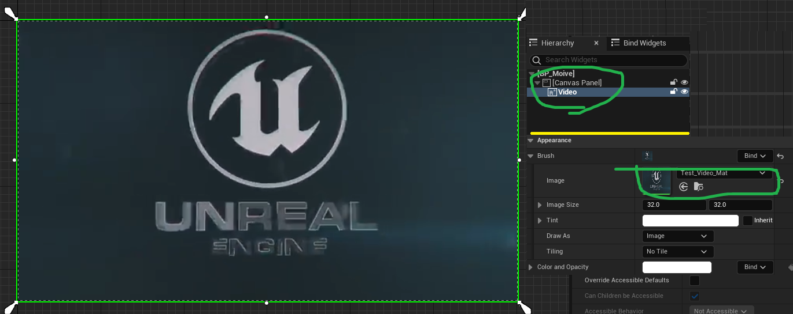
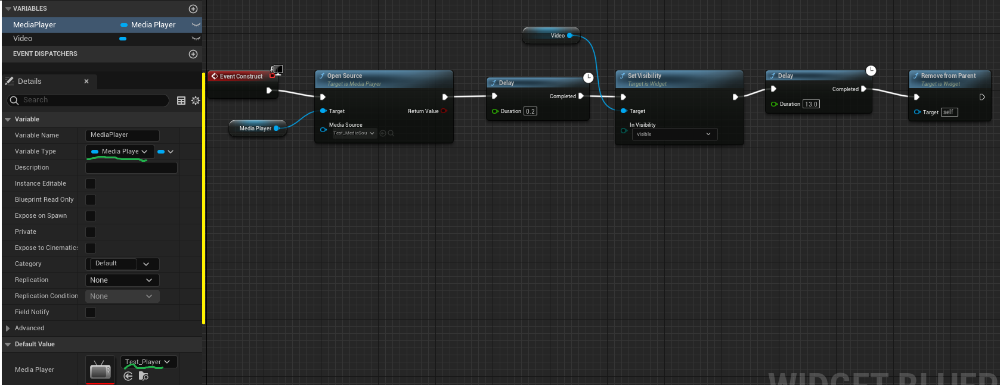
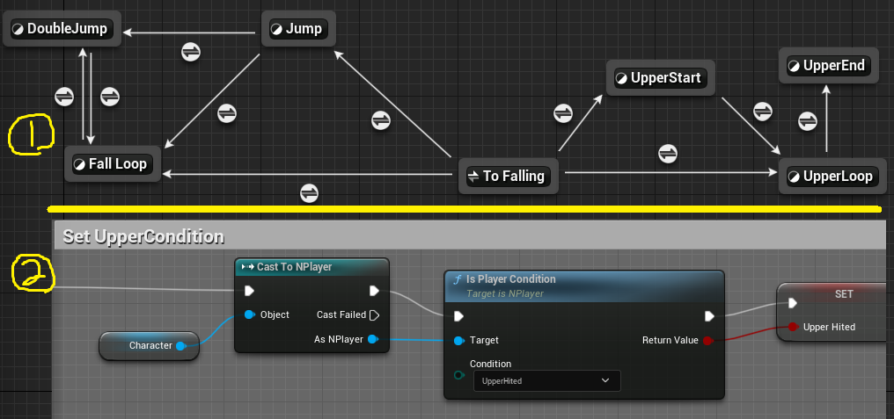
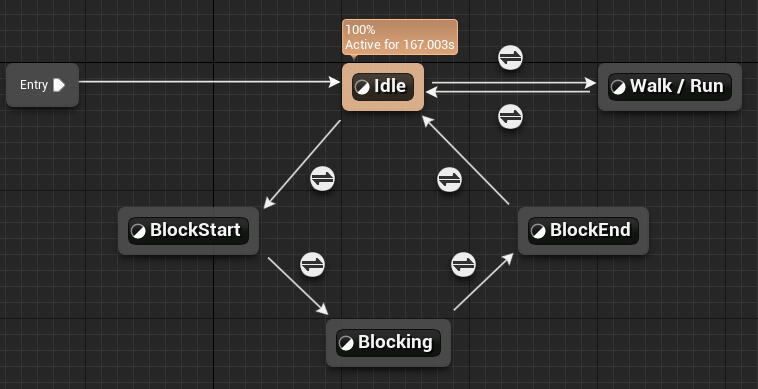
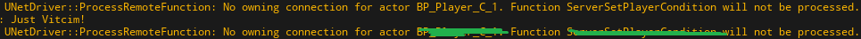
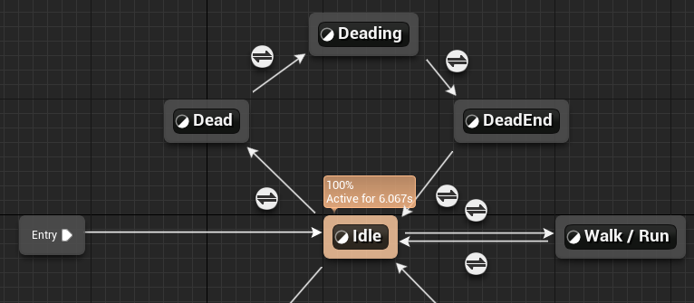
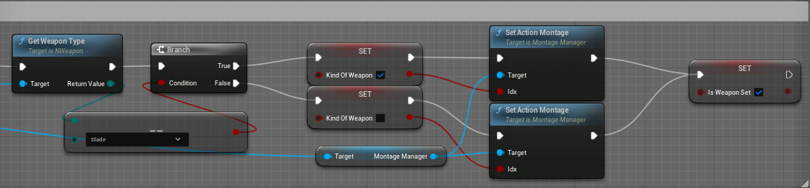
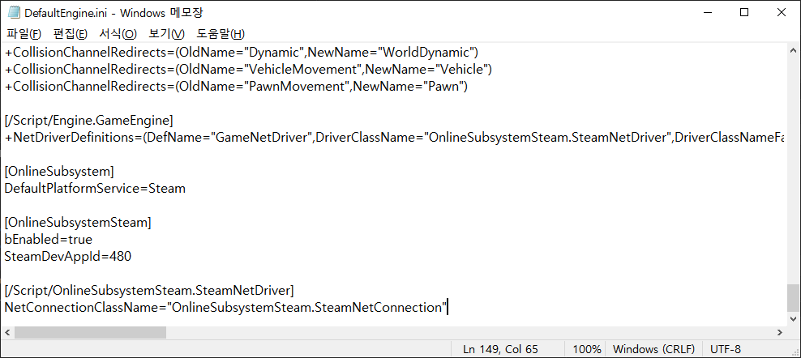
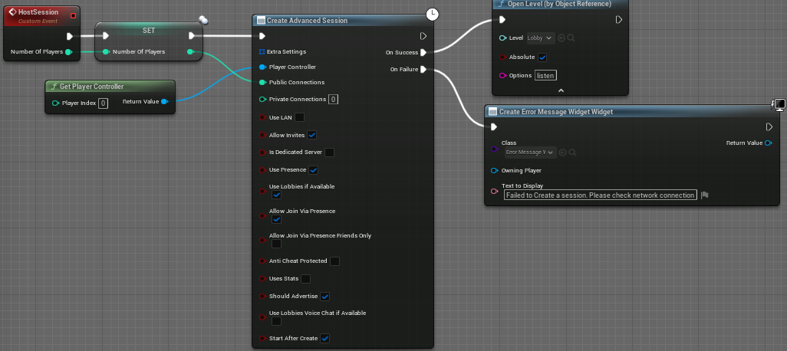
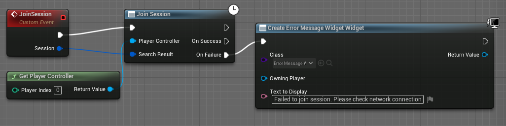

# 3D Fighting Game
- 3D Fighting Game (reproduction of Naruto Shippuden)
- 나루토 얼티밋스톰4를 기준으로 모작

## **Day_1**
> **<h3>Today Dev Story</h3>**
- ## <span style = "color:yellow;">메인 카메라의 이동</span>
  - 
  - 기존 본인이 제작한 "CameraManager" plugin을 서버 멀티플레이에서도 동작하도록 수정 및 개선
  - __플레이어__
    - 월드 상의 NcameraManager를 찾아 __"ClientSetViewTarget"하여__ 컨트롤러의 타겟을 카메라로 변경
    - CameraManager의 SetPlayer()메서드를 통해, 본인 객체를 __CamerManager가 참고하도록 설정__
  - __메인 카메라__
    - Player들의 정보가 저장되는 Players라는 TArray를 __Replicated하여__ 변경되면 서버에도 똑같이 반영
    - 그를 위해 __SetPlayer()메서드가__ Server에서 실행되는 __ServerSetPlayer()메서드__ 선언 후 구현
  - __문제점__
    - Server모드에서만 적용되는 문제 존재
    - 반응 속도가 느리다는 문제 (쉽게 해결 가능)

    <details><summary>C++ File</summary> 

    ```c++
    //NPlayer.cpp
    void ANPlayer::BeginPlay() {
      Super::BeginPlay();
      
      /** Find MainCameraManager & Set */
      if (CameraManagerClass) {
        ANCameraManager* TargetCamera = Cast<ANCameraManager>(UGameplayStatics::GetActorOfClass(this, ANCameraManager::StaticClass()));

        if (TargetCamera) {
          CameraManager = TargetCamera;
          APlayerController* ControllComp = Cast<APlayerController>(GetController());
          if (ControllComp) {
            PlayerControlComp = ControllComp;
            PlayerControlComp->bAutoManageActiveCameraTarget = false;
            PlayerControlComp->ClientSetViewTarget(CameraManager);
          }
        }
        else GEngine->AddOnScreenDebugMessage(-1, 5.0f, FColor::Red, TEXT("Error! MainCameraManager does not exist in the world!"));
      }

      if (CameraManager) CameraManager->SetPlayer(this);
    }
    ```
    ```c++
    //NCameraManager.cpp
    #include "Net/UnrealNetwork.h"

    ANCameraManager::ANCameraManager() {  
      SetReplicates(true);
      SetReplicateMovement(true);
    }
    void ANCameraManager::SetPlayer(AActor* Player) {
      if (!HasAuthority()) ServerSetPlayer(Player);

      UE_LOG(LogTemp, Warning, TEXT("New Player : %s"), *Player->GetName());
      Players.Push(Player);
    }
    void ANCameraManager::ServerSetPlayer_Implementation(AActor* Player) {
      SetPlayer(Player);
    }
    bool ANCameraManager::ServerSetPlayer_Validate(AActor* Player) {
      return true;
    }
    void ANCameraManager::GetLifetimeReplicatedProps(TArray< FLifetimeProperty >& OutLifetimeProps) const{
      Super::GetLifetimeReplicatedProps(OutLifetimeProps);

      DOREPLIFETIME(ANCameraManager, Players);
    }
    ```
    
    </details>

    <details><summary>Header File</summary> 

    ```c++
    //NCameraManager.h	
    public:
      void SetPlayer(AActor* Player);

      UFUNCTION(Server, Reliable, WithValidation)
      void ServerSetPlayer(AActor* Player);
    protected:
    	UPROPERTY(Replicated, EditInstanceOnly, Category = "Setting")
	    TArray<AActor*> Players;
    ```
    </details>

**<h3>Realization</h3>**
  - 메인카메라가 Server모드에서만 적용되는 문제 존재, 수정 필요..!
  - 반응 속도가 느리다는 문제 (쉽게 해결 가능)

## **Day_2**
> **<h3>Today Dev Story</h3>**
- ## <span style = "color:yellow;">애니메이션</span>
  - 
  - 애니메이션의 구성은 모두 Blueprint에서 제작했고, 점프, 속도등 관련해서 제작
  - 모든 애니메이션은 RootMotion을 사용하지 않음

- ## <span style = "color:yellow;">더블 점프</span>
  - 
  - 
  - 현재 개발한 것은 제자리에서의 이중 점프에 한정
  - __플레이어__
    - 더블 점프는 단순히 JumpMaxCount의 수를 변경하면 단순히 점프의 개수를 정할 수 있음
    - 또한 공중제어를 불가능하게 하고, 점프 높이 또한 변경
  - __월드__
    - 월드의 중력을 "-3800"으로 변경하여, 나루토 게임과 유사하게 제작
  - __문제점__
    - 점프는 방향키의 입력에 따라 이동하도록 해야 함
      - 즉, 이동속도에 따른 점프 거리가 정해지는것이 아닌, 방향키 입력에 따른 일정한 거리의 이동이 이루어져야함

    <details><summary>C++ File</summary> 

    ```c++
    ANPlayer::ANPlayer() {
      ...
      /* Jump Setting */
      JumpMaxCount = 2;
      GetCharacterMovement()->JumpZVelocity = 1400.f;
      GetCharacterMovement()->AirControl = 0.f;
    }
    ```
    </details>

## **Day_3**
> **<h3>Today Dev Story</h3>**
- ## <span style = "color:yellow;">더블 점프_2</span>
  - 
  - 방향키가 입력되어 있다면 방향으로의 점프를 하기 위해서 LaunchCharacter()메서드를 사용하였고, 현재 눌려있는 방향키를 표시하기 위해서 Enum 클래스 사용. 
    - 이는 현재 굳이 필요없지만 추후 공격의 콤보에도 사용하기에 미리 제작
  - 서버와 클라이언트 모두 LaunchCharacter()메서드를 처리하기 위해서 Server 함수 생성하여 해결

    <details><summary>C++ File</summary> 

    ```c++
    ANPlayer::ANPlayer() {
      ...
    	/* Jump Setting */
	    GetCharacterMovement()->JumpZVelocity = 1400.f;

      /* Impressed Keys */
      SetKeyUpDown(EKeyUpDown::EKUD_Default);
      SetKeyLeftRight(EKeyLeftRight::EKLR_Default);
    }
    void ANPlayer::MoveForward(float Value) {
      FRotator Rot = FRotator(0.f, GetControlRotation().Yaw, 0.f);
      AddMovementInput(UKismetMathLibrary::GetForwardVector(Rot), Value);

      if (Value > 0) SetKeyUpDown(EKeyUpDown::EKUD_Up);
      else if (Value < 0) SetKeyUpDown(EKeyUpDown::EKUD_Down);
      else SetKeyUpDown(EKeyUpDown::EKUD_Default);
    }
    void ANPlayer::MoveRight(float Value) {
      FRotator Rot = FRotator(0.f, GetControlRotation().Yaw, 0.f);
      AddMovementInput(UKismetMathLibrary::GetRightVector(Rot), Value);

      if (Value > 0) SetKeyLeftRight(EKeyLeftRight::EKLR_Right);
      else if (Value < 0) SetKeyLeftRight(EKeyLeftRight::EKLR_Left);
      else SetKeyLeftRight(EKeyLeftRight::EKLR_Default);
    }
    void ANPlayer::Jump() {
      if(!HasAuthority()) {
        ServerJump();
        return;
      }

      if (JumpCurrentCount < 2) {
        FVector ForceVec = (GetActorUpVector() * (JumpMovementForce - GetVelocity().Size())) + (GetActorForwardVector() * (JumpMovementForce - GetVelocity().Size()));
        ForceVec.Z = 1400.f;
        LaunchCharacter(ForceVec, false, false);
        JumpCurrentCount++;
      }
    }
    void ANPlayer::ServerJump_Implementation() {
      Jump();
    }
    bool ANPlayer::ServerJump_Validate() {
      return true;
    }
    ```
    </details>
    <details><summary>Header File</summary> 

    ```c++
    UENUM(BlueprintType)
    enum class EKeyUpDown : uint8 {
      EKUD_Up				UMETA(DisplayName = "Up"),
      EKUD_Down			UMETA(DisplayName = "Down"),

      EKUD_Default		UMETA(DisplayName = "Default")
    };

    UENUM(BlueprintType)
    enum class EKeyLeftRight : uint8 {
      EKLR_Right			UMETA(DisplayName = "Right"),	
      EKLR_Left			UMETA(DisplayName = "Left"),
      
      EKLR_Default		UMETA(DisplayName = "Default")
    };
    protected:
      /* Inpressed Keys */
      UPROPERTY(VisibleAnywhere, Category="Movement")
      EKeyUpDown Key_UD;

      UPROPERTY(VisibleAnywhere, Category = "Movement")
      EKeyLeftRight Key_LR;

      UPROPERTY(EditDefaultsOnly, Category = "Movement|Jump")
      float JumpMovementForce;

    	/* Jump */
      UFUNCTION(Server, Reliable, WithValidation)
      void ServerJump();
      
      FORCEINLINE void SetKeyUpDown(EKeyUpDown newKey) { Key_UD = newKey; }
      FORCEINLINE void SetKeyLeftRight(EKeyLeftRight newKey) { Key_LR = newKey; }

      FORCEINLINE EKeyUpDown GetKeyUpDown() { return Key_UD; }
      FORCEINLINE EKeyLeftRight GetKeyLeftRight() { return Key_LR; }
    public:
      virtual void Jump() override;
    ```
    </details>
    
- ## <span style = "color:yellow;">잡다한것</span>
  - 제자리 점프와 달려가면서 하는 점프간의 속도 차이가 발생
    - 기존 점프 Force에서 현재 이동 속도를 빼서 계산한 만큼 점프
      ```cpp
      ForceVec = FVector(0, -(JumpMovementForce - GetVelocity().Size()), 1400.f);
      ```
  - 기존에는 카메라가 움직이지 않았지만, 멀티에서는 움직이기 때문에 점프 방향의 문제 발생
    - 방향을 __"GetActorUpVector() + GetActorForwardVector()"로__ 처리
      ```cpp
      FVector ForceVec = (GetActorUpVector() * (JumpMovementForce - GetVelocity().Size())) + (GetActorForwardVector() * (JumpMovementForce - GetVelocity().Size()));
      ```

**<h3>Realization</h3>**
  - 제자리 점프와 달려가면서 하는 점프간의 속도 차이가 발생
    - 기존에는 움직임을 멈추고, Jump(), 하지만 이 방법은 너무 개발자답지 못한 방식이였기 때문에 기존 점프 Force에서 현재 이동 속도를 빼서 계산한 만큼 점프하도록 변경

  - 기존에는 카메라가 움직이지 않았지만, 멀티에서는 움직이기 때문에 점프 방향의 문제가 발생
    - 방향을 __"GetActorUpVector() + GetActorForwardVector()"로__ 처리

  - 
  - __개선점__ : 클라이언트는 점프를 3번하는 문제와 애니메이션이 실행되지 않는 문제

## **Day_4**
> **<h3>Today Dev Story</h3>**
- ## <span style = "color:yellow;">무기에 따른 애니메이션</span>
  - 
  - 추가로 weapon에 따라 애니메이션이 달라지는 "KindOfWeapon"제작
  - 이를 위해서 Weapon클래스를 제작해야하고, Player에 장착된 Weapon의 종류에 따라 애니메이션을 다르게 처리해야한다.
    - 아직 애니메이션 처리를 하지 않았음
  - NWeapon클래스를 만들고 이를 NPlayer에서 호출하여 생성. 이때 무기는 랜덤으로 지정 (SetWeaponRandom())
    - 또한 서버에서 공유되어야 하기때문에 Replicates설정
  - NPlayer에서의 Weapon 생성은 BeginPlay()에서 진행되며 서버일때만 생성되도록 설정

    <details><summary>C++ File</summary> 

    ```c++
    //NWeapon.cpp
    ANWeapon::ANWeapon(){
      MeshComp = CreateDefaultSubobject<UStaticMeshComponent>(TEXT("MeshComp"));
      SetRootComponent(MeshComp);
      if(WeaponMeshType.Num() >= 2) MeshComp->SetStaticMesh(WeaponMeshType[0]);

      SetReplicates(true);
    }
    void ANWeapon::BeginPlay(){
      Super::BeginPlay();

      SetWeaponRandom();
    }
    void ANWeapon::SetWeaponRandom() {
      if (WeaponMeshType.Num() >= 2) {
        int32 WeaponTmp = FMath::RandRange(0, 1);
        if (WeaponTmp == 0) {
          MeshComp->SetStaticMesh(WeaponMeshType[WeaponTmp]);
          WeaponType = EWeaponType::EWT_Sword;
        }
        else {
          MeshComp->SetStaticMesh(WeaponMeshType[WeaponTmp]);
          WeaponType = EWeaponType::EWT_Blade;
        }
    }
    ```
    ```cpp
    //NPlayer.cpp
    ANPlayer::ANPlayer() {
      ...

    	WeaponAttachSocketName = "WeaponSocket";
    }
    void ANPlayer::BeginPlay() {
      ...

      /** Spawn Weapon */
      if (HasAuthority()) {
        FActorSpawnParameters SpawnParams;
        SpawnParams.SpawnCollisionHandlingOverride = ESpawnActorCollisionHandlingMethod::AlwaysSpawn;

        if (StarterWeaponClass) CurrentWeapon = GetWorld()->SpawnActor<ANWeapon>(StarterWeaponClass, FVector::ZeroVector, FRotator::ZeroRotator, SpawnParams);
        if (CurrentWeapon) {
          CurrentWeapon->SetOwner(this);
          CurrentWeapon->AttachToComponent(GetMesh(), FAttachmentTransformRules::SnapToTargetNotIncludingScale, WeaponAttachSocketName);
        }
      }
    }
    ```
    </details>

    <details><summary>Header File</summary> 

    ```c++
    //NWeapon.h
    protected:
      UPROPERTY(EditDefaultsOnly,Category = "Weapon")
      EWeaponType WeaponType;

      /* Please Set Weapons Mesh */
      UPROPERTY(EditDefaultsOnly, Category = "Weapon")
      TArray<UStaticMesh*> WeaponMeshType;

      UPROPERTY(EditDefaultsOnly,Category = "Weapon")
      UStaticMeshComponent* MeshComp;

      /* Set Player's Weapon for Random */
      UFUNCTION()
      void SetWeaponRandom();
    public:	
      FORCEINLINE EWeaponType GetWeaponType() { return WeaponType; }
    ```
    ```c++
    //NPlayer.h
    UPROPERTY(EditDefaultsOnly, Category = "Weapon")
    TSubclassOf<AActor> StarterWeaponClass;

    UPROPERTY(VisibleAnywhere, Category = "Weapon")
    class ANWeapon* CurrentWeapon;

    UPROPERTY(VisibleDefaultsOnly, Category = "Weapon")
    FName WeaponAttachSocketName;
    ```
    </details>

**<h3>Realization</h3>**
  - 무기 클래스는 생성했으나 무기에 따른 애니메이션은 생성 X 
  - ### 또한 무기를 생성했을때, 호환되지 않는 문제 발생

## **Day_5**
> **<h3>Today Dev Story</h3>**
- ## <span style = "color:yellow;">점프 수정</span>
  - 
  - __더블 점프가 3번 되는 문제 해결__
    - 로그를 띄워보니 JumpCurrentCount가 클라이언트에만 적용된다고 판단
    - Server를 통한 호출은 따로 JumpCurrentCount++ 처리하여 해결
  - __점프 애니메이션 문제 해결__
    - 
    - bIsDubleJump라는 bool을 DOREPLIFETIME처리하여 동기화를 유지한다. 이 값에 따라 애니메이션이 달라진다.

    <details><summary>Cpp File</summary> 

    ```c++
    //NPlayer.cpp
    #include "Net/UnrealNetwork.h"
    ANPlayer::ANPlayer() {
      ...
      bIsDoubleJump = false;
    }
    void ANPlayer::Jump() {
      if (!HasAuthority()) {
        NServerJump();
        return;
      }

      if (JumpCurrentCount++ < 2) {
        /** for Animation */
        if (JumpCurrentCount == 2) bIsDoubleJump = true;
		    else bIsDoubleJump = false;
        
        FVector ForceVec = (GetActorUpVector() * (JumpMovementForce - GetVelocity().Size())) + (GetActorForwardVector() * (JumpMovementForce - GetVelocity().Size()));
        ForceVec.Z = 1400.f;
        LaunchCharacter(ForceVec, false, false);
      }
    }
    void ANPlayer::ServerJump_Implementation() {
      /** resolved triple jump! */
      JumpCurrentCount++;
      Jump();
    }
    void ANPlayer::ResetJumpState() {
      ...
      if (GetCharacterMovement() && !GetCharacterMovement()->IsFalling()) bIsDoubleJump = false;
    }
    void ANPlayer::GetLifetimeReplicatedProps(TArray< FLifetimeProperty >& OutLifetimeProps) const {
      ...
      DOREPLIFETIME(ANPlayer, bIsDoubleJump);
    }
    ```
    </details>

    <details><summary>Header File</summary> 

    ```c++
    //NPlayer.h
    private:
    	UPROPERTY(Replicated, BlueprintReadWrite, Category = "Movement|Jump")
	    bool bIsDoubleJump;
    ```
    </details>

**<h3>Realization</h3>**
  - 로그를 띄워서 확인하는 습관을 지니자

## **Day_6**
> **<h3>Today Dev Story</h3>**
- ## <span style = "color:yellow;">더블 점프를 공중에서 조금 더 유연하도록 수정</span>
  - 
  - 기존 방향으로 점프는 구성되어 있었지만, 반대 방향으로의 속도 때문에 적용되지 않았다.
    - 단순히 속도를 멈추는 방식으로 진행하였으나, 애니메이션으로 처리한다면 지금까지의 과정이 필요없을 것으로 예상된다.

    <details><summary>Cpp File</summary> 

    ```cpp
    //NPlayer.cpp
    void ANPlayer::Jump() {
      ...
      if (JumpCurrentCount++ < 2) {
        if (JumpCurrentCount == 2) {
          GetMovementComponent()->StopMovementImmediately();
          bIsDoubleJump = true;
        }
        ...
        LaunchCharacter(ForceVec, false, false);
      }
    }
    ```
    </details>

**<h3>Realization</h3>**
  - null

  
## **Day_5**
> **<h3>Today Dev Story</h3>**
- ## <span style = "color:yellow;">점프 수정</span>
  - 
  - __더블 점프가 3번 되는 문제 해결__
    - 로그를 띄워보니 JumpCurrentCount가 클라이언트에만 적용된다고 판단
    - Server를 통한 호출은 따로 JumpCurrentCount++ 처리하여 해결
  - __점프 애니메이션 문제 해결__
    - 
    - bIsDubleJump라는 bool을 DOREPLIFETIME처리하여 동기화를 유지한다. 이 값에 따라 애니메이션이 달라진다.

    <details><summary>Cpp File</summary> 

    ```c++
    //NPlayer.cpp
    #include "Net/UnrealNetwork.h"
    ANPlayer::ANPlayer() {
      ...
      bIsDoubleJump = false;
    }
    void ANPlayer::Jump() {
      if (!HasAuthority()) {
        NServerJump();
        return;
      }

      if (JumpCurrentCount++ < 2) {
        /** for Animation */
        if (JumpCurrentCount == 2) bIsDoubleJump = true;
		    else bIsDoubleJump = false;
        
        FVector ForceVec = (GetActorUpVector() * (JumpMovementForce - GetVelocity().Size())) + (GetActorForwardVector() * (JumpMovementForce - GetVelocity().Size()));
        ForceVec.Z = 1400.f;
        LaunchCharacter(ForceVec, false, false);
      }
    }
    void ANPlayer::ServerJump_Implementation() {
      /** resolved triple jump! */
      JumpCurrentCount++;
      Jump();
    }
    void ANPlayer::ResetJumpState() {
      ...
      if (GetCharacterMovement() && !GetCharacterMovement()->IsFalling()) bIsDoubleJump = false;
    }
    void ANPlayer::GetLifetimeReplicatedProps(TArray< FLifetimeProperty >& OutLifetimeProps) const {
      ...
      DOREPLIFETIME(ANPlayer, bIsDoubleJump);
    }
    ```
    </details>

    <details><summary>Header File</summary> 

    ```c++
    //NPlayer.h
    private:
    	UPROPERTY(Replicated, BlueprintReadWrite, Category = "Movement|Jump")
	    bool bIsDoubleJump;
    ```
    </details>

**<h3>Realization</h3>**
  - 로그를 띄워서 확인하는 습관을 지니자

## **Day_7**
> **<h3>Today Dev Story</h3>**
- ## <span style = "color:yellow;">공격 클래스 작성</span>
  - 
  - 
  - 플레이어의 공격들을 담당하는 'ActorComponent'인 'AttackActorComponent'클래스 생성
    - 기본 공격, 콤보, 특정 공격등과 관련된 모든 것을 관리
    - 현재는 테스트용으로 "몽타주"를 Replicated하게만 했음

    <details><summary>Cpp File</summary> 

    ```cpp
    //UAttackActorComponent.cpp
    #include "Net/UnrealNetwork.h"  
    void UAttackActorComponent::Attack() {
      PlayNetworkMontage(AttackMontage, 1.f);
    }

    void UAttackActorComponent::PlayNetworkMontage(UAnimMontage* Mongtage, float PlayRate) {
      if (Cast<ACharacter>(GetOwner())->IsLocallyControlled()) {
        if (MainAnimInstance) MainAnimInstance->Montage_Play(Mongtage, PlayRate);

        ServerPlayMontage(Mongtage,PlayRate);
      }
    }
    void UAttackActorComponent::MultiPlayNetworkMontage_Implementation(UAnimMontage* Mongtage, float PlayRate) {
      if (!Cast<ACharacter>(GetOwner())->IsLocallyControlled()) {
        if (MainAnimInstance) MainAnimInstance->Montage_Play(Mongtage, PlayRate);
      }
    }
    bool UAttackActorComponent::MultiPlayNetworkMontage_Validate(UAnimMontage* Mongtage, float PlayRate) {
      return true;
    }
    void UAttackActorComponent::ServerPlayMontage_Implementation(UAnimMontage* Mongtage, float PlayRate) {
      MultiPlayNetworkMontage(Mongtage, PlayRate);
    }
    bool UAttackActorComponent::ServerPlayMontage_Validate(UAnimMontage* Mongtage, float PlayRate) {
      return true;
    }
    ```
    ```cpp
    //NPlayer.cpp
    ANPlayer::ANPlayer() {
      ...
	    CurAttackComp = CreateDefaultSubobject<UAttackActorComponent>(TEXT("AttackComponent"));
    }
    void ANPlayer::BeginPlay() {
      ...
      CurAttackComp->SetAnimInstance(GetMesh()->GetAnimInstance());
    }
    void ANPlayer::Attack() {
      CurAttackComp->Attack();
    }
    ```
    </details>
    <details><summary>Header File</summary> 

    ```cpp
    //UAttackActorComponent.h
    public:
      UPROPERTY(EditDefaultsOnly, BlueprintReadOnly, Category = "Anims")
      class UAnimMontage* AttackMontage;

      void Attack();	

      void PlayNetworkMontage(UAnimMontage* Mongtage, float PlayRate);

      UFUNCTION(NetMulticast, Reliable, WithValidation)
      void MultiPlayNetworkMontage(UAnimMontage* Mongtage, float PlayRate);

      UFUNCTION(Server, Reliable, WithValidation)
      void ServerPlayMontage(UAnimMontage* Mongtage, float PlayRate);
      FORCEINLINE void SetAnimInstance(UAnimInstance* AnimInst) { MainAnimInstance = AnimInst; }
    ```
    </details>

> **<h3>Realization</h3>**
  - 오랜만에 하니 네트워크 관련해서 다 잊었다. 다시 시작하자. 

## **Day_8**
> **<h3>Today Dev Story</h3>**
- ## <span style = "color:yellow;">무기 생성 문제 해결</span>
  - 
  - 기존 [Day4](#또한-무기를-생성했을때,-호환되지-않는-문제-발생)의 문제를 해결하기 위해서 원인을 판단 
    - 초기에는 생성에 오류가 있는듯 했으나, 클라이언트에 생성은 되지만 Mesh에 NULL값이 들어가있는 것을 확인 -> 즉, Mesh에 Replicated가 적용 X

    ---
    <details><summary>Cpp File</summary> 

    ```cpp
    //NPlayer.cpp
    void ANPlayer::BeginPlay() {
      ...
	    SetWeapon();
    }
    void ANPlayer::SetWeapon() {
      if (HasAuthority()) {
        FActorSpawnParameters SpawnParams;
        SpawnParams.SpawnCollisionHandlingOverride = ESpawnActorCollisionHandlingMethod::AlwaysSpawn;

        if (StarterWeaponClass) CurrentWeapon = GetWorld()->SpawnActor<ANWeapon>(StarterWeaponClass, FVector::ZeroVector, FRotator::ZeroRotator, SpawnParams);
        if (CurrentWeapon) {
          CurrentWeapon->SetOwner(this);
          CurrentWeapon->SetWeaponRandom();
          CurrentWeapon->AttachToComponent(GetMesh(), FAttachmentTransformRules::SnapToTargetNotIncludingScale, WeaponAttachSocketName);
        }
      }
    }
    ```
    ```cpp
    //NWeapon.cpp
    ANWeapon::ANWeapon(){
      ...
      MeshComp->SetIsReplicated(true);
    }
    ```
    </details>
    
- ## <span style = "color:yellow;">공격의 콤보 구조체</span>
  -  Actor클래스를 상속받은 새로운 구조체 클래스(AttackStruct)를 생성
  - __"AttackStruct"는__ 행동에 맞는 각 몽타주를 위해서 2개의 몽타주(Attacker,Victim), 콤보의 최대 카운트(ComboCnt), 거리(distance)로 구성
    - 이때 거리는 특정 스킬을 사용할때 사용할 예정
    ---
    <details><summary>Header File</summary> 

    ```cpp
    //AttackStruct.h
    USTRUCT(Atomic, BlueprintType)
    struct FAttackMontageStruct
    {
      GENERATED_BODY()
    public:
      UPROPERTY(EditAnywhere, BlueprintReadWrite)
      class UAnimMontage* MT_Attacker;
      UPROPERTY(EditAnywhere, BlueprintReadWrite)
      class UAnimMontage* MT_Victim;
      UPROPERTY(EditAnywhere, BlueprintReadWrite)
	    int ComboCnt;
      UPROPERTY(EditAnywhere, BlueprintReadWrite)
      float distance;
    };
    ```
    ```cpp
    // AttackActorComponent.cpp
    UPROPERTY(EditDefaultsOnly, Category = "AttackMontage")
    TArray<FAttackMontageStruct> MontageArr;
    ```
    </details>


- ## <span style = "color:yellow;">공격의 콤보</span>
  - 
  - 
  - 이전 프로젝트에서 구현한 코드하여 제작했으며, 콤보를 위해서 기존 Montage 관련 메서드에 몽타주 idx번호를 추가
    - __"AttackInputCheck()"__ 노티파이전에 입력이 들어왔다면, Attack()하여 콤보를 진행하고, 그렇지 않다면 __"EndAttack()"__ 메서드 실행하여 콤보를 종료

    ---
    <details><summary>CPP File</summary> 

    ```cpp
    //AttackActorComponent.cpp
    void UAttackActorComponent::DefaultAttack_KeyDown() {
      bLMBDown = true;

      if (!bAttacking) Attack();
      else bIsAttackCheck = true;
    }
    void UAttackActorComponent::Attack() {
      bAttacking = true;

      if (MainAnimInstance) {
        if (!MainAnimInstance->Montage_IsPlaying(MontageArr[0].MT_Attacker)) {	
          ComboCnt = 1;
          PlayNetworkMontage(MontageArr[0].MT_Attacker, 1.f, 1);    //초기 공격
        }
        else PlayNetworkMontage(MontageArr[0].MT_Attacker, 1.f, ComboCnt);
      }
    }
    void UAttackActorComponent::EndAttack() {
      bAttacking = false;
    }
    void UAttackActorComponent::AttackInputCheck() {
      if (bIsAttackCheck) {
        ComboCnt++;
        if (ComboCnt > MontageArr[0].ComboCnt) ComboCnt = 1;
        bIsAttackCheck = false;
        Attack();
      }
    }
    FName UAttackActorComponent::GetAttackMontageSection(int32 Section) {
      return FName(*FString::Printf(TEXT("Attack%d"), Section));
    }
    ```
    </details>
    <details><summary>Header File</summary> 

    ```cpp
    //AttackActorComponent.h
    void DefaultAttack_KeyDown();
    void Attack();	

    UFUNCTION(BlueprintCallable)
    void EndAttack();

    UFUNCTION(BlueprintCallable)
    void AttackInputCheck();

    FName GetAttackMontageSection(int32 Section);

    int16 ComboCnt = 0;
    bool bAttacking = false;
    bool bLMBDown = false;
    bool bIsAttackCheck = false;

    /** Montage 관련 메서드 -> 매개변수 idx의 추가 */
    void PlayNetworkMontage(UAnimMontage* Mongtage, float PlayRate, int idx);
	  void MultiPlayNetworkMontage(UAnimMontage* Mongtage, float PlayRate, int idx);
	  void ServerPlayMontage(UAnimMontage* Mongtage, float PlayRate, int idx);
    ```
    </details>

> **<h3>Realization</h3>**
  - 현재 콤보를 진행할때, 하나의 콤보만 진행되는데 키 입력에 따른 다양화를 할 생각
    - 즉, MontageArr 배열에 추가하고, 조건 변경..

## **Day_9**
> **<h3>Today Dev Story</h3>**
- ## <span style = "color:yellow;">입력에 따른 공격 모션</span>
  -   
  - 기존 'NPlayer.h'에서 움직임을 위해 상하좌우 키를 저장하는 ENUM클래스 __"EKeyUpDown, EKeyLeftRight"를__ 'AttackStruct.h'로 이동
  - 'NPlayer'에서 Attack()을 호출할때, __입력된 상하키의 입력 정보를 전달__ 
    - 이 정보에 따라 'AttackActorComponent'에서 공격 중 몽타주를 전환
  - 콤보 시전 중에 일정 타이밍에 '상하'버튼이 눌려있다면, 다음 콤보 시 몽타주를 변경
    - 전환은 구조체(FAttackMontageStruct)에 저장된 __"SplitIdx"의__ 값과 콤보의 번호가 일치할때, 키보드의 입력 정보에 따라 몽타주를 실행

    <details><summary>CPP File</summary> 
   
    ```cpp
    //NPlayer.cpp
    void ANPlayer::Attack() {
      CurAttackComp->DefaultAttack_KeyDown(GetKeyUpDown()); // 상하정보 전달
    }
    ```
    ```cpp
    void UAttackActorComponent::DefaultAttack_KeyDown(EKeyUpDown KeyUD){
      TmpKeyUD = KeyUD;
      ...
    }
    void UAttackActorComponent::Attack() {
      ...
      if (MainAnimInstance) {
        ...
        else {
          // 직전 입력된 "상하"키에 따라 전환되는 몽타주
          if (CurKeyUD == EKeyUpDown::EKUD_Up) PlayNetworkMontage(MontageArr[0].AttackSplit.MTUP_Attacker, 1.f, ComboCnt);
          else if (CurKeyUD == EKeyUpDown::EKUD_Down) PlayNetworkMontage(MontageArr[0].AttackSplit.MTDOWN_Attacker, 1.f, ComboCnt);
          else PlayNetworkMontage(MontageArr[0].MT_Attacker, 1.f, ComboCnt);
        }
      }
    }
    void UAttackActorComponent::EndAttack() {
      ...
      CurKeyUD = EKeyUpDown::EKUD_Default;      //초기화
    }
    void UAttackActorComponent::AttackInputCheck() {
      if (bIsAttackCheck) {
        ...
        if (MontageArr[0].splitIdx == ComboCnt) CurKeyUD = TmpKeyUD;
      }
    }
    ```
    </details>
    <details><summary>Header File</summary> 

    ```cpp
    //AttackActorComponent.h
    UPROPERTY(VisibleAnyWhere)
    EKeyUpDown CurKeyUD;			// 특정 콤보횟수에 저장되며, 이에 따라 다음 몽타주가 구분

    UPROPERTY(VisibleAnyWhere)
    EKeyUpDown TmpKeyUD;			// 현재 입력된 상하버튼의 정보를 저장
    ```
    </details>
    
    ---
  - 추가적으로 AttackStruct클래스에 상하키 입력에 따른 새로운 구조체를 만들고, 기존 구조체에 추가하는 과정을 진행
    - __FAttackSplitMontageStruct__ : UP & DOWN 콤보로 변환되는 몽타주의 저장
    - __FAttackMontageStruct__ : 기존 구조체

    <details><summary>Header File</summary> 
   
    ```cpp
    //AttackStruct.h
    USTRUCT(Atomic, BlueprintType)
    struct FAttackSplitMontageStruct  // UP & DOWN 콤보로 변환되는 몽타주의 저장
    {
      GENERATED_BODY()
    public:
      UPROPERTY(EditAnywhere, BlueprintReadWrite)
      class UAnimMontage* MTUP_Attacker;
      UPROPERTY(EditAnywhere, BlueprintReadWrite)
      class UAnimMontage* MTUP_Victim;
      UPROPERTY(EditAnywhere, BlueprintReadWrite)
      class UAnimMontage* MTDOWN_Attacker;
      UPROPERTY(EditAnywhere, BlueprintReadWrite)
      class UAnimMontage* MTDOWN_Victim;
    };

    USTRUCT(Atomic, BlueprintType)
    struct FAttackMontageStruct   //기존 구조체
    {
      ...
      UPROPERTY(EditAnywhere, BlueprintReadWrite)   // Split할 콤보의 인덱스
      int splitIdx;

      UPROPERTY(EditAnywhere, BlueprintReadWrite)
      FAttackSplitMontageStruct AttackSplit;  
    };
    ```
    </details>

> **<h3>Realization</h3>**
  - 이제는 Victim이 몽타주를 실행하도록 해야함...

## **Day_10**
> **<h3>Today Dev Story</h3>**
- ## <span style = "color:yellow;">Attack Check</span>
  -  
  -  
  - 위 그림과 같이 객체에 맞게 콜리전을 정의 및 설정
    - 무기 액터에는 <ins>__"OnComponentBeginOverlap"에 함수를 AddDynamic하여 충돌처리 추가__</ins>

  1. 무기가 플레이어와 오버랩되면 Actor가 소유한 AttackComponent의 배열(OverlapActors)에 저장
      - 서버에서만 진행
  2. __'Set/Get/IsAlreadyOverlap'을__ 하고, 이미 존재한다면 추가 X

    <details><summary>CPP File</summary> 
   
    ```cpp
    //AttackActorComponent.cpp
    UAttackActorComponent::UAttackActorComponent(){
      SetIsReplicated(true);
      ...
    }
    void UAttackActorComponent::SetOverlapActors(AActor* actor) {
      OverlapActors.Add(actor);
    }
    TArray<AActor*> UAttackActorComponent::GetOverlapActors() {
      return OverlapActors;
    }
    bool UAttackActorComponent::IsAlreadyOverlap(AActor* actor) { 
      for (int i = 0; i< OverlapActors.Num();i++) { 
        if (OverlapActors[i] == actor) return true;
      } 
      return false;
    }
    void UAttackActorComponent::GetLifetimeReplicatedProps(TArray< FLifetimeProperty >& OutLifetimeProps) const {
      Super::GetLifetimeReplicatedProps(OutLifetimeProps);

      DOREPLIFETIME(UAttackActorComponent, OverlapActors);
    }
    ```
    ```cpp
    //NWeapon.cpp
    ANWeapon::ANWeapon(){
      ...
      MeshComp->OnComponentBeginOverlap.AddDynamic(this, &ANWeapon::OnAttackBoxOverlapBegin);
    }
    void ANWeapon::SetWeaponRandom() {
      ...
      /** Set AttackController */
      ANPlayer* OwnPlayer = Cast<ANPlayer>(GetOwner());
      AttackController = OwnPlayer->GetCurAttackComp();
    }
    void ANWeapon::OnAttackBoxOverlapBegin(UPrimitiveComponent* OverlappedComponent, AActor* OtherActor, UPrimitiveComponent* OtherComp, int32 OtherBodyIndex, bool bFromSweep, const FHitResult& SweepResult) {
      // 서버일때만 진행하며, 이미 배열에 존재하면 추가하지 않음
      if (HasAuthority() && OtherActor != this->GetOwner() && !AttackController->IsAlreadyOverlap(OtherActor)) {
        AttackController->SetOverlapActors(OtherActor);
        UE_LOG(LogTemp, Warning, TEXT("Attack!!! %s"), *OtherActor->GetName());
      }
    }
    ```
    </details>
    <details><summary>Header File</summary> 
   
    ```cpp
    //AttackActorComponent.h
    public:
      /** Get/Set Overlap Actors Method */
      UFUNCTION()
      void SetOverlapActors(AActor* actor);

      UFUNCTION()
      TArray<AActor*> GetOverlapActors();

      UFUNCTION()
      bool IsAlreadyOverlap(AActor* actor);
    private:
      UPROPERTY(Replicated, VisibleAnyWhere)
      TArray<AActor*> OverlapActors;	// OverlapActor's Array
    ```
    ```cpp
    //NWeapon.h
    protected:
    	/** If Overlap other Actor */
      UFUNCTION()
      void OnAttackBoxOverlapBegin(UPrimitiveComponent* OverlappedComponent, AActor* OtherActor, UPrimitiveComponent* OtherComp, int32 OtherBodyIndex, bool bFromSweep, const FHitResult& SweepResult);

      UPROPERTY(EditDefaultsOnly, Category = "Attack")
      class UAttackActorComponent* AttackController;
    ```
    </details>
  
> **<h3>Realization</h3>**
  - NULL

## **Day_10**
> **<h3>Today Dev Story</h3>**
- ## <span style = "color:yellow;">Weapon Collision ON/OFF</span>
  -  
  -  
  - 위 그림과 같이 특정타임에서 노티파이를 실행하여 Weapon의 Collision을 컸다끄며, 끄는 시점에는 OverlapActors 배열을 초기화한다.
    - <ins>이게 지금 맞는지 확인이 안되네...?  서버에만 실행하는게 맞나?</ins>
    
    <details><summary>CPP File</summary> 
    
    ```cpp
    //NWeapon.cpp
    void ANWeapon::SetCollisionONOFF(bool isSet) {
      if (HasAuthority()) {
        if (!isSet) {
          MeshComp->SetCollisionEnabled(ECollisionEnabled::NoCollision);
          UE_LOG(LogTemp, Warning, TEXT("Collision OFF"))
        }
        else {
          MeshComp->SetCollisionEnabled(ECollisionEnabled::QueryAndPhysics);
          AttackController->ClearOverlapActors();
          UE_LOG(LogTemp, Warning, TEXT("Collision ON"));
        }
      }
    }
    ```
    ```cpp
    //AttackActorComponent.cpp
    void UAttackActorComponent::ClearOverlapActors() { 
      OverlapActors.Reset(); 
    }
    ```
    </details>
    <details><summary>Header File</summary> 
    
    ```cpp
    //NWeapon.h
    public:
    UFUNCTION(BlueprintCallable)
	    void SetCollisionONOFF(bool isSet);
    ```
    ```cpp
    //AttackActorComponent.h
    public:
    	// ResetOverlapActors..
      UFUNCTION()
      void ClearOverlapActors();
    ```
    </details>

> **<h3>Realization</h3>**
  - AttackCollision의 Reset을 서버에서만 하는게 맞나? 다음 Health Down할때 확인하자.

## **Day_11**
> **<h3>Today Dev Story</h3>**
- ## <span style = "color:yellow;">Victim Montage</span>
  -  
  - Overlap된 Actor에게 <ins>__"Montage, ComboCnt"__</ins> 정보를 넘겨서 몽타주를 실행하도록 한다.
    - 이때 서버에서만 실행된다.

    <details><summary>Cpp File</summary> 
    
    ```cpp
    //NWeapon.cpp
    void ANWeapon::OnAttackBoxOverlapBegin(UPrimitiveComponent* OverlappedComponent, AActor* OtherActor, UPrimitiveComponent* OtherComp, int32 OtherBodyIndex, bool bFromSweep, const FHitResult& SweepResult) {
      if (HasAuthority() && OtherActor != this->GetOwner() && !AttackController->IsAlreadyOverlap(OtherActor)) {
        AttackController->SetOverlapActors(OtherActor);

        // 피격 몽타주 실행 :  AttackActorComponent의 MontageArr와 ComboCnt만 넘긴다.
        ANPlayer* vitcim = Cast<ANPlayer>(OtherActor);
        UAnimMontage* mon = OwnPlayer->GetCurAttackComp()->GetActionMontage().MT_Victim;
        vitcim->GetCurAttackComp()->PlayNetworkMontage(mon,1.f, OwnPlayer->GetCurAttackComp()->GetComboCnt());
        UE_LOG(LogTemp, Warning, TEXT("%s attack %s"), *this->GetOwner()->GetName(), *OtherActor->GetName());
      }
    }
    ```
    </details>
    <details><summary>Header File</summary> 
    
    ```cpp
    //AttackActorComponent.h
    public:
    	/** For Access from NWeapon*/
      UFUNCTION()
      FORCEINLINE int16 GetComboCnt() { return ComboCnt; }

      UFUNCTION()
	    FORCEINLINE FAttackMontageStruct GetActionMontage() { return ActionMontage; }
    ```
    </details>

> **<h3>Realization</h3>**
  - Day 10의 AttackCollision의 Reset을 서버에서만 하는게 맞나? -> 맞는듯
  - 공격할때, 사용자에게 자동으로 Rotate되도록 해야될듯하다.
    - 단 상대의 좌표를 알아야하는데, 그러면 각 플레이어에게 상대 플레이를 할당해야하는가?

## **Day_12**
> **<h3>Today Dev Story</h3>**
- ## <span style = "color:yellow;">Rotate to another Player (Attacker)</span>
  -  
  - 공격 시 일정 범위내의 플레이어를 판단하고, 가장 가까운 플레이어를 향해 회전
    - Player의 __"UCapsuleComponent(CheckOverlapActorsCollision)"를__ 통해서 일정범위 내의 다른 플레이어를 판단하고, 존재한다면 각 AttackActorComponent의 __"AActor(InRangeActor)"에__ 할당한다.
      - 이때 InRangeActor는 Replicated...
    - Attack()메서드가 호출될때마다 타플레이어를 향해 회전하며, 이때 Pitch와 Roll은 고정된다.
      - SetActorRotation()메서드를 사용하는데, 이는 Local에서만 적용되기 때문에 Multi/Server 메서드를 추가로 생성하여 호출한다.

    <details><summary>Cpp File</summary> 
    
    ```cpp
    //AttackActorComponent.cpp
    void UAttackActorComponent::Attack() {
      /** Rotate to another Actor.. (Network & MutiCast) 	*/
      RotateToActor();
      ...
    }
    void UAttackActorComponent::RotateToActor() {
      if (Cast<ACharacter>(GetOwner())->IsLocallyControlled() && InRangeActor != nullptr) {
        UE_LOG(LogTemp, Warning, TEXT("%s is Exist so Attack Roate"), *InRangeActor->GetName());

        /** Rotate (Fixed Roll & Pitch) */
        FRotator RotateVal = UKismetMathLibrary::FindLookAtRotation(GetOwner()->GetActorLocation(), InRangeActor->GetActorLocation());
        RotateVal.Roll = GetOwner()->GetActorRotation().Roll;
        RotateVal.Pitch = GetOwner()->GetActorRotation().Pitch;
        GetOwner()->SetActorRotation(RotateVal);
        ServerRotateToActor(RotateVal);
      }
    }
    void UAttackActorComponent::MultiRotateToActor_Implementation(FRotator Rot){
      if (!Cast<ACharacter>(GetOwner())->IsLocallyControlled()) {
        GetOwner()->SetActorRotation(Rot);		
      }
    }
    bool UAttackActorComponent::MultiRotateToActor_Validate(FRotator Rot) {
      return true;
    }
    void UAttackActorComponent::ServerRotateToActor_Implementation(FRotator Rot) {
      MultiRotateToActor(Rot);
    }
    bool UAttackActorComponent::ServerRotateToActor_Validate(FRotator Rot) {
      return true;
    }
    ```
    ```cpp
    //ANPlayer.cpp
    ANPlayer::ANPlayer() {
      /** Check Overlap Anthor Actor */
      CheckOverlapActorsCollision = CreateDefaultSubobject<UCapsuleComponent>(TEXT("CheckOverlapActorsCollision"));
      CheckOverlapActorsCollision->SetupAttachment(GetRootComponent());
      CheckOverlapActorsCollision->SetCapsuleHalfHeight(300.f);
      CheckOverlapActorsCollision->SetCapsuleRadius(300.f);
      CheckOverlapActorsCollision->SetVisibility(true);
      CheckOverlapActorsCollision->OnComponentBeginOverlap.AddDynamic(this, &ANPlayer::OnActorOverlapBegin);
      CheckOverlapActorsCollision->OnComponentEndOverlap.AddDynamic(this, &ANPlayer::OnActorOverlapEnd);
    }
    void ANPlayer::OnActorOverlapBegin(UPrimitiveComponent* OverlappedComponent, AActor* OtherActor, UPrimitiveComponent* OtherComp, int32 OtherBodyIndex, bool bFromSweep, const FHitResult& SweepResult) {
      if (OtherActor != this) {
        CurAttackComp->SetInRangeActor(OtherActor);
        UE_LOG(LogTemp, Warning, TEXT("%s is overlap"), *OtherActor->GetName());
      }
    }
    void ANPlayer::OnActorOverlapEnd(UPrimitiveComponent* OverlappedComponent, AActor* OtherActor, UPrimitiveComponent* OtherComp, int32 OtherBodyIndex) {
      if (OtherActor != this) {
        CurAttackComp->SetInRangeActor(nullptr);
        UE_LOG(LogTemp, Warning, TEXT("%s is overlap END"), *OtherActor->GetName());
      }
    }
    ```
    </details>
    <details><summary>Header File</summary> 
    
    ```cpp
    //AttackActorComponent.h
    protected:
      UPROPERTY(Replicated, VisibleAnyWhere)
      AActor* InRangeActor;	// OverlapActor's Array

    public:
      UFUNCTION()
      FORCEINLINE void SetInRangeActor(AActor* Actor) { InRangeActor = Actor; }

      /** Rotate to another Actor.. (Network & MutiCast) 	*/
      UFUNCTION()
      void RotateToActor();

      UFUNCTION(NetMulticast, Reliable, WithValidation)
      void MultiRotateToActor(FRotator Rot);

      UFUNCTION(Server, Reliable, WithValidation)
      void ServerRotateToActor(FRotator Rot);
    ```
    ```cpp
    //ANPlayer.h
    protected:
      UPROPERTY(EditAnywhere, Category = "CheckOverlap", Meta = (AllowPrivateAccess = true))
      class UCapsuleComponent* CheckOverlapActorsCollision;

    public:
      UFUNCTION()
      void OnActorOverlapBegin(UPrimitiveComponent* OverlappedComponent, AActor* OtherActor, UPrimitiveComponent* OtherComp, int32 OtherBodyIndex, bool bFromSweep, const FHitResult& SweepResult);

      UFUNCTION()
      void OnActorOverlapEnd(UPrimitiveComponent* OverlappedComponent, AActor* OtherActor, UPrimitiveComponent* OtherComp, int32 OtherBodyIndex);
    ```
    </details>

- ## <span style = "color:yellow;">Rotate to another Player (Victim)</span>
  - 공격자가 피격자를 향해 회전할 수 있다면, 피격자도 범위내에 공격자가 있다는 뜻이기에 단순히 RoateToActor()메서드 실행하여 회전한다.

    <details><summary>Cpp File</summary> 
    
    ```cpp
    //NWeapon.cpp
    void ANWeapon::OnAttackBoxOverlapBegin(UPrimitiveComponent* OverlappedComponent, AActor* OtherActor, UPrimitiveComponent* OtherComp, int32 OtherBodyIndex, bool bFromSweep, const FHitResult& SweepResult) {
	    ...
		  vitcim->GetCurAttackComp()->RotateToActor();
    }
    ```
    </details>

> **<h3>Realization</h3>**
  - Rotate to another Player (Attacker) : 추후 플레이어가 여러명인 경우에는 가장 근접한 객체로 바꾸어야함. 

## **Day_13**
> **<h3>Today Dev Story</h3>**
- ## <span style = "color:yellow;">차크라 (Chacra)</span>
  - 차크라는 대쉬, 공격, 원거리 무기에 추가적인 효과를 준다.
  - 차크라는 2번 중첩이 가능하며, 사용 후 일정 시간이 지나면 소멸된다.
    - TimerManager를 사용해서 Delay를 제작하여 리셋

    <details><summary>Cpp File</summary> 
    
    ```cpp
    //ChacraActorComponent.cpp
    UChacraActorComponent::UChacraActorComponent(){
      PrimaryComponentTick.bCanEverTick = false;
      SetIsReplicated(true);

      ChacraCnt = 0;
    }
    void UChacraActorComponent::UseChacra() {
      if (ChacraCnt < 2) {
        ChacraCnt++;
        UE_LOG(LogTemp, Warning, TEXT("Chacra : %d"), ChacraCnt);
        GetWorld()->GetTimerManager().ClearTimer(ResetChacraHandle);
        GetWorld()->GetTimerManager().SetTimer(ResetChacraHandle, this, &UChacraActorComponent::ResetChacraCnt, 3.f,false);
      }
    }
    void UChacraActorComponent::ResetChacraCnt() {
      ChacraCnt = 0;
      UE_LOG(LogTemp, Warning, TEXT("Reset Chacra"));
    }
    void UChacraActorComponent::GetLifetimeReplicatedProps(TArray< FLifetimeProperty >& OutLifetimeProps) const {
      Super::GetLifetimeReplicatedProps(OutLifetimeProps);

      DOREPLIFETIME(UChacraActorComponent, ChacraCnt);
    }
    ```
    ```cpp
    //NPlayer.cpp
    ANPlayer::ANPlayer() {
      /* Chacra Component */
      CurChacraComp = CreateDefaultSubobject<UChacraActorComponent>(TEXT("ChacraComponent"));
    }
    void ANPlayer::SetupPlayerInputComponent(UInputComponent* PlayerInputComponent) {
      PlayerInputComponent->BindAction("Chacra", IE_Pressed,this, &ANPlayer::Chacra);
    }
    void ANPlayer::Chacra() {
      CurChacraComp->UseChacra();
    }
    ```
    </details>
    <details><summary>Header File</summary> 
    
    ```cpp
    //ChacraActorComponent.cpp
    protected:
      UPROPERTY(Replicated, VisibleAnywhere)
      int8 ChacraCnt;

      UPROPERTY()
      FTimerHandle ResetChacraHandle;

    public:
      UFUNCTION()
      void UseChacra();

      UFUNCTION()
      void ResetChacraCnt();

      UFUNCTION()
      FORCEINLINE int8 GetChacraCnt() {return ChacraCnt;}
    ```
    ```cpp
    //NPlayer.h
    protected:
      UPROPERTY(VisibleDefaultsOnly, BlueprintReadOnly, Category = "Chacra")
      class UChacraActorComponent* CurChacraComp;

      /** if D Key Down */
      void Chacra();
    public:
      UFUNCTION()
      FORCEINLINE UChacraActorComponent* GetCurChacraComp() { return CurChacraComp; }
    ```
    </details>

- ## <span style = "color:yellow;">점프/차크라 공격&대쉬</span>
  -  
  - 점프중이거나 차크라가 켜진 상태로 공격이나 차크라가 켜진 상태로 대쉬를 누를때 특별한 행동을 위한 처리

    <details><summary>Cpp File</summary> 

    ```cpp
    //UAttkackActorComponent.cpp
    void UAttackActorComponent::Attack() {
      ...
      /** Play Animation Montage */
      if (MainAnimInstance) {
        if (Cast<ANPlayer>(GetOwner())->GetMovementComponent()->IsFalling()) {
          UE_LOG(LogTemp, Warning, TEXT("Air Attack"));
          bAttacking = false; 
        }
        else if (Cast<ANPlayer>(GetOwner())->GetCurChacraComp()->GetChacraCnt() > 0) {
          UE_LOG(LogTemp, Warning, TEXT("Chacra Attack"));
          bAttacking = false; 
        }
        else {
          UE_LOG(LogTemp, Warning, TEXT("Nomal Attack"));
          ...
        }
      }
    }
    ```
    ```cpp
    // ANPlayer.cpp
    void ANPlayer::Jump() {
      if (CurChacraComp->GetChacraCnt() > 0 && IsLocallyControlled()) {
        // @TODO : Chacra Dash
      }
      else{ ... }
    }
    ```
    </details>
  
> **<h3>Realization</h3>**
  - 스킬 사용 고민...
    1. 컷씬 : 상대방이 맞았을때, 이후 콤보를 애니메이션으로 처리
    2. 콤보 : 맞았을때, 이후 그냥 두 놈의 애니메이션으로 처리
 
## **Day_14**
> **<h3>Today Dev Story</h3>**
- ## <span style = "color:yellow;">차크라 (Chacra) 점프</span>
  - GameState에서 PlayerArray를 받아와 상대 액터를 받아온다. 그 후 그 액터로 Rotate하고 대쉬한다.
    - 본래는 애니메이션으로 처리하고 싶었지만 불가능... (제작X)

    <details><summary>Cpp File</summary>

    ```cpp
    // ANPlayer.cpp
    void ANPlayer::Jump() {
      if (CurChacraComp->GetChacraCnt() > 0) {
        // @TODO : 로컬은 성공했으나 서버 실패 && 점프후 대쉬 또한 가능하니 상대를 바라보고 대쉬..

        for (auto x : GetWorld()->GetGameState()->PlayerArray){
          if (this != x->GetPawn()) {
            UE_LOG(LogTemp, Warning, TEXT("Chacra Dash to %s"), *x->GetPawn()->GetName());	

            FRotator RotateVal = UKismetMathLibrary::FindLookAtRotation(GetActorLocation(), x->GetPawn()->GetActorLocation());
            RotateVal.Roll = GetActorRotation().Roll;
            RotateVal.Pitch = GetActorRotation().Pitch;
            SetActorRotation(RotateVal);

            FVector ForceVec = GetActorForwardVector() * 10000.f;
            LaunchCharacter(ForceVec, false, false);

            break;
          }
        } 
      }
    }
    ```  
    </details>

- ## <span style = "color:yellow;">캐릭터의 상태 구분</span>
  - 캐릭터의 현재 상태나 공격횟수, 막기 등등을 하나의 오브젝트에서 관리했으면 좋겠다라는 생각이 들어 PlayerState에 새롭게 추가
    - 이때 상태는 아래와 같으며, 이는 Player을 거쳐 수정하거나 확인할 수 있도록 구현하였다.
  - 하지만 서버 관련 문제인지... 알 수 없는 문제로 자꾸 nullptr이 반환되는 것을 확인하여서 조치중에서 있다.
    - 해결 1번 : Player에 접근하지 않고, 자기 자신을 바로 접근하면 되지 않나..?

      |상태들...||||
      |:--:|:--:|:--:|:--:|
      |피격|일반 공격|스킬 공격(2개)|막기|
      |정지|이동|차크라 대쉬|차크라 회복|

    <details><summary>Cpp File</summary>

    ```cpp
    //NPlayerState.cpp
    #include "NPlayerState.h"
    #include "Net/UnrealNetwork.h"

    ANPlayerState::ANPlayerState() {
      SetPlayerCondition(EPlayerCondition::EPC_Idle);
    }

    void ANPlayerState::GetLifetimeReplicatedProps(TArray< FLifetimeProperty >& OutLifetimeProps) const{
      Super::GetLifetimeReplicatedProps(OutLifetimeProps);

      DOREPLIFETIME(ANPlayerState, PlayerCondition);
    }
    ```  
    ```cpp
    // AttackActorComponent.cpp
    // Owner의 PlayerState를 불러와 사용... 
    void UAttackActorComponent::Attack() {
      ...
      if (MainAnimInstance) {
        ...
        if (isFalling) {
          CurOwner->GetPlayerCondition()->SetPlayerCondition(EPlayerCondition::EPC_Attack); //ERROR

          EndAttack(); // 임시 (삭제)
        }
        else if (ChacraCom->GetChacraCnt() > 0) {
          CurOwner->GetPlayerCondition()->SetPlayerCondition(EPlayerCondition::EPC_Skill); //ERROR
          ...
        }
        else {
          CurOwner->GetPlayerCondition()-> SetPlayerCondition(EPlayerCondition::EPC_Attack); //ERROR
          ...
        }
      }
    }
    void UAttackActorComponent::EndAttack() {
      CurOwner->GetPlayerCondition()->SetPlayerCondition(EPlayerCondition::EPC_Idle); //ERROR
      ...
    }
    ```
    </details>
    <details><summary>Header File</summary>

    ```cpp
    //NPlayerState.h
    UENUM(BlueprintType)
    enum class EPlayerCondition : uint8 {
      EPC_Idle			UMETA(DisplayName = "Idle"),
      EPC_Hited			UMETA(DisplayName = "Hited"),
      EPC_Parry			UMETA(DisplayName = "Parry"),
      EPC_Charge			UMETA(DisplayName = "Charge"),
      EPC_Dash			UMETA(DisplayName = "Dash"),
      EPC_Attack			UMETA(DisplayName = "Attack"),

      EPC_Skill			UMETA(DisplayName = "Skill")
    };

    UCLASS()
    class NARUTO_API ANPlayerState : public APlayerState
    {
      GENERATED_BODY()

    public:
      ANPlayerState();

      virtual void GetLifetimeReplicatedProps(TArray< FLifetimeProperty >& OutLifetimeProps) const override;

      UFUNCTION()
      FORCEINLINE void SetPlayerCondition(EPlayerCondition NewCondition) { PlayerCondition = NewCondition;}

      UFUNCTION()
      FORCEINLINE EPlayerCondition GetPlayerCondition() {return PlayerCondition; }
    protected:
      UPROPERTY(Replicated, VisibleAnywhere, Category="State")
      EPlayerCondition PlayerCondition;
    };
    ```  
    </details>

> **<h3>Realization</h3>**
  - 서버에서는 상대 컨트롤러를 얻어올 수 없다는 것을 명심!
  - 스킬은 상대방이 피격 여부에 따라 이후 콤보는 자동으로 진행
    - 피격자도 마찬가지

## **Day_15**
> **<h3>Today Dev Story</h3>**
- ## <span style = "color:yellow;">캐릭터의 상태 구분 (수정)</span>
  - 이전 PlayerState에서 캐릭터의 상태를 관리했는데, 서버 관련해서 어려움을 겪어서 그냥 Player클래스에서 선언하도록 수정하고 Replicated선언..!

    <details><summary>Cpp File</summary>

    ```cpp
    //NPlayer.cpp
    void UAttackActorComponent::EndAttack(ANPlayer* player) {
      CurOwner->SetPlayerCondition(EPlayerCondition::EPC_Idle);   // 이처럼 사용한다.
      ...
    }
    ```
    </details>    
    <details><summary>Header File</summary>

    ```cpp
    //NPlayer.h
    public:
      UFUNCTION()
      FORCEINLINE EPlayerCondition GetPlayerCondition() { return PlayerCondition; }

      UFUNCTION()
      FORCEINLINE void SetPlayerCondition(EPlayerCondition NewCondition) { PlayerCondition = NewCondition; }

    protected:
      UPROPERTY(Replicated,VisibleAnywhere, Category = "Condition")
      EPlayerCondition PlayerCondition;
    ```
    </details>

- ## <span style = "color:yellow;">바꿔치기(SideStep)</span>
  -  
  - 상대방의 공격에 의해 피격중일때, 사용할 수 있는 회피로 상대방의 뒤쪽으로 순간이동한다.
    - 뒤로 이동하기 위해서 <ins>상대방의 '위치 벡터' - '방향(후면) 벡터'을 사용하여 좌표를 지정하였다.</ins>
  - 현재는 시연 및 사용을 위해서 일정 범위 내에 상대가 있을때 사용할 수 있도록 설계하였으며, 추후 피격시에만 사용 가능하도록 수정할 것이다.
  - 이때 회피기의 사용횟수는 최대 4번으로 고정되며, 사용후 일정시간이 지나면 "RecoverSideStepCnt()"메서드에 타이머를 적용하여 회복하도록한다.

    <details><summary>Cpp File</summary>

    ```cpp
    //NPlayer.cpp
    void ANPlayer::SideStep() {
      if(!HasAuthority()){
        ServerSideStep();
      }
      else{	
        AActor* Other = CurAttackComp->GetInRangeActor();
        /* TODO: 맞고 있을때만 사용 가능하도록 조정
        *if(!IsPlayerCondition(EPlayerCondition::EPC_Hited) || OtherA->GetInRangeActor() == nullptr || SideStepCnt < 0) return; */
        if (Other == nullptr || SideStepCnt <= 0) return;

        FVector VecVal = Other->GetActorLocation() - (Other->GetActorForwardVector() * 100.f);
        SetActorLocation(VecVal);

        FRotator RotateVal = UKismetMathLibrary::FindLookAtRotation(GetActorLocation(), Other->GetActorLocation());
        RotateVal.Roll = GetActorRotation().Roll;
        RotateVal.Pitch = GetActorRotation().Pitch;
        SetActorRotation(RotateVal);
        ClientSideStep(RotateVal);
        SideStepCnt--;

        GetWorld()->GetTimerManager().ClearTimer(SideStepHandle);
        GetWorld()->GetTimerManager().SetTimer(SideStepHandle, this, &ANPlayer::RecoverSideStepCnt, 3.f, false);
      }
    }
    void ANPlayer::ClientSideStep_Implementation(FRotator rot) {
      SetActorRotation(rot);
    }
    void ANPlayer::ServerSideStep_Implementation() {
      SideStep();
    }
    bool ANPlayer::ServerSideStep_Validate() {
      return true;
    }
    void ANPlayer::RecoverSideStepCnt() {
      if (++SideStepCnt < SideStepMaxCnt) {
        UE_LOG(LogTemp, Warning, TEXT("SideStepCnt %d"), SideStepCnt);
        GetWorld()->GetTimerManager().ClearTimer(SideStepHandle);
        GetWorld()->GetTimerManager().SetTimer(SideStepHandle, this, &ANPlayer::RecoverSideStepCnt, 3.f, false);
      }
    }
    void ANPlayer::GetLifetimeReplicatedProps(TArray< FLifetimeProperty >& OutLifetimeProps) const {
      ...
      DOREPLIFETIME(ANPlayer, SideStepCnt);
    }
    ```
    </details>
    <details><summary>Header File</summary>

    ```cpp
    //NPlayer.h
    protected:
      UPROPERTY(Replicated, VisibleAnywhere)
      int8 SideStepCnt = 4;

      int8 SideStepMaxCnt = 4;

      UPROPERTY()
      FTimerHandle SideStepHandle;

      UFUNCTION()
      void SideStep();

      UFUNCTION()
      void RecoverSideStepCnt();							// Recover Side Step's Count (Timer)
      
      UFUNCTION(Client, Reliable)
      void ClientSideStep(FRotator rot);					// For Client Rotation

      UFUNCTION(Server, Reliable, WithValidation)
      void ServerSideStep();								// For Server Move & Rot
    ```
    </details>

> **<h3>Realization</h3>**
  - 각 행동을 취할때 상태를 추가적으로 설정해주어야한다.
  - 바꿔치기를 피격중에만 가능하도록 추후 수정이 필요하다.

## **Day_16**
> **<h3>Today Dev Story</h3>**
- ## <span style = "color:yellow;">상대 캐릭터 정보 저장</span>
  - 진행하다보니 상대방의 위치/상태와 같은 정보를 자주 호출하게 되는 것을 느껴, 각 플레이어는 상대 플레이어의 정보를 항시 가지고 있도록 한다.
    - 상태 매니저를 만들려고 했으나, 어차피 상대 플레이어 객체만 알고 있으면 되기 때문에 만들지 않았다.
  - 기존 공격 시 상대방이 플레이어 구체 이내에 있다면(Overlap시), 자동으로 회전하도록 처리하였는데 수정하여, 액터와 일정 범위내에 있다면 회전하도록 하였다.
    - CheckOverlapActorsCollision 삭제....!!!

    <details><summary>Cpp File</summary>

    ```cpp
    //NPlayer.cpp
    void ANPlayer::Tick(float DeltaTime) {
      ...

      /** Get Another Player */
      if (!AnotherPlayer) {
        for (auto x : GetWorld()->GetGameState()->PlayerArray) {
          if (this != x->GetPawn()) AnotherPlayer = Cast<ANPlayer>(x->GetPawn());
        }
      }
      else {
        double val = (GetActorLocation() - AnotherPlayer->GetActorLocation()).Size();

        // If it is within a certain range, it rotates automatically on attack.
        if(val < AutoRotDistance) CurAttackComp->SetInRangeActor(AnotherPlayer);
        else CurAttackComp->SetInRangeActor(nullptr);
      }
    }
    ```
    ```cpp
    //AttackActorComponent.cpp
    void UAttackActorComponent::RotateToActor() {
      // 주인으로부터 허락을 받고, 좌표값만 넘겨받음....
      if (CurOwner && CurOwner->GetIsInRange()) {
        FRotator RotateVal = UKismetMathLibrary::FindLookAtRotation(GetOwner()->GetActorLocation(), CurOwner->GetAnotherLocation());   
        ...
      }
      else {
        UE_LOG(LogTemp, Warning, TEXT("ERROR : Roate Attack is Not Working"));
      }
    }
    ```
    </details>
    <details><summary>Header File</summary>

    ```cpp
    //NPlayer.h
    public:
      UPROPERTY(Replicated, VisibleAnywhere)
      ANPlayer* AnotherPlayer;

      double AutoRotDistance = 450.f;			// Can Attack Min Distance
      bool IsInRange = false;
    public:
      FORCEINLINE bool GetIsInRange() {return IsInRange; }
      FORCEINLINE FVector GetAnotherLocation() { return AnotherPlayer->GetActorLocation(); }
    ```
    </details>

- ## <span style = "color:yellow;">상대 캐릭터으로의 방향벡터 LOG & 돌진</span>
  - 
  - 각 플레이어로부터 상대 플레이어로의 방향 벡터를 계산하여, 화면상 로그로 띄우고, 일정 크기 돌진한다.
  - 돌진의 로직은 현재 LaunchCharacter()메서드를 사용하였지만 추후 수정할 예정이다.
    - 일정속도로 지속적으로 이동하며, 다른 플레이어와 닿거나 일정 시간으로 초과하면 종료하도록 수정
    - 방향키의 입력에 따라 뒤로 이동하도록 수정

    <details><summary>Cpp File</summary>

    ```cpp
    //ANPlayer.cpp
    void ANPlayer::SetAnotherPlayer() {
      ...
      else {
		    /** Set IsInRange & DirectionVector (this to AnotherActor)*/
        double val = (GetActorLocation() - AnotherPlayer->GetActorLocation()).Size();
        IsInRange = (val < AutoRotDistance) ? true : false;

        DirectionVec = (GetAnotherLocation() - GetActorLocation()).GetSafeNormal();
        DrawDebugLine(GetWorld(), GetActorLocation(), GetActorLocation() + (DirectionVec * 100), FColor::Red, false, 0, 0, 5);
      }
    }
    void ANPlayer::Jump() {
      if (CurChacraComp->GetChacraCnt() > 0) {
        if (AnotherPlayer) {
          ...
          // @TODO : 수정 필요 다른 로직으로
          LaunchCharacter(DirectionVec * 5000.f, false, false);
        }
      }
    }
    ```
    </details>
    <details><summary>Header File</summary>

    ```cpp
    //ANPlayer.h
    protected:
	    FVector DirectionVec;
    ```
    </details>


> **<h3>Realization</h3>**
  - 돌진 로직 수정

## **Day_17**
> **<h3>Today Dev Story</h3>**
- ## <span style = "color:yellow;">돌진의 로직 수정</span>
  - 
  - 기존 돌진하고 끝냈던 로직을 아래와 같이 수정한다.
    - 돌진을 지속적으로 사용하며, 다른 플레이어와의 거리가 일정이내라면 종료하도록 수정
    - 최대 5번 진행하며, 다른 플레이어와 150거리만큼 좁혀진다면 사용하지 않는다.
  - IsCanMove() : 돌진 중일때는 플레이어의 상태를 전환하고, 다른키의 입력이 불가능하도록 수정..

    <details><summary>Cpp File</summary>

    ```cpp
    //NPlayer.cpp
    bool ANPlayer::IsCanMove() {
      if(GetPlayerCondition() == EPlayerCondition::EPC_Dash) return false;
      else return true;
    }
    void ANPlayer::Jump() {
      if (!IsCanMove()) return;

      if (CurChacraComp->GetChacraCnt() > 0) {
        ChacraDash();
      }
    }
    void ANPlayer::ChacraDash() {
      if (AnotherPlayer) {
        UE_LOG(LogTemp, Warning, TEXT("Chacra Dash to %s"), *AnotherPlayer->GetName());

        if (!HasAuthority()) ServerChacraDash();
        AutoChacraDash();
        SetPlayerCondition(EPlayerCondition::EPC_Dash);
        CurChacraComp->ResetChacraCnt();
      }
    }
    void ANPlayer::AutoChacraDash() {
      /** Check Condition And Dash.! */
      if (--ChacraDashCnt < 0 || AP_Distance < ChacraDashStopDis) {
        UE_LOG(LogTemp, Warning, TEXT("AutoDash is Stop || Cnt : %d, Dis :%f"), ChacraDashCnt, AP_Distance);
        ChacraDashCnt = ChacraDashMaxCnt;
        SetPlayerCondition(EPlayerCondition::EPC_Idle);
      }
      else {
        FRotator RotateVal = UKismetMathLibrary::FindLookAtRotation(GetActorLocation(), GetAnotherLocation());
        RotateVal.Roll = GetActorRotation().Roll;
        RotateVal.Pitch = GetActorRotation().Pitch;
        SetActorRotation(RotateVal);

        LaunchCharacter(DirectionVec * ChacraDashForce, false, false);
        GetWorld()->GetTimerManager().ClearTimer(AutoChacraDashHandle);
        GetWorld()->GetTimerManager().SetTimer(AutoChacraDashHandle, this, &ANPlayer::AutoChacraDash, 0.3f, false);
      }
    }
    void ANPlayer::GetLifetimeReplicatedProps(TArray< FLifetimeProperty >& OutLifetimeProps) const {
      ...
      DOREPLIFETIME(ANPlayer, ChacraDashCnt);
    }
    ```
    </details>    
    <details><summary>Header File</summary>

    ```cpp
    //NPlayer.h
    public:
    	/* Check Player Can Input..? */
	    bool IsCanMove();

    protected:
      UPROPERTY(Replicated, VisibleAnywhere)
      int8 ChacraDashCnt = 5;

      int8 ChacraDashMaxCnt = 5;
      double ChacraDashForce = 5000.f;
      double ChacraDashStopDis = 150.f;

      UPROPERTY()
      FTimerHandle AutoChacraDashHandle;

      UFUNCTION()
      void ChacraDash();

      UFUNCTION(Server, Reliable, WithValidation)
      void ServerChacraDash();

      /** Auto Dash but Can not Move.. */
      UFUNCTION()
      void AutoChacraDash();      
    ```
    </details>

- ## <span style = "color:yellow;">돌진의 로직 수정_2</span>
  - 
  - 위에서의 로직이 부자연스럽다고 생각. 어차피 움직임은 봉쇄되니 액터의 좌표를 직접 Tick 마다 움직이는 방식으로 로직을 교체
    - 대신 Tick에서 작동하기 때문에 사용자의 PC에 따른 문제가 발생할 수 있음. Tick을 고정하면 해결완료.

    <details><summary>Cpp File</summary>

    ```cpp
    //ANPlayer.cpp
    void ANPlayer::Tick(float DeltaTime) {
      ...
      /** Active Chacra Dash */
      AutoChacraDash(DeltaTime);
    }
    void ANPlayer::ChacraDash() {
      if (AnotherPlayer) {
        UE_LOG(LogTemp, Warning, TEXT("Chacra Dash to %s"), *AnotherPlayer->GetName());

        if (!HasAuthority()) ServerChacraDash();

        SetPlayerCondition(EPlayerCondition::EPC_Dash);
        CurChacraComp->ResetChacraCnt();

        // Reset Timer
        GetWorld()->GetTimerManager().ClearTimer(StopChacraDashHandle);
        GetWorld()->GetTimerManager().SetTimer(StopChacraDashHandle, this, &ANPlayer::StopChacraDash, 1.5f, false);
      }
    }
    void ANPlayer::AutoChacraDash(float DeltaTime) {
      if (IsPlayerCondition(EPlayerCondition::EPC_Dash)) {
        if (AP_Distance < ChacraDashStopDis) {
          StopChacraDash();
          return;
        }

        // Set Rotation
        FRotator RotateVal = UKismetMathLibrary::FindLookAtRotation(GetActorLocation(), GetAnotherLocation());
        RotateVal.Roll = GetActorRotation().Roll;
        RotateVal.Pitch = GetActorRotation().Pitch;
        SetActorRotation(RotateVal);

        // Set Location
        FVector Loc = GetActorLocation();
        Loc += (AnotherPlayer->GetActorLocation() - Loc).GetSafeNormal() * ChacraDashForce * DeltaTime;
        SetActorLocation(Loc);
      }
    }
    void ANPlayer::StopChacraDash() {
      if (AP_Distance < ChacraDashStopDis || IsPlayerCondition(EPlayerCondition::EPC_Dash)) {
        SetPlayerCondition(EPlayerCondition::EPC_Idle);
      }
    }
    ```
    </details>
    <details><summary>Header File</summary>

    ```cpp
    //ANPlayer.h
    protected:
      UFUNCTION()
      void StopChacraDash();
    ```
    </details>

- ## <span style = "color:yellow;">잡다한 것들</span>
  1. 클라이언트에서도 LaunchCharacter()메서드가 호출되도록 서버를 통해 호출.

      <details><summary>Cpp File</summary>

      ```cpp
      //NPlayer.cpp
      void ANPlayer::ServerChacraDash_Implementation() {
        ChacraDash();
      }
      bool ANPlayer::ServerChacraDash_Validate() {
        return true;
      }
      ```
      </details>    
      <details><summary>Header File</summary>

      ```cpp
      //NPlayer.h
      protected:
        UFUNCTION()
        void ChacraDash();

        UFUNCTION(Server, Reliable, WithValidation)
        void ServerChacraDash();
      ```
      </details>

  2. 애니메이션 몽타주 관리자 생성
    - 기존 몽타주의 실행은 어느곳에서든 진행되었는데, 이를 ActorComponent로 생성하여 관리..
    - 기존 AttackActorComponet에 존재하던 메서드를 모두 이동...

> **<h3>Realization</h3>**
  - 돌진로직에서 방향키의 입력에 따른 이동은 제거..
  - 돌진을 조금 더 디테일하게 수정하려면, 거리에 따른 Force를 지정해주어야한다.

## **Day_18**
> **<h3>Today Dev Story</h3>**
- ## <span style = "color:yellow;">잡기</span>
  - 
  - 
  - 막기를 누른 상태에서 공격키를 누르면 잡기를 시전한다. 이는 상대가 무슨 상태이던 상관없이 피격처리한다.
  - 잡기가 성공했는지 여부를 애니메이션 노티파이를 사용하여 확인하고, 성공했다면 나머지 애니메이션도 실행한다.
    - 문제점 : 애니메이션이 실행되나 위치가 동일하지 않다. 수정 필요..!

    <details><summary>Cpp File</summary>

    ```cpp
    //NWeapon.cpp
    void ANWeapon::OnAttackBoxOverlapBegin(UPrimitiveComponent* OverlappedComponent, AActor* OtherActor, UPrimitiveComponent* OtherComp, int32 OtherBodyIndex, bool bFromSweep, const FHitResult& SweepResult) {
      ...
      else if (OwnPlayer->IsPlayerCondition(EPlayerCondition::EPC_Grap)) {
        UE_LOG(LogTemp, Warning, TEXT("%s Grap %s"), *this->GetOwner()->GetName(), *OtherActor->GetName());
        UAnimMontage* mon = OwnPlayer->GetMontageManager()->GetActionMontage().MT_GrapVictim;
        vitcim->GetMontageManager()->PlayNetworkMontage(mon, 1.f, true);
        vitcim->GetCurAttackComp()->RotateToActor();

        OwnPlayer->GetCurAttackComp()->bGrapHited = true;
      }
    }
    ```
    ```cpp
    //AttackActorComponent.cpp
    void UAttackActorComponent::Attack() {
      bAttacking = true;

      /** Play Animation Montage */
      if(CurOwner->GetMontageManager()){
        ...
        else if (CurOwner->IsPlayerCondition(EPlayerCondition::EPC_Block)) {
          UE_LOG(LogTemp, Warning, TEXT("Grap Attack"));
          CurOwner->SetPlayerCondition(EPlayerCondition::EPC_Grap);
          CurOwner->GetMontageManager()->PlayNetworkMontage(CurOwner->GetMontageManager()->GetActionMontage().MT_GrapAttack, 1.f, true);
        }
      }
    }
    void UAttackActorComponent::GrapHitedCheck() {
      if (bGrapHited) {
        UE_LOG(LogTemp, Warning, TEXT("Grap Attack Hited!"));
        CurOwner->GetMontageManager()->PlayNetworkMontage(CurOwner->GetMontageManager()->GetActionMontage().MT_GrapAttack, 1.f, true, 1);
        bGrapHited = false;
      }
      else {
        UE_LOG(LogTemp, Warning, TEXT("Grap Attack Not Hited!"));
      }
    }
    ```
    ```cpp
    //MontageManager.cpp
    void UMontageManager::PlayNetworkMontage(UAnimMontage* Mongtage, float PlayRate, bool isSkill, int idx) {
      if (MainAnimInstance) {
        MainAnimInstance->Montage_Play(Mongtage, PlayRate);
        if (!isSkill) {
          MainAnimInstance->Montage_JumpToSection(GetAttackMontageSection(idx), Mongtage);
        }
        else if (idx == 1) {	//그랩 마무리
          MainAnimInstance->Montage_JumpToSection("SuccessedAttack", Mongtage);
        }
      }

      ServerPlayMontage(Mongtage, PlayRate, isSkill, idx);
    }
    ```
    </details>    
    <details><summary>Header File</summary>

    ```cpp
    //AttackActorComponent.h
    public:
      UFUNCTION(BlueprintCallable)
      void GrapHitedCheck();				  // Check Grap Hited!

      bool bGrapHited = false;
    ```
    ```cpp
    //NPlayer.h
    public:
      FORCEINLINE void PressBlock() { PlayerCondition = EPlayerCondition::EPC_Block; }
      FORCEINLINE void ReleaseBlock() { PlayerCondition = EPlayerCondition::EPC_Idle; }
    ```
    </details>

- ## <span style = "color:yellow;">잡기 (수정)</span>
  - 
  - 이전에서 말했듯이 애니메이션은 모두 잘 실행되나, 위치에 있어 동기화가 필요하다고 판단..
  - 그래서 강제로 좌표이동하며, 기존 Weapon에 작성되었던 애니메이션의 실행과 로직은 Player의 메서드로 이동하고, 이를 Weapon에서 호출해서 사용..!
  - 또한 상대 상태 변경하여 이동이 불가능하도록 수정하였다. 이때 바꿔치기만 가능하다.

    <details><summary>Cpp File</summary>

    ```cpp
    //ANPlayer.cpp
    void ANPlayer::IsHited() {
      /** Check Attack Information... (Normal or Skill) */
      if (AnotherPlayer->IsPlayerCondition(EPlayerCondition::EPC_Attack)) {
        UAnimMontage* mon = AnotherPlayer->GetMontageManager()->GetActionMontage().MT_Victim;
        GetMontageManager()->PlayNetworkMontage(mon, 1.f, false, AnotherPlayer->GetCurAttackComp()->GetComboCnt());
        GetCurAttackComp()->RotateToActor();

        UE_LOG(LogTemp, Warning, TEXT("%s attack %s"), *AnotherPlayer->GetName(), *this->GetName());
      }
      else if (AnotherPlayer->IsPlayerCondition(EPlayerCondition::EPC_Grap)) {
        UE_LOG(LogTemp, Warning, TEXT("%s Grap %s"), *AnotherPlayer->GetName(), *this->GetName());
        UAnimMontage* mon = AnotherPlayer->GetMontageManager()->GetActionMontage().MT_GrapVictim;
        GetMontageManager()->PlayNetworkMontage(mon, 1.f, true);
        GetCurAttackComp()->RotateToActor();

        FVector forceVec = AnotherPlayer->GetActorLocation() + (AnotherPlayer->GetActorForwardVector() * 100.f);
        SetActorLocation(forceVec);

        AnotherPlayer->GetCurAttackComp()->bGrapHited = true;
      }
    }
    ```
    ```cpp
    //ANWeapon.cpp
    void ANWeapon::OnAttackBoxOverlapBegin(UPrimitiveComponent* OverlappedComponent, AActor* OtherActor, UPrimitiveComponent* OtherComp, int32 OtherBodyIndex, bool bFromSweep, const FHitResult& SweepResult) {
      if (HasAuthority() && OtherActor != this->GetOwner() && !AttackController->IsAlreadyOverlap(OtherActor)) {
        AttackController->SetOverlapActors(OtherActor);

        // 피격 몽타주 실행 : AttackActorComponent의 MontageArr와 ComboCnt만 넘긴다.
        ANPlayer* victim = Cast<ANPlayer>(OtherActor);
        victim->IsHited();
      }
    }
    ```
    </details>
    <details><summary>Header File</summary>

    ```cpp
    //ANPlayer.h
    public:
      UFUNCTION()
      void IsHited();
    ```
    </details>

- ## <span style = "color:yellow;">잡다한 것들</span>
  1. 대쉬 애니메이션
    - 해당 애니메이션은 1프레임짜리로 단순 반복되며, 대쉬가 종료된다면 몽타주를 종료..

    <details><summary>Header File</summary>

    ```cpp
    //ANPlayer.cpp
    void ANPlayer::StopChacraDash() {
      if (AP_Distance < ChacraDashStopDis || IsPlayerCondition(EPlayerCondition::EPC_Dash)) {
        SetPlayerCondition(EPlayerCondition::EPC_Idle);
        GetMontageManager()->StopMontage();
      }
    }
    ```
    </details> 

> **<h3>Realization</h3>**
  - 개발이 그렇듯 그 상태변화에 따른 추후 공격 불가 경우 존재
    - 수정 필요..

## **Day_19**
> **<h3>Today Dev Story</h3>**
- ## <span style = "color:yellow;">공격중 카메라 회전</span>
  - 
  - 공격 중 상대가 2타 이상 피격당한다면, 두 플레이어가 모두 잘보이도록 회전한다.
    - 이때 회전은 이전 2D에서 사용한 로직을 일시적으로 사용하며, 각도가 회복되었을때 종료한다.

    <details><summary>Cpp File</summary>

    ```cpp
    //ANPlayer.cpp
    void ANPlayer::IsHited() {
      if (AnotherPlayer->IsPlayerCondition(EPlayerCondition::EPC_Attack)) {
        ...
        /** Set Attack View */
        if(AnotherPlayer->GetCurAttackComp()->GetComboCnt() >= 2) TargetCamera->SetAttackView();
      }
    }
    ```
    ```cpp
    //NCameraManager.cpp
    void ANCameraManager::RotateDefaultScene() {
      if(GetCameraType() != ECameraType::ECT_3D || bIsAttackView) {
        ...
        if (AbsInnerVal <= 0.9f) { ... }
        else {
          UE_LOG(LogTemp, Warning, TEXT("[NCameraManager] Set Attack View_False"));
          bIsAttackView = false;
        }
      }
      ...
    }
    void ANCameraManager::SetAttackView() {
      if (GetCameraType() == ECameraType::ECT_3D) {
        UE_LOG(LogTemp, Warning, TEXT("[NCameraManager] Set Attack View_True"));
        bIsAttackView = true;
      }
    }
    ```
    </details> 
    <details><summary>Header File</summary>

    ```cpp
    //NCameraManager.h
    private:
      bool bIsAttackView = false;

    public:
      UFUNCTION()
      void SetAttackView();	// Set Attack View : The two players look at all
    ```
    </details> 

> **<h3>Realization</h3>**
  - 공격 애니메이션 오류 발생으로 인한 개발 부재
    - 상대 상태에 따른 애니메이션이 선택되다 보니 오류 발생
    - 서버 관련 오류인줄 알고 확인하다가 많은 시간 소요
  - Hited 이후 상태 복원 필요.

## **Day_20**
> **<h3>Today Dev Story</h3>**
- ## <span style = "color:yellow;">차크라 공격에 대한 로직</span>
  1. 컷 씬을 사용한 처리
    - 차크라 공격이 피격 처리되면, 사전에 미리 녹화한 컷 씬을 보여주어 처리한다.
    - 하지만 이는 씬이 2번 이상 시전되거나, 바로 시전되지 않고 조금 있다가 시전되는등 구현에 있어 어려움이 존재했다.   
      - 기존 Charactor에 비해 카메라가 PlayerController에게 타켓팅되어 있기 때문이 아닌가라고 조심스럽게 생각해본다.
    - 궁극적으로 현재 맵 상태에 카메라가 적용되는 것이기 때문에, 구현하려는 것에 어려움이 존재한다.
      - 그래서 2번안으로 선택하으며, 아래는 도전했던 코드이다..
      - 참고로 모듈도 추가해주어야한다.

      ```cpp
      //NPlayer.cpp
      if (IsPlayerCondition(EPlayerCondition::EPC_Skill1) || IsPlayerCondition(EPlayerCondition::EPC_Skill2)) {
        UE_LOG(LogTemp, Warning, TEXT("Sequence is Started"));
        FMovieSceneSequencePlaybackSettings PlaybackSettings;
        ALevelSequenceActor* OutActor = nullptr;
        if (ChangeSequence) {
          ULevelSequencePlayer* LevelSequencePlayer = ULevelSequencePlayer::CreateLevelSequencePlayer(
            GetWorld(),
            ChangeSequence,
            FMovieSceneSequencePlaybackSettings(),
            OutActor
          );
          // 시네머신 시퀀스가 끝나면 실행해야할 함수를 이벤트 할당 하였다.
          //LevelSequencePlayer->OnFinished.AddDynamic(this, &ANPlayer::SkillEnd);
          LevelSequencePlayer->Play();
        }
      }
      ```

  2. 영상을 플레이하여 처리
    - 스킬에 맞는 각 영상을 만들어두고, 피격시 영상을 보여준다. 
    - 이때 사용자는 움직이지 못하며, 끝나는 시점에 적 플레이어를 날라가도록 설정하여 실감을 더한다.
    - 이 구현은 아래에서 진행한다.

- ## <span style = "color:yellow;">차크라 공격 로직(영상 활용)</span>
  - 
  - 
  - 
  - 위에서 설명한 것처럼 영상으로 처리하기 위한 로직 : (모듈 "UMG"추가)
    - 그림처럼 Widget은 "캔버스와 이미지"로 구성되어 있으며, 이미지에 영상을 띄우는 원리
    - 현재는 Widget을 생성하면 바로 영상이 띄워지도록 되어있기에 수정 필요. (테스트 단계)
  - PlayerController에 Widget을 추가하는 원리
    - 즉, 다음에는 새로운 Widget을 만들고, 특정 입력이 들어오면 해당 Widget의 메서드를 활성화하여 영상이 띄워지도록 구현...

    <details><summary>Cpp File</summary>

    ```cpp
    //NPlayerController.cpp
    void ANPlayerController::BeginPlay() {
      if (NewIntroWidget) {
        PlayerWidget = CreateWidget<UUserWidget>(this, NewIntroWidget);
        if (PlayerWidget) {
          PlayerWidget->AddToViewport();
          PlayerWidget->SetVisibility(ESlateVisibility::Visible);
        }
      }
    }
    ```
    </details> 
    <details><summary>Header File</summary>

    ```cpp
    //NPlayerController.h
    public:
      UPROPERTY(VisibleAnywhere, Category = "Widget")
      class UUserWidget* PlayerWidget;

      UPROPERTY(EditAnywhere, BlueprintReadWrite, Category = "Widget")
      TSubclassOf<class UUserWidget> NewIntroWidget;
    ```
    </details> 

> **<h3>Realization</h3>**
  - 힘들다

## **Day_21**
> **<h3>Today Dev Story</h3>**
- ## <span style = "color:yellow;">컷씬 위젯</span> 
  - 
  - 이전날과 동일하게 위젯을 PlayerController에 추가하여 사용하는데, UUserWidget클래스를 상속받고 추상화하여 제작한 CutSceneWidget을 추가
    - Hited되면 Controller에서 CutScene위젯의 메서드를 실행하여 영상을 실행.
    - 영상이 종료되면, 화면을 지울 수 있도록 MediaPlayer의 OnEndReached에 델리케이트 연결하여 처리
  - 영상은 현재 기존 AttackStruct의 몽타주와 함께 저장되어 있음
    - 추후 무기에 따른 애니메이션이나 영상이 재생되어야 하기 때문에, struct와 DataTable을 사용할 예정

    <details><summary>Cpp File</summary>

    ```cpp
    //NPlayerController.cpp
    void ANPlayerController::BeginPlay() {
      if (IsLocalController() && MainSource && CutSceneSource) {
        PlayerWidget = CreateWidget<UUserWidget>(this, MainSource);
        CutSceneWidget = CreateWidget<UCutSceneWidget>(this, CutSceneSource);
        if (PlayerWidget && CutSceneWidget) {
          PlayerWidget->AddToViewport();
          PlayerWidget->SetVisibility(ESlateVisibility::Visible);
          CutSceneWidget->AddToViewport();
          CutSceneWidget->SetVisibility(ESlateVisibility::Hidden);
        }
      }
    }
    void ANPlayerController::PlayCutScene(UMediaSource* Source) {
      CutSceneWidget->SetVisibility(ESlateVisibility::Visible);
      CutSceneWidget->PlayCutScene(Source);
    }
    ```
    ```cpp
    //UCutSceneWidget.cpp
    #include "CutSceneWidget.h"
    #include "MediaPlayer.h"
    #include "NPlayerController.h"
    #include "Components/Image.h"
    void UCutSceneWidget::NativeConstruct() {
      MediaPlayer->OnEndReached.AddDynamic(this, &UCutSceneWidget::StopCutScene);
    }
    void UCutSceneWidget::PlayCutScene(UMediaSource* Source) {
      if(Source) {
        bIsPlaying = true;
        MediaPlayer->OpenSource(Source);
        VideoImage->SetVisibility(ESlateVisibility::Visible);	
      }
      else UE_LOG(LogTemp, Error, TEXT("[PlayCutScene] There is no MediaSource"))
    }
    void UCutSceneWidget::StopCutScene() {
      bIsPlaying = false;
      MediaPlayer->Rewind();
      MediaPlayer->Pause();
      VideoImage->SetVisibility(ESlateVisibility::Hidden);
    }
    ```
    ```cpp
    //ANPlayer.cpp
    void ANPlayer::IsHited() {
      ...
      if (AnotherPlayer->IsPlayerCondition(EPlayerCondition::EPC_Skill1) || AnotherPlayer->IsPlayerCondition(EPlayerCondition::EPC_Skill2)) {
        UE_LOG(LogTemp, Warning, TEXT("TRY Scene"));

        ClientPlayScene();
        AnotherPlayer->ClientPlayScene();
      }
    }
    void ANPlayer::ClientPlayScene_Implementation() {
      GetMainController()->PlayCutScene(GetMontageManager()->GetActionMontage().MS_Skill[0]);
    }
    ```
    </details> 
    <details><summary>Header File</summary>

    ```cpp
    //NPlayerController.h
    public:
      UPROPERTY(VisibleAnywhere, Category = "Widget")
      class UUserWidget* PlayerWidget;

      UPROPERTY(VisibleAnywhere, Category = "Widget")
      class UCutSceneWidget* CutSceneWidget;

      UPROPERTY(EditAnywhere, BlueprintReadWrite, Category = "Widget")
      TSubclassOf<class UUserWidget> MainSource;

      UPROPERTY(EditAnywhere, BlueprintReadWrite, Category = "Widget")
      TSubclassOf<class UUserWidget> CutSceneSource;
    public:
      UFUNCTION()
      void PlayCutScene(UMediaSource* Source);      // Play Cut Scene in Widget : IN LOCAL
    ```
    ```cpp
    //UCutSceneWidget.h
    UCLASS(Abstract)
    class NARUTO_API UCutSceneWidget : public UUserWidget
    {
      GENERATED_BODY()
    public:
      virtual void NativeConstruct() override;

    protected:
      UPROPERTY(meta = (BindWidget))
      class UImage* VideoImage;

      UPROPERTY(EditAnywhere, category="CutScene")
      class UMediaPlayer* MediaPlayer;

      UPROPERTY(VisibleAnywhere, category = "CutScene")
      bool bIsPlaying = false;
    public:
      UFUNCTION()
      void PlayCutScene(UMediaSource* Source);       

      UFUNCTION()
      void StopCutScene();
    };
    ```
    ```cpp
    //ANPlayer.h
    public:	
      UFUNCTION(Client, Reliable)
      void ClientPlayScene();       // Play Scene IN LOCAL
    ```
    </details> 

- ## <span style = "color:yellow;">컷씬 위젯 완료</span> 
  - 
  - 기존 테스트 컷씬을 삭제하고, 새롭게 영상을 제작하였다.
    - AtoB (2개), BtoA(2개)
  - 추가로 컷씬이 종료되면, 공격자와 피격자가 각각 애니메이션을 진행하고 움직일 수 있게 된다. (EndCutScene())
    - 즉 현재 애니메이션이 진행 중인 상태를 추가하였다. (EPC_CantMove) 

    <details><summary>Header File</summary> 
    
    ```cpp
    //ANPlayerController.cpp
    void ANPlayerController::PlayCutScene(UMediaSource* Source, UAnimMontage* Mongtage) {
      CutSceneWidget->SetVisibility(ESlateVisibility::Visible);
      CutSceneWidget->PlayCutScene(Source);

      /** Set Montage & Condition */
      EndMongtage = Mongtage;			
      ANPlayer* OwnPlayer = Cast<ANPlayer>(GetCharacter());
      OwnPlayer->SetPlayerCondition(EPlayerCondition::EPC_CantMove);
    }
    void ANPlayerController::EndCutScene() {
      if (EndMongtage) {
        ANPlayer* OwnPlayer = Cast<ANPlayer>(GetCharacter());
        OwnPlayer->GetMontageManager()->PlayNetworkMontage(EndMongtage, 1.f, EPlayerCondition::EPC_Idle,0);
      }
    }
    ```
    ```cpp
    //UCutSceneWidget.cpp
    void UCutSceneWidget::StopCutScene() {
      ...
      // Play Animation Monatge if End Cut Scene..
      ANPlayerController* OnwerController =  Cast<ANPlayerController>(GetOwningPlayer());
      if(OnwerController) OnwerController->EndCutScene();
    }
    ```
    </details> 
    <details><summary>Header File</summary>

    ```cpp
    //ANPlayerController.h
    protected:
      class UAnimMontage* EndMongtage;

    public:
      UFUNCTION()
      void PlayCutScene(UMediaSource* Source, UAnimMontage* Mongtage);		// Play Cut Scene in Widget : IN LOCAL
      
      UFUNCTION()
      void EndCutScene();														// Play  End Montage each Player's
    ```
    </details> 

> **<h3>Realization</h3>**
  - 영상은 현재 기존 AttackStruct의 몽타주와 함께 저장되어 있음
    - 추후 무기에 따른 애니메이션이나 영상이 재생되어야 하기 때문에, struct와 DataTable을 사용할 예정
  - Media 용량이 크면 끝날때 지연되는 문제가 발생한다.
    - 4M인데도 걸림.;
    - 그래서 다른 곳에 띄워두고, 카메라의 전환으로 처리할까 생각 중..
  - 추가적으로 클라이언트에서 실행되지 않던 문제를 해결해야한다.

## **Day_22**
> **<h3>Today Dev Story</h3>**
- ## <span style = "color:yellow;">애니메이션 클라이언트 오류</span> 
  - 어제 클라이언트에서 실행되지 않던 문제는 서버문제로 값이 갱신되지 않았기 때문이다.
  - 근데 분명 변수에 대해서 Replicated하고, DOREPLIFETIME로 설정해주었는데 왜 안되는지 의문이다.
    - 그래서 모든 클라이언트에도 정보를 강제로 가질 수 있도록 "Client,Multi,Sever" 3가지 함수를 사용하여 다시 지정해주었다.
    - 'Player의 PlayerCondition'과 'AttackActorComponent의 ComboCnt'에 적용해주었다.
  - 이는 임시방편이기 때문에 추후에는 수정해야한다.
    
    <details><summary>Header File</summary>

    ```cpp
    //NPlayer.cpp
    void ANPlayer::SetPlayerCondition(EPlayerCondition NewCondition) {
      PlayerCondition = NewCondition;

      ServerSetPlayerCondition(NewCondition);
    }
    void ANPlayer::MultiSetPlayerCondition_Implementation(EPlayerCondition NewCondition) {
      PlayerCondition = NewCondition;
    }
    bool ANPlayer::MultiSetPlayerCondition_Validate(EPlayerCondition NewCondition) {
      return true;
    }
    void ANPlayer::ServerSetPlayerCondition_Implementation(EPlayerCondition NewCondition) {
      MultiSetPlayerCondition(NewCondition);
    }
    bool ANPlayer::ServerSetPlayerCondition_Validate(EPlayerCondition NewCondition) {
      return true;
    }
    ```
    ```cpp
    //AttackActorComponent.cpp
    void UAttackActorComponent::SetComoboCnt(int16 cnt){
      ComboCnt = cnt;
      ServerSetComboCnt(cnt);
    }
    void UAttackActorComponent::MultiSetComoboCnt_Implementation(int16 cnt) {
      ComboCnt = cnt;
    }
    bool UAttackActorComponent::MultiSetComoboCnt_Validate(int16 cnt) {
      return true;
    }
    void UAttackActorComponent::ServerSetComboCnt_Implementation(int16 cnt) {
      MultiSetComoboCnt(cnt);
    }
    bool UAttackActorComponent::ServerSetComboCnt_Validate(int16 cnt) {
      return true;
    }
    ```
    </details> 
    <details><summary>Header File</summary>

    ```cpp
    //NPlayer.h
    protected:
    	UFUNCTION(BlueprintCallable)
      void SetPlayerCondition(EPlayerCondition NewCondition);		

      UFUNCTION(NetMulticast, Reliable, WithValidation)
      void MultiSetPlayerCondition(EPlayerCondition NewCondition);

      UFUNCTION(Server, Reliable, WithValidation)
      void ServerSetPlayerCondition(EPlayerCondition NewCondition);
    ```
    ```cpp
    //AttackActorComponent.h
    protected:
    	UFUNCTION()
      void SetComoboCnt(int16 cnt);		

      UFUNCTION(NetMulticast, Reliable, WithValidation)
      void MultiSetComoboCnt(int16 cnt);

      UFUNCTION(Server, Reliable, WithValidation)
      void ServerSetComboCnt(int16 cnt);
    ```
    </details> 

- ## <span style = "color:yellow;">컷씬 위젯 수정</span> 
  - 
  - 기존 위젯에서 영상이 끝나도 델리게이트가 발생하지 않는 문제가 있었는데, 카메라를 하나 더 만들어 두고, 카메라의 전환으로 처리하였다.
    - 하지만 이 방식으로 진행해도 똑같은 문제가 발생하여, Timer를 통해 영상의 종료 로직을 실행하였다. (용량이 작은 영상은 잘 종료된다...)
    - 생각해보니 기존 방식으로 진행하면 될듯해서 다 지우고, 기존방식에 Timer를 적용하여 사용해야겠다. 이는 단순 기록용이다.
  - StaticMesh의 Material을 설정하고, 영상을 플레이하는 로직이다..
  
    <details><summary>Cpp File</summary>

    ```cpp
    //SceneManager.cpp
    ASceneManager::ASceneManager(){
      PrimaryActorTick.bCanEverTick = true;

      SceneCamera = CreateDefaultSubobject<UCameraComponent>(TEXT("SceneCamera"));
      MainMesh = CreateDefaultSubobject<UStaticMeshComponent>(TEXT("MainMesh"));

      RootComponent = SceneCamera;
      MainMesh->SetRelativeLocation(FVector(450.f,0.f,0.f));
      MainMesh->SetRelativeRotation(FRotator(90.f,0.f,90.f));
      MainMesh->SetRelativeScale3D(FVector(9.f,5.f,1.f));
      MainMesh->SetupAttachment(RootComponent);
    }
    void ASceneManager::BeginPlay(){
      Super::BeginPlay();

      MediaPlayer->OnEndReached.AddDynamic(this, &ASceneManager::StopCutScene);
    }
    void ASceneManager::PlayCutScene(UMediaSource* Source) {
      UE_LOG(LogTemp, Warning, TEXT("Sceneing.."));
      MediaPlayer->OpenSource(Source);
      MediaPlayer->Play();
    }
    void ASceneManager::StopCutScene() {
      UE_LOG(LogTemp, Warning, TEXT("End Scene"));
      MediaPlayer->Rewind();
      MediaPlayer->Pause();
    }
    ```
    </details>     
    <details><summary>Header File</summary>

    ```cpp
    //SceneManager.h
    protected:
      UPROPERTY(EditAnywhere, category="CutScene")
      class UCameraComponent* SceneCamera;

    public:
      UFUNCTION()
      FORCEINLINE UCameraComponent* GetSceneCamera() {return SceneCamera; }

      UPROPERTY(EditAnywhere, category = "CutScene")
      class UMediaPlayer* MediaPlayer;

      UPROPERTY(EditAnywhere, category = "CutScene")
      class UStaticMeshComponent* MainMesh;

      UFUNCTION()
      void PlayCutScene(class UMediaSource* Source);

      UFUNCTION()
      void StopCutScene();
    ```
    </details>   

- ## <span style = "color:yellow;">컷씬 위젯 찐최종</span> 
  - 
  - struct에 영상의 길이를 삽입하고, 그 길이 이후 영상을 종료 & 애니메이션을 실행한다.
    
    <details><summary>Cpp File</summary>

    ```cpp
    //UCutSceneWidget.cpp
    void UCutSceneWidget::PlayCutScene(UMediaSource* Source, float MediaLength) {
      if(Source) {
        ...
        /** Set End Scene Timer... */
        GetWorld()->GetTimerManager().ClearTimer(StopMediaHandle);
        GetWorld()->GetTimerManager().SetTimer(StopMediaHandle, this, &UCutSceneWidget::StopCutScene, MediaLength, false);
      }
      else UE_LOG(LogTemp, Error, TEXT("[PlayCutScene] There is no MediaSource"))
    }
    ```
    </details>     
    <details><summary>Header File</summary>

    ```cpp
    //UCutSceneWidget.h
    public:
      UFUNCTION()
      void PlayCutScene(UMediaSource* Source, float MediaLength);
    ```
    </details>   

> **<h3>Realization</h3>**
  - 추가적으로 클라이언트에서 서버를 공격할때, 충돌처리가 되지않는 경우를 확인
    - 프로젝트의 FPS를 60으로 고정하여 해결.


## **Day_22**
> **<h3>Today Dev Story</h3>**
- ## <span style = "color:yellow;">Skill 피격 중 플레이어 이동 제한</span> 
  - 
  - Skill이 피격처리 할때, 그 뒤 애니메이션을 실행하지 않도록하여 SkillEnd()메서드의 호출을 방지한다.
    - 이 SkillEnd()메서드에는 Player의 Codition을 Hited 애니메이션이 실행되어 결과적으로 Conition이 Idle로 바뀌기 때문에 CutScene이 실행되는 동안 플레이어들이 움직일 수 있다.
  - MontageManager클래스에서 몽타주를 멈추는 클래스를 제작하여 이를 Hited()에서 호출하여 사용...

    <details><summary>Cpp File</summary>

    ```cpp
    //MontageManager.cpp
    void UMontageManager::StopNetworkMontage() {
      if (MainAnimInstance) MainAnimInstance->Montage_Stop(0.f);
      ServerStopMontage();
    }
    void UMontageManager::MultiStopNetworkMontage_Implementation() {
      if (MainAnimInstance) MainAnimInstance->Montage_Stop(0.f);
    }
    bool UMontageManager::MultiStopNetworkMontage_Validate() {
      return true;
    }
    void UMontageManager::ServerStopMontage_Implementation() {
      MultiStopNetworkMontage();
    }
    bool UMontageManager::ServerStopMontage_Validate(){
      return true;
    }
    ```
    ```cpp
    //ANPlayer.cpp
    void ANPlayer::ClientPlayScene_Implementation(bool bisAttacker, int idx) {
      GetMontageManager()->StopNetworkMontage();                        // Stop Cur Montage...
      SetPlayerCondition(EPlayerCondition::EPC_CantMove);
      ...
    }
    ```
    </details>  
    <details><summary>Header File</summary>

    ```cpp
    //MontageManager.h
    public:
      UFUNCTION()
      void StopNetworkMontage();

    private:
      UFUNCTION(NetMulticast, Reliable, WithValidation)
      void MultiStopNetworkMontage();

      UFUNCTION(Server, Reliable, WithValidation)
      void ServerStopMontage();
    ```
    </details>  

- ## <span style = "color:yellow;">잡다한 것</span> 
  1. UP&DOWN 공격 구분 문제와 DOWN 콤보만 이루어지지 않는 문제 해결
    - 기존 Player의 MoveFroward/Right의 "IsCanMove()"메서드에서 움직일 수 없으면, 값이 저장되지 않았기때문에 문제 발생.
      - 움직임 여부와 관계없이 키의 입력이 항상 우선시 되도록 상단으로 이동..

      ```cpp
      //NPlayer.cpp
      void ANPlayer::MoveForward(float Value) {
        if (Value > 0) SetKeyUpDown(EKeyUpDown::EKUD_Up);
        else if (Value < 0) SetKeyUpDown(EKeyUpDown::EKUD_Down);
        else SetKeyUpDown(EKeyUpDown::EKUD_Default);

        if(!IsCanMove()) return;
        ...
      }
      ``` 

    - Down 콤보만 이루어지지 않는 이유는 UP 콤보만 조건을 넣어주었기 때문..

      ```cpp
      //AttackActorComponent.cpp
      void UAttackActorComponent::Attack() {
        ...
        else {	
        CurOwner->SetPlayerCondition(EPlayerCondition::EPC_Attack); 
        if (!CurOwner->GetMontageManager()->IsMontagePlaying(CurOwner->GetMontageManager()->GetActionMontage().MT_Attacker) &&
          !CurOwner->GetMontageManager()->IsMontagePlaying(CurOwner->GetMontageManager()->GetActionMontage().AttackSplit.MTUP_Attacker) && 
          !CurOwner->GetMontageManager()->IsMontagePlaying(CurOwner->GetMontageManager()->GetActionMontage().AttackSplit.MTDOWN_Attacker)) {	//공격중이 아닐때 (처음 공격)
            ...
          }
        }
      }
      ```

> **<h3>Realization</h3>**
  - 점프 공격 & 막기만 하면 끝이다!

## **Day_23**
> **<h3>Today Dev Story</h3>**
- ## <span style = "color:yellow;">점프 공격 시전</span> 
  - 
  - 
  - IsHited()메서드 호출 시 상대가 "UpperAttack"을 시전했다면 상태를 "UpperHited"로 전환하고, LaunchCharacter를 통해 후방으로 날라간다.
  - 이는 몽타주를 실행하는 것이 아닌, AnimInstance에서 진행하였고, 구조는 그림과 같다.
  - 또한 이때 상대방에게 대쉬하여 공중 공격을 진행할 수 있다.
    - 추후 대쉬에 부딪치거나 공격을 맞게되는 경우 두 플레이어 모두 중력을 제거해야한다.

    <details><summary>Cpp File</summary>

    ```cpp
    //ANPlayer.cpp
    void ANPlayer::IsHited() {
      ...
    	else  {
      /** 공중으로 날림 */
      if (AnotherPlayer->IsPlayerCondition(EPlayerCondition::EPC_UpperAttack)) {
        UE_LOG(LogTemp, Warning, TEXT("Upper Vitcim!"));
        SetPlayerCondition(EPlayerCondition::EPC_UpperHited);

        FVector ForceVec = (GetActorForwardVector() * -500.f) + FVector(0.f, 0.f, 2000.f);
        LaunchCharacter(ForceVec, false, false);
      }
    }
    void ANPlayer::AutoChacraDash(float DeltaTime) {
      if (IsPlayerCondition(EPlayerCondition::EPC_Dash)) {
        if (AP_Distance < ChacraDashStopDis) {
          StopChacraDash();
          GetMovementComponent()->StopMovementImmediately();
          return;
        }
      }
      ...
    }
    ```
    </details>  
    <details><summary>Header File</summary>

    ```cpp
    //ANPlayer.h
    UENUM(BlueprintType)
    enum class EPlayerCondition : uint8 {
      EPC_AirHited		UMETA(DisplayName = "AirHited"),
      EPC_UpperHited		UMETA(DisplayName = "UpperHited"),
      EPC_UpperAttack		UMETA(DisplayName = "UpperAttack"),
	    EPC_AirAttack		UMETA(DisplayName = "AirAttack")
      ...
    }
    ```
    </details>  

- ## <span style = "color:yellow;">점프 공격 중</span> 
  - 
  - 차크라 대쉬나 공중에서 공격할때, 상대방이 피격당한다면 공중에서 멈춰 있어야한다. 이를 위해서 'EPC_AirAttack'와 'EPC_AirHited'상태에서는 공중에 머물도록 Gravity를 꺼주어 처리한다.
  - 또한 차크라 대쉬를 시전하면, 공격과 관련된 변수를 초기화해준다. 
    - AttackActorComponent의 ResetAll()메서드...

    <details><summary>Cpp File</summary>

    ```cpp
    //ANPlayer.cpp
    void ANPlayer::Tick(float DeltaTime) {
      ...
      // Gravitiy ON&OFF
      if (!bIsGravityHandling && (IsPlayerCondition(EPlayerCondition::EPC_AirAttack) || IsPlayerCondition(EPlayerCondition::EPC_AirHited))) {
        SetGravity(0.f);

        bIsGravityHandling = true;
        FTimerDelegate TimerDel;
        TimerDel.BindUFunction(this, FName("SetGravity"), 1.f);         // Timer에 매개변수 전달..
        GetWorld()->GetTimerManager().ClearTimer(GravityHandle);
        GetWorld()->GetTimerManager().SetTimer(GravityHandle, TimerDel, ResetGravityTime, false);
      }
    }
    void ANPlayer::AutoChacraDash(float DeltaTime) {
      if (IsPlayerCondition(EPlayerCondition::EPC_Dash)) {
        if (AP_Distance < ChacraDashStopDis) {
          StopChacraDash();
          GetMovementComponent()->StopMovementImmediately();
          AnotherPlayer->GetMovementComponent()->StopMovementImmediately();
          
          // 대쉬 맞았을때, 상태 변경
          SetPlayerCondition(EPlayerCondition::EPC_AirAttack);
          AnotherPlayer->SetPlayerCondition(EPlayerCondition::EPC_AirHited);
          return;
        }
      }
    }
    void ANPlayer::SetGravity(float val) {
      GetCharacterMovement()->GravityScale = val;
      SetPlayerCondition(EPlayerCondition::EPC_Idle);
    }
    ```
    ```cpp
    //UAttackActorComponent.cpp
    void UAttackActorComponent::ResetAll() {
      SetComoboCnt(0);
      bAttacking = false;
      bIsAttackCheck = false;
    }
    ```
    </details>  
    <details><summary>Header File</summary>

    ```cpp
    //ANPlayer.h
    protected:
      UPROPERTY()
      FTimerHandle GravityHandle;		          // Set Default Gravity

      UPROPERTY()
      bool bIsGravityHandling = false;        // Current Gravity is Working..?

      const float ResetGravityTime = 0.5f;    // Reset Time..

      UFUNCTION()
      void SetGravity(float val = 0);         // Gravity ON&OFF
    ```
    ```cpp
    //UAttackActorComponent.h
    public:
      UFUNCTION()
      void ResetAll();                        // Reset variables associated with an Attack
    ```
    </details>  

> **<h3>Realization</h3>**
  - 투척도 만들어야 한다...

## **Day_24**
> **<h3>Today Dev Story</h3>**
- ## <span style = "color:yellow;">점프 공격 후 연타</span> 
  - 
  - 공중에서 공격을 성공하여 피격 대상이 있다면, 공중에 계속 떠 있을 수 있도록 Gravity를 조정하는 타이머 사용.
  - 마지막 공격을 하거나 맞는다면, Gravity를 복구해 아래로 떨어진다.

    <details><summary>Cpp File</summary>

    ```cpp
    //AttackActorComponent.cpp
    void UAttackActorComponent::Attack() {
      ...
      if(CurOwner->GetMontageManager()){
        ...
        if(!isFalling) bAirAttackEnd = false;

        if (isFalling && !bAirAttackEnd){           /** 공중 공격 */
          /** Reset & Play Montage */
          CurOwner->SetPlayerCondition(EPlayerCondition::EPC_AirAttack);
          if (!CurOwner->GetMontageManager()->IsMontagePlaying(CurOwner->GetMontageManager()->GetActionMontage().MT_JumpAttack)) EndAttack();
          CurOwner->GetMontageManager()->PlayNetworkMontage(CurOwner->GetMontageManager()->GetActionMontage().MT_JumpAttack, 1.f, CurOwner->GetPlayerCondition(), ComboCnt);

          /** Disable Gravity */
          CurOwner->SetGravityHandling(false);
        }
      }
    }
    void UAttackActorComponent::AttackInputCheck() {
      bool isFalling = Cast<ANPlayer>(GetOwner())->GetMovementComponent()->IsFalling();
      if (isFalling) {
        if (OverlapActors.Num() <= 0 || ComboCnt == 5) {		/** Last Attack & Not Hit then fall Down.. */
          bAirAttackEnd = true;
          CurOwner->SetGravity(1.f);
        }
        else if (bIsAttackCheck) {								/** Continue Fly Attack.. */
          SetComoboCnt(ComboCnt + 1);
          bIsAttackCheck = false;
          Attack();
        }
      }
    }
    ```
    ```cpp
    //NPlayer.cpp
    void ANPlayer::Tick(float DeltaTime) {
      ...
      /** ON& OFF Gravitiy */
      if (!bIsGravityHandling && (IsPlayerCondition(EPlayerCondition::EPC_AirAttack) || IsPlayerCondition(EPlayerCondition::EPC_AirHited))) {
        SetGravity(0.f);
        GetMovementComponent()->StopMovementImmediately();

        bIsGravityHandling = true;
        FTimerDelegate TimerDel;
        TimerDel.BindUFunction(this, FName("SetGravity"), 1.f);
        GetWorld()->GetTimerManager().ClearTimer(GravityHandle);
        GetWorld()->GetTimerManager().SetTimer(GravityHandle, TimerDel, ResetGravityTime, false);
      }
    }
    void ANPlayer::IsHited() {
      ...
      else  {
        if (AnotherPlayer->IsPlayerCondition(EPlayerCondition::EPC_AirAttack)) {					    /** Air Attack */
          UE_LOG(LogTemp, Warning, TEXT("Air Vitcim!"));
          SetPlayerCondition(EPlayerCondition::EPC_AirHited);

          UAnimMontage* mon = AnotherPlayer->GetMontageManager()->GetActionMontage().MT_JumpVictim;
          GetMontageManager()->PlayNetworkMontage(mon, 1.f, GetPlayerCondition());

          // Set ON Gravity if Last Attack Hited
          if(AnotherPlayer->GetCurAttackComp()->GetComboCnt() == 5) SetGravity(1.f);
          else bIsGravityHandling = false;
        }
        else if (AnotherPlayer->IsPlayerCondition(EPlayerCondition::EPC_UpperAttack)) {				/** Upper Attack */
          UE_LOG(LogTemp, Warning, TEXT("Upper Vitcim!"));
          SetPlayerCondition(EPlayerCondition::EPC_UpperHited);

          // Launch Another Characer
          FVector ForceVec = (GetActorForwardVector() * -500.f) + FVector(0.f, 0.f, 2000.f);
          LaunchCharacter(ForceVec, false, false);
          
          bIsGravityHandling = false;
        }
      }
    }
    void ANPlayer::AutoChacraDash(float DeltaTime) {
      if (IsPlayerCondition(EPlayerCondition::EPC_Dash)) {
        if (AP_Distance < ChacraDashStopDis) {
          StopChacraDash();
          
          // Set Player Condition if Crash 'in Air'
          if(GetMovementComponent()->IsFalling()){           
            SetPlayerCondition(EPlayerCondition::EPC_AirAttack);
            AnotherPlayer->SetPlayerCondition(EPlayerCondition::EPC_AirHited);

            // Set Location (Force)
            FVector TmpVec = AnotherPlayer->GetActorLocation() + (AnotherPlayer->GetActorForwardVector() * 100);
            SetActorLocation(TmpVec);
          }
          return;
        }
        ....
      }
    }
    ```
    </details>  
    <details><summary>Header File</summary>

    ```cpp
    //AttackActorComponent.h
    protected:
      UPROPERTY()
      bool bAirAttackEnd = false;       // End Air Attack
    ```
    ```cpp
    //NPlayer.h
    public:
      UFUNCTION()
      FORCEINLINE void SetGravityHandling(bool val) { bIsGravityHandling = val;}		// Call ON&OFF Controller at AttackActorComponent
    ```
    </details>  

> **<h3>Realization</h3>**
  - 구조가 복잡해지니 점점 복잡해진다...

## **Day_25**
> **<h3>Today Dev Story</h3>**
- ## <span style = "color:yellow;">표창 생성 및 로직</span> 
  - 
  - 이 게임에서 표창은 주로 상대방이 차크라를 회복하거나 거리를 벌리는등 견제할때 사용한다.
  - __로직 :__
    - 사용자의 전면에 생성되며, 지속적으로 갱신되는 목표물의 위치로 이동한다.
    - 이때 목표물의 위치로 이동하는 방식은 2가지로 구성된다.
      - 차크라 X : 직선으로만 이동하며 회전하지 않는다.
      - 차크라 O : 이동과 회전을 동시에 진행하지만, 회전에는 한계가 있기 때문에 목표물에 도달하지 못할 수 있다.
    - 부딪치거나, 일정 시간이 지나면 표창은 사라지며, 이때 다시 시전할 수 있다.
  - __구현 :__
    - Player에서 'A'키가 입력되면 AttackActorComponent클래스에서 표창을 생성하여 상대방에서 날라간다.
    - AttackActorComponent클래스에서 표창을 Server에서 생성, 타켓의 정보등을 전달하며, NinjaStar클래스에서 사전 받은 정보를 바탕으로 이동한다.
      - 키가 입력될때, 매개변수로 차크라의 사용여부를 전달한다.
    - 목표물로의 회전은 최대/최소 회전 각도를 지정해두고, 매 틱마다 회전하도록한다. (MoveStar()메서드 확인)
      - 즉 이렇게 되면, 플레이어를 아슬아슬하게 추격하며 회피할 수 있다.
    - 추가적으로 싱글톤패턴을 사용할까 싶었지만, 그리 많이 생성되지 않기 때문에 사용하지 않았다.    

      <details><summary>Cpp File</summary>

      ```cpp
      //NPlayer.cpp
      void ANPlayer::ThrowStar() {
        bool bIsChacraThrow = false;
        if (GetCurChacraComp()->GetChacraCnt() >= 1) {
          GetCurChacraComp()->ResetChacraCnt();
          bIsChacraThrow = true;
        }
        CurAttackComp->ThrowNinjaStar(bIsChacraThrow);
      }
      ```
      ```cpp
      //AttackActorComponent.cpp
      void UAttackActorComponent::ThrowNinjaStar(bool bIsChacra) {
        if (GetOwner()->GetLocalRole() != ROLE_Authority) ServerThrowNinjaStar(bIsChacra);
        else if (!NinjaStar && NinjaStarClass) {
          RotateToActor();

          FActorSpawnParameters SpawnParams;
          SpawnParams.Owner = GetOwner();
          SpawnParams.Instigator = GetOwner()->GetInstigator();

          /** Set INIT (Loc & Rot) */
          FVector SpawnVec = CurOwner->GetActorLocation() + (CurOwner->GetActorForwardVector() * 100.f);
          FRotator Rot = UKismetMathLibrary::FindLookAtRotation(SpawnVec, CurOwner->GetAnotherLocation());
          NinjaStar = GetWorld()->SpawnActor<ANinjaStar>(NinjaStarClass, SpawnVec, Rot, SpawnParams);
          NinjaStar->InitSetting(CurOwner->GetAnotherPlayer(), bIsChacra);

          /** Set Timer */
          GetWorld()->GetTimerManager().ClearTimer(NinjaStarHandle);
          GetWorld()->GetTimerManager().SetTimer(NinjaStarHandle, this, &UAttackActorComponent::ResetNinjaStar, 2.f, false);
        }
      }
      void UAttackActorComponent::ServerThrowNinjaStar_Implementation(bool bIsChacra) {
        ThrowNinjaStar(bIsChacra);
      }
      bool UAttackActorComponent::ServerThrowNinjaStar_Validate(bool bIsChacra) {
        return true;
      }
      void UAttackActorComponent::ResetNinjaStar() {
        UE_LOG(LogTemp, Warning, TEXT("NinjaStar is Reset"));
        NinjaStar = nullptr;
      }
      ```
      ```cpp
      //NinjaStar.cpp
      ANinjaStar::ANinjaStar(){
        PrimaryActorTick.bCanEverTick = true;

        BoxCollision = CreateDefaultSubobject<UBoxComponent>(TEXT("BoxCollision"));
        BoxCollision->SetIsReplicated(true);
        SetRootComponent(BoxCollision);

        StaticMesh = CreateDefaultSubobject<UStaticMeshComponent>(TEXT("StaticMesh"));
        StaticMesh->SetupAttachment(RootComponent);

        bReplicates = true;
        SetReplicateMovement(true);
      }
      void ANinjaStar::BeginPlay(){
        Super::BeginPlay();

        Setting();
      }
      void ANinjaStar::Tick(float DeltaTime){
        Super::Tick(DeltaTime);

        MoveStar();
        StaticMesh->AddLocalRotation(FRotator(0.f,5.f,0.f));
      }
      void ANinjaStar::Setting() {
        BoxCollision->OnComponentBeginOverlap.AddDynamic(this, &ANinjaStar::OnNinjaStarOverlapBegin);

        GetWorld()->GetTimerManager().ClearTimer(StopStarHandle);
        GetWorld()->GetTimerManager().SetTimer(StopStarHandle, this, &ANinjaStar::StopStar, LifeTime, false);
      }
      void ANinjaStar::InitSetting(AActor *player, bool bIsChacra) {
        Target = player;
        bIsChacraThrow = bIsChacra;

        /** Set Speed! */
        if(bIsChacra) {Speed = MaxSpeed; UE_LOG(LogTemp, Warning, TEXT("PowerFull NinjaStar!!"));}
      }
      void ANinjaStar::MoveStar() {
        if (Target) {
          SetActorLocation(GetActorTransform().GetLocation() + (GetActorForwardVector() * Speed));

          /** Set Rotation if ChacraThrow.. */
          if (bIsChacraThrow) {			
            FRotator Rot = UKismetMathLibrary::FindLookAtRotation(GetActorLocation(), Target->GetActorLocation());

            /* Get gap between two players..
            * move Yaw&Pitch if not a straight line */
            int YawVal = GetActorRotation().Yaw - Rot.Yaw, PitchVal = GetActorRotation().Pitch - Rot.Pitch;
            YawVal = (abs(YawVal) > 1) ? ((YawVal < 0) ? 1 : -1) : 0;
            PitchVal = (abs(PitchVal) > 1) ? ((PitchVal < 0) ? 1 : -1) : 0;

            AddActorLocalRotation(FRotator(PitchVal, YawVal,0.f));
          }
        }
      }
      void ANinjaStar::StopStar() {
        UE_LOG(LogTemp, Warning, TEXT("NinjaStar is Destory..."));
        Destroy();
      }
      void ANinjaStar::OnNinjaStarOverlapBegin(UPrimitiveComponent* OverlappedComponent, AActor* OtherActor, UPrimitiveComponent* OtherComp, int32 OtherBodyIndex, bool bFromSweep, const FHitResult& SweepResult) {
        if (OtherActor != Owner) {
          UE_LOG(LogTemp, Warning, TEXT("NinjaStar is Hited %s"), *OtherActor->GetName());

          ANPlayer* victim = Cast<ANPlayer>(OtherActor);
          victim->IsHited();
          StopStar();
        }
      }
      ```
      </details>  
      <details><summary>Header File</summary>

      ```cpp
      //NPlayer.h
      public:
        UFUNCTION()
        void ThrowStar();
      ```
      ```cpp
      //AttackActorComponent.h
      protected:
        UPROPERTY(EditDefaultsOnly, Category = "NinjaStar", Meta = (AllowPrivateAccess = true))
        TSubclassOf<AActor> NinjaStarClass;

        UPROPERTY(VisibleAnywhere, Category = "NinjaStar")
        class ANinjaStar* NinjaStar = nullptr;

        UPROPERTY()
        FTimerHandle NinjaStarHandle;

        UFUNCTION()
        void ResetNinjaStar();									// Reset NinjaStar
      public:
        UFUNCTION()
        void ThrowNinjaStar(bool bIsChacra = false);

        UFUNCTION(Server, Reliable, WithValidation)
        void ServerThrowNinjaStar(bool bIsChacra = false);
      ```
      ```cpp
      //NinjaStar.h
      protected:
        UPROPERTY(EditAnywhere, Category = "Info", Meta = (AllowPrivateAccess = true))
        UStaticMeshComponent* StaticMesh;

        UPROPERTY(EditAnywhere, Category = "Info", Meta = (AllowPrivateAccess = true))
        class UBoxComponent* BoxCollision;

        UPROPERTY(VisibleAnywhere, Category="Info")
        AActor* Target;		
        
        UPROPERTY()
        FTimerHandle StopStarHandle;

        UPROPERTY()
        bool bIsChacraThrow = false;

        float Speed = 20.f;						// Move Speed
        float MaxSpeed = 30.f;					// Move Speed (Chacra)
        float LifeTime = 3.f;					// Life Time
          
      private:
        UFUNCTION()
        void MoveStar();

        UFUNCTION()
        void StopStar();

        void Setting();							// Set timer & Collision

        /** If Overlap other Actor */
        UFUNCTION()
        void OnNinjaStarOverlapBegin(UPrimitiveComponent* OverlappedComponent, AActor* OtherActor, UPrimitiveComponent* OtherComp, int32 OtherBodyIndex, bool bFromSweep, const FHitResult& SweepResult);
      public:
        UFUNCTION()
        void InitSetting(AActor* player, bool bIsChacra);		// Set Target & Chacra
      ```
      </details>  
  
- ## <span style = "color:yellow;">막기</span> 
  - 
  - 
  - Player의 Codition에 따라 막는다고 판정하며, 두 플레이어의 상대적인 위치 (내적)을 판단하여 피격 여부를 결정한다.
    - 위 영상처럼 방향에 따라 피격 여부가 결정되며, 아래 경우에 따라 또한 피격이 결정된다.
    - 피격되는 경우 : ChacraSkill, GrapAttack, BackAttack
    - 피격되지 않는 경우 : Normal Attack
  - 방어하는 과정까지는 애니메이션 인스턴스를 사용하였고, 피격 시 몽타주를 실행하였다.

      <details><summary>Cpp File</summary>

      ```cpp
      //NPlayer.cpp
      void ANPlayer::IsHited() {
        /** if blocking */
        if (IsPlayerCondition(EPlayerCondition::EPC_Block) && AnotherPlayer->IsPlayerCondition(EPlayerCondition::EPC_Attack)) {
          // Can Block -60 ~ 60 Degree
          float Inner = GetDotProductTo(AnotherPlayer);

          if (Inner > BlockDegree) {
            GetMontageManager()->PlayNetworkMontage(AnotherPlayer->GetMontageManager()->GetActionMontage().MT_BlockHited, 1.f, GetPlayerCondition());
            UE_LOG(LogTemp, Warning, TEXT("Block Successed!!"));
            return;
          }
          else UE_LOG(LogTemp, Warning, TEXT("Block failed!"));
          ...
      } 
      void ANPlayer::PressBlock() { 
        if(!GetMovementComponent()->IsFalling()) SetPlayerCondition(EPlayerCondition::EPC_Block);
      }
      void ANPlayer::ReleaseBlock() { 
        if (IsPlayerCondition(EPlayerCondition::EPC_Block)) SetPlayerCondition(EPlayerCondition::EPC_Idle);
      }
      ```
      </details>  
      <details><summary>Header File</summary>

      ```cpp
      //NPlayer.cpp
      private:
        const float BlockDegree = 0.5f;   // can block '-60 ~ 60 degree'
      public:
        UFUNCTION()
        void PressBlock();

        UFUNCTION()
        void ReleaseBlock();
      ```
      </details>  

- ## <span style = "color:yellow;">잡다한 것</span> 
  1. Upper Attack 이후 돌진 시 공중에 멈추지 않는 문제
    - SetPlayerCondition()이나 SetGravity()메서드를 사용할때, Multi를 사용한 문제로 실행에 오류..
    - Multicast는 모두 지워주고, Client와 Server만 연계하여 사용.
      - 
      - 문제는 위와 같이 할당되지 않았다는 문제가 발생한다는점이다.... 해결은 생각중이다.

      <details><summary>Cpp File</summary>

      ```cpp
      //NPlayer.cpp
      void ANPlayer::SetPlayerCondition(EPlayerCondition NewCondition) {
        if (!HasAuthority()) ServerSetPlayerCondition(NewCondition);
        else PlayerCondition = NewCondition;
      }
      void ANPlayer::ServerSetPlayerCondition_Implementation(EPlayerCondition NewCondition) {
        SetPlayerCondition(NewCondition);
      }
      void ANPlayer::SetGravity(float val) {
        if(!HasAuthority()) SetServerGravity(val);
        
        if (GetCharacterMovement()->GravityScale != val) {
          GetCharacterMovement()->GravityScale = val;
          SetPlayerCondition(EPlayerCondition::EPC_Idle);
        }
      }
      void ANPlayer::SetServerGravity_Implementation(float val) {
        SetGravity(val);
      }
      ```
      </details>  

> **<h3>Realization</h3>**  
  - 
    - 문제는 위와 같이 할당되지 않았다는 문제가 발생한다는점이다.... 해결은 생각중이다.
  - 현재 점프 공격 관련해서 많은 문제가 발생하고 있는데, 해결에 어려움이 존재함.(점프 공격 후 연타)
    - 이걸로 스트레스를 너무 많이 받으니 뒤로 미루고, 쉬운 것 부터 처리하여 자존감 회복할 예정...
  - 표창 관련 애니메이션은 존재하지 않기 때문에 생략
  - 추가적으로 데미지 처리를 해야한다.

## **Day_26**
> **<h3>Today Dev Story</h3>**
- ## <span style = "color:yellow;">체력 관리</span>
  - 
  - 
  - 플레이어의 체력을 담당하여 관리하는 ActorComponent클래스인 "HealthManager"클래스를 생성
  - SetDecreaseHealth()메서드를 호출하여 사용하며, Player클래스의 Hited()메서드에서 호출..
  - 애니메이션은 Instance를 사용하여 위 그림과 같이 구현

      <details><summary>Cpp File</summary>

      ```cpp
      //HealthManager.cpp
      #include "HealthManager.h"
      #include "Net/UnrealNetwork.h"

      UHealthManager::UHealthManager(){
        PrimaryComponentTick.bCanEverTick = false;
        SetIsReplicated(true);

        CurrentHealth = MaxHealth;
      }
      bool UHealthManager::SetDecreaseHealth(float val) {
        CurrentHealth -= val;
        SetHealthRatio();
        UE_LOG(LogTemp, Warning, TEXT("Hited %f damage -> %f"), val, CurrentHealth);

        return (CurrentHealth <= 0) ? true : false;
      }
      void UHealthManager::GetLifetimeReplicatedProps(TArray< FLifetimeProperty >& OutLifetimeProps) const {
        Super::GetLifetimeReplicatedProps(OutLifetimeProps);

        DOREPLIFETIME(UHealthManager, CurrentHealth);
      }
      ```
      ```cpp
      //NPlayer.cpp
      void ANPlayer::IsHited() {
        if (GetHealthManager()->SetDecreaseHealth(10.f)) {
		      GetCurAttackComp()->RotateToActor();
          UE_LOG(LogTemp,Warning, TEXT("Player is Died"));
          SetPlayerCondition(EPlayerCondition::EPC_Dead);
          return;
        }
        ...
      }
      ```
      </details>  
      <details><summary>Cpp File</summary>

      ```cpp
      //HealthManager.h
      private:
        /** Health */
        const float MaxHealth = 100.f;

        UPROPERTY(Replicated, VisibleAnywhere, Category="Health")
        float CurrentHealth = 100.f;

        float HealthRatio = 0.f;

      public:
        /** Health */
        FORCEINLINE void SetHealthRatio(){	HealthRatio = CurrentHealth / MaxHealth; }

        UFUNCTION()
        bool SetDecreaseHealth(float val);			// Decrease Health & Return true if Health is under than 0

        UFUNCTION()
        FORCEINLINE float GetHealthRatio() { return HealthRatio; }
      ```
      </details>  

  
- ## <span style = "color:yellow;">차크라 관리</span> 
  - 
  - 기존 차크라는 버튼만 누르면 카운트를 증가 시켰는데, 변경하여 차크라를 회복하여야만 카운트가 증가 할 수있도록 수정하였다.
  - __로직 :__
    - 움직이지 않는 상태일때 차크라버튼을 누르고 있으면, 차크라를 회복한다. (한번 누르면 차크라를 시전한다.)
      - 일정 양을 소지하고 있지 않으면, 차크라를 시전할 수 없다.
    - 차크라를 시전하고, 스킬을 사용하면 차크라의 양이 소모되지만, 스킬을 사용하지 않으면 차크라는 소모되지 않는다.
  - __구현 :__
    - NPlayer클래스의 "SetupPlayerInputComponent"메서드에서 누르고 있으면 발동되는 'IE_Repeat'을 "ChargingChacra()"메서드와 연동하였다.
      - 차크라버튼을 누르고 일정 시간내에 뗀다면, "ChargingChacra()"메서드가 호출되지 않고, 차크라를 시전한다.
      - 누르고 있는다면, 차크라의 양을 모아 회복시킨다. (이때 손가락을 떼어도 차크라가 시전되지 않는다.)
    - ChacraActorComponent클래스에서 주목할 점은 스킬 사용의 여부인데, 델리게이트를 사용하여 스킬을 시전하지 않았을때는 소모되지 않도록 하였다.

      <details><summary>Cpp File</summary>

      ```cpp
      //NPlayer.cpp
      void ANPlayer::SetupPlayerInputComponent(UInputComponent* PlayerInputComponent) {
        ...
        PlayerInputComponent->BindAction("Chacra", IE_Pressed,this, &ANPlayer::StartChacra);
        PlayerInputComponent->BindAction("Chacra", IE_Repeat,this, &ANPlayer::ChargingChacra);
        PlayerInputComponent->BindAction("Chacra", IE_Released,this, &ANPlayer::EndChacra);
      }
      void ANPlayer::StartChacra() {
        ChacraPressedTime = FDateTime::Now().GetTicks();
        bisCharing = false;
      }
      void ANPlayer::ChargingChacra() {
        if (!IsPlayerCondition(EPlayerCondition::EPC_Idle)) {
          EndChacra();
          return;
        }

        /** ChacraCharging in few Seconds */
        int64 HoldingTime = ChacraPressedTime / 10000;
        if (HoldingTime >= ChacraChargingSec) {
          CurChacraComp->ChargingChacra();
          bisCharing = true;
        }
      }
      void ANPlayer::EndChacra() {
        if(bisCharing) return;

        /** Try to Set Chacra */
        CurChacraComp->UseChacra();
      }
      ```
      ```cpp
      //ChacraActorComponent.cpp
      void UChacraActorComponent::UseChacra() {
        if ((ChacraCnt == 0 && CurrentChacra >= 30.f) || (ChacraCnt == 1 && CurrentChacra >= 60.f)) {
          ChacraCnt++;

          UE_LOG(LogTemp, Warning, TEXT("Chacra : %d"), ChacraCnt);

          FTimerDelegate ResetChacra;
          ResetChacra.BindUFunction(this, FName("ResetChacraCnt"), false);
          GetWorld()->GetTimerManager().ClearTimer(ResetChacraHandle);
          GetWorld()->GetTimerManager().SetTimer(ResetChacraHandle, ResetChacra, 3.f, false);
        }
      }
      void UChacraActorComponent::ResetChacraCnt(bool bIsUsed) {
        UE_LOG(LogTemp, Warning, TEXT("[Chacra]Reset Cnt"));

        /** Chacra consumption if used the skill */
        if (bIsUsed && ChacraCnt > 0) {CurrentChacra -= (ChacraCnt * 30.f); UE_LOG(LogTemp, Warning, TEXT("[Chacra]Used Chacra"));}
        ChacraCnt = 0;
        GetWorld()->GetTimerManager().ClearTimer(ResetChacraHandle);
      }
      void UChacraActorComponent::ChargingChacra() {
        if (CurrentChacra < MaxChacra) {
          UE_LOG(LogTemp, Warning, TEXT("[Chacra]Charging"));
          CurrentChacra += ChargingVal;			
        }
      }
      ```
      </details>   
      <details><summary>Header File</summary>

      ```cpp
      //NPlayer.h
      protected:
        float ChacraPressedTime;							      // The time when Chacra pressed
        const float ChacraChargingSec = 0.5f;				// The time it take to Charging

        bool bisCharing = false;							// Check Charging 

        void StartChacra();
        void ChargingChacra();
        void EndChacra();
      ```
      ```cpp
      //ChacraActorComponent.h
      private:
        const float MaxChacra = 100.f;
        float ChacraRatio = 0.f;
        const float ChargingVal = 0.7f;				// Increase Val

        UPROPERTY(Replicated, VisibleAnywhere, Category = "Chacra")
        float CurrentChacra = 40.f;

      public:
        UFUNCTION()
        void ChargingChacra();

        UFUNCTION()
        void UseChacra();				// Decressed Chacra

        UFUNCTION()
        void ResetChacraCnt(bool bIsUsed = true);
      ```
      </details>  

- ## <span style = "color:yellow;">체력&차크라 위젯 초기</span> 
  - 체력&차크라의 양을 위젯을 위해 <ins>"PlayerStateWidget클래스"</ins>와 이를 연동하기 위해 새로운 <ins>"PlayerState클래스"</ins> 생성
  - GameMode클래스에서 PlayerState를 초기 설정해주고, PlayerState에 새로운 값을 갱신하면, UI가 갱신되도록 델리게이트를 사용하였다.
  - 연결이 복잡하여 이해하는데 어려움이 있을 수 있으나 아래 로직을 따른다고 생각하면 쉽다.  
  - __로직 :__ Player 피격 -> IsHited()메서드에서 체력 감소 -> PlayerState클래스의 SetHealth()메서드를 통해 데이터 갱신 -> 갱신될때 델리게이트를 통해 PlayerStateWidget클래스의 UI연동
  - __문제점 :__ 클라이언트에서 처리가 안되는 문제 때문에 진행이 어려움

      <details><summary>Cpp File</summary>

      ```cpp
      // NGameMode.cpp
      // PlayerState 초기 설정
      ANGameMode::ANGameMode() {
        PlayerStateClass = ANPlayerState::StaticClass();
      }
      void ANGameMode::PostLogin(APlayerController* NewPlayer) {
        Super::PostLogin(NewPlayer);

        ANPlayerState* MainlayerState = Cast<ANPlayerState>(NewPlayer->PlayerState);
        MainlayerState->InitPlayerData();
      }
      ```
      ```cpp
      //NPlayerState.cpp
      ANPlayerState::ANPlayerState() {
        Health = 5.f;
      }
      float ANPlayerState::GetHealth() const{
        return Health;
      }
      void ANPlayerState::InitPlayerData(){
        Health = 100.f;
      }
      void ANPlayerState::SetHealth(float val) {
        Health = val;
        OnPlayerHealthChanged.Broadcast();      // UI 갱신
      }
      ```
      ```cpp
      //NPlayerController.cpp
      void ANPlayerController::BeginPlay() {
        if (IsLocalController() && MainWidgetClass && CutSceneWidgetClass) {
          if (MainWidget && CutSceneWidget) {
            ...
            // Set Health Widget
            HealthWidget = MainWidget->WidgetTree->FindWidget<UPlayerStateWidget>("BP_OwnerHealth");
          }
        }
        
        // 체력 초기 설정과 UI갱신
        ANPlayerState* ABPlayerState = Cast<ANPlayerState>(PlayerState);
        if (ABPlayerState) {
          HealthWidget->BindPlayerState(ABPlayerState);
          ABPlayerState->OnPlayerHealthChanged.Broadcast();
        }
      }
      ```
      ```cpp
      //PlayerStateWidget.cpp
      void UPlayerStateWidget::BindPlayerState(class ANPlayerState* PlayerState) {
        if (PlayerState) {
          CurrentPlayerState = PlayerState;
          PlayerState->OnPlayerHealthChanged.AddUObject(this, &UPlayerStateWidget::UpdatePlayerState);    // UI 갱신 함수을 연동
        }
      }
      void UPlayerStateWidget::UpdatePlayerState(){
        if (CurrentPlayerState) {
          FNumberFormattingOptions Opts;
          Opts.SetMaximumFractionalDigits(0);

          HealthBar->SetPercent(CurrentPlayerState->GetHealth() / 100.f);
          CurrentHealthLabel->SetText(FText::AsNumber(CurrentPlayerState->GetHealth(), &Opts));
        }
      };
      ```
      ```cpp
      //NPlayer.cpp
      void ANPlayer::PossessedBy(AController* NewController) {
        if (!MainPlayerState) MainPlayerState = Cast<ANPlayerState>(GetPlayerState());
      }
      void ANPlayer::IsHited() {
        ...
        if (MainPlayerState) MainPlayerState->SetHealth(GetHealthManager()->GetCurrentHealth());
      }
      ```
      </details>   
      <details><summary>Header File</summary>

      ```cpp
      //NPlayerState.h
      public:
        float GetHealth() const;
        void InitPlayerData();                                    // 초기화
        void SetHealth(float val);

        FOnPlayerHealthChangeDelegate OnPlayerHealthChanged;      //데이터가 변동되면, UI 또한 연동되로고 델리게이트 설정
      protected:
        UPROPERTY(VisibleAnywhere,Transient)
        float Health;
      ```
      ```cpp
      //NPlayerController.cpp
      public:
	      UPROPERTY(VisibleAnywhere, Category = "Widget")
        class UPlayerStateWidget* HealthWidget;
      ```
      ```cpp
      //PlayerStateWidget.h
      public:
        void BindPlayerState(class ANPlayerState* PlayerState);

      protected:
        UPROPERTY(meta = (BindWidget))
        class UProgressBar* HealthBar;

        UPROPERTY(meta = (BindWidget))
        class UTextBlock* CurrentHealthLabel;

        UFUNCTION()
        void UpdatePlayerState();           // Update Value..

      private:
        class ANPlayerState* CurrentPlayerState;
      ```
      </details>

> **<h3>Realization</h3>**  
  - 데미지의 값을 저장하는 구조체 필요
    - 구현 후 데미지를 입히도록 수정해야함 (현재는 10으로 고정되어 있음)
    - 방패로 막았을 경우도 데미지 처리..
    - 모드에서 플레이어가 죽은 경우를 추가적으로 처리하여 2회전을 할 수 있도록 진행해야함...
  - 체력&차크라 위젯 : 클라이언트에서 처리가 안되는 문제 때문에 진행이 어려움

## **Day_27**
> **<h3>Today Dev Story</h3>**
- ## <span style = "color:yellow;">체력 위젯 수정</span>
  - 
  - 기존 클라이언트에서 적용되지 않던 문제 해결했고, 2가지의 문제점이 있었다.
    1. 기존 Controller의 BeginPlay()에서 PlayerState를 호출할 수 없었다. 분명 PlayerState는 서버와 클라이언트 모두 존재하며 Replicated된다고 들었는데 말이다.
      - 그래서 현재는 Player가 Hited()될때, PlayerState를 호출하여 바인딩하도록 하였다. 
      - 추후에는 GameMode에서 게임에 참여할때, 바꾸도록 해야할듯하다.
    2. Widget은 서버에 존재하지 않고, 각 클라이언트에만 존재한다.
      - 그렇기 때문에 Null참조가 떠서 클라이언트에서만 접근 가능하도록 수정하였다.
  - 체력의 소모, 위젯의 설정은 모두 클라이언트에서만 진행하도록 수정하였다.

      <details><summary>Cpp File</summary>

      ```cpp
      //ANPlayerController.cpp
      void ANPlayerController::BeginPlay() {
        if (IsLocalPlayerController() && MainWidgetClass && CutSceneWidgetClass) {
          ...
          // Set Health
          HealthWidget = MainWidget->WidgetTree->FindWidget<UPlayerStateWidget>("BP_OwnerHealth");
        }
      }
      void ANPlayerController::SetHealthWidget() {
        ANPlayerState* ABPlayerState = Cast<ANPlayerState>(PlayerState);     
        if (ABPlayerState) {
          HealthWidget->BindPlayerState(ABPlayerState);
          ABPlayerState->OnPlayerHealthChanged.Broadcast();
        }
      }
      ```
      ```cpp
      //NPlayer.cpp
      void ANPlayer::SetWidget_Implementation(){
        if (!MainPlayerState) MainPlayerState = Cast<ANPlayerState>(GetPlayerState());
        if (MainPlayerController) MainPlayerController->SetHealthWidget();
      }
      void ANPlayer::IsHited() {
	      // @TODO: GameMode로 이전
        if(!bIsWidgetSetting){
          SetWidget();
          bIsWidgetSetting = true;
        }

        /** Decreased Health & UI */
        DecreasedHealth();
      }
      void ANPlayer::DecreasedHealth_Implementation() {
        GetHealthManager()->SetDecreaseHealth(10.f);
        GetCurAttackComp()->RotateToActor();
        if (MainPlayerState) MainPlayerState->SetHealth(GetHealthManager()->GetCurrentHealth());
      }
      ```
      </details>      
      <details><summary>Header File</summary>

      ```cpp
      //ANPlayerController.h
      public:
        UFUNCTION()
        void SetHealthWidget();       //Player의 Hited()메서드에서 호출하여 바인딩.... (추후 수정)
      ```
      ```cpp
      protected:
      	UFUNCTION(client, Reliable)
        void DecreasedHealth();         //체력의 관리는 클라이언트에서..
      
      	bool bIsWidgetSetting = false;  //위젯 설정 완료 여부

        UFUNCTION(client, Reliable)
        void SetWidget();
      ```
      </details>

> **<h3>Realization</h3>**  
  - 위젯 마음에 안듦 수정 필요!

## **Day_28**
> **<h3>Today Dev Story</h3>**
- ## <span style = "color:yellow;">체력 위젯 수정_2</span>
  - 
  - 이전에는 바인딩을 사용하여 각 플레이어의 체력만 나왔다. 이는 배틀 시스템에 적합하지 않다고 판단하여, 두 플레이어의 체력이 모두 노출되도록 수정.
  - 바인딩을 삭제하고, PlayerState에 Player의 체력을 저장하고, PlayerController에서 Hited될때마다 갱신하고 위젯에 정보를 넘겨준다.
    - PlayerState의 Health는 자동으로 RPC되기 때문에 Replicated하지 않아도된다.
    - PlayerController클래스에서 위젯을 갱신할때, PlayerState를 얻기 위해서 서버에서 진행되지만, 위젯에 적용할때는 클라이언트에서만 진행한다.
      - 서버 : SetWidget(), 클라 : UpdateWidget()

      <details><summary>Cpp File</summary>

      ```cpp
      //NPlayerState.cpp
      void ANPlayerState::SetHealth(float val) {
        Health = val;
      }
      ```
      ```cpp
      //NPlayerController.cpp
      void ANPlayerController::BeginPlay() {
        if (IsLocalPlayerController() && MainWidgetClass && CutSceneWidgetClass) {
          ...
            // Set Health
            P1HealthWidget = MainWidget->WidgetTree->FindWidget<UPlayerStateWidget>("BP_P1Health");
            P2HealthWidget = MainWidget->WidgetTree->FindWidget<UPlayerStateWidget>("BP_P2Health");

            // Reset All Widget..
            ResetWidget();
          }
        }
      }
      void ANPlayerController::SetWidget() {
        int i = 0;
        for (auto x : GetWorld()->GetGameState()->PlayerArray){
          ANPlayerState* Stae = Cast<ANPlayerState>(x);

          UpdateWidget(i++, Stae->GetHealth());
        }
      }
      void ANPlayerController::UpdateWidget_Implementation(int idx, float health){
        if (idx == 0) {
          P1HealthWidget->UpdatePlayerState(health);
        }
        else {
          P2HealthWidget->UpdatePlayerState(health);
        }
      }
      void ANPlayerController::ResetWidget_Implementation() {
        P1HealthWidget->UpdatePlayerState(100);
        P2HealthWidget->UpdatePlayerState(100);
      }
      ```
      ```cpp
      //NPlayer.cpp
      void ANPlayer::DecreasedHealth() {
        // @TODO : 데미지 값 추가
        GetHealthManager()->SetDecreaseHealth(10.f);
        GetCurAttackComp()->RotateToActor();
        if (MainPlayerState) MainPlayerState->SetHealth(GetHealthManager()->GetCurrentHealth());

        // Update Widget
        if (MainPlayerController) {
          GetMainController()->SetWidget();
          AnotherPlayer->GetMainController()->SetWidget();
        }
      }
      ```
      </details>
      <details><summary>Header File</summary>

      ```cpp
      //NPlayerState.h
      protected:
        float Health;
      ```
      ```cpp
      //NPlayerController.h
      private:
        UFUNCTION(Client, Reliable)
        void UpdateWidget(int idx, float health);			// Update Widget Only Client
          
        UFUNCTION(Client, Reliable)
        void ResetWidget();									          // INIT Widget
      public:
        UFUNCTION()
        void SetWidget();								              // Some Player State Changed..
      ```
      ```cpp
      //NPlayer.h
      protected:
      	UFUNCTION()
	      void DecreasedHealth();                       // if Hited
      ```
      </details>

- ## <span style = "color:yellow;">차크라&회피 위젯 추가</span>
  - 
  - 체력과 동일하게 적용했는데, 차크라는 적용이 되지 않는 문제 발생
    - 원인은 차크라의 값이 서버에 Replicated되지 않았기 때문이였기 때문에, ChacraActorComponent의 메서드를 Server로 수정
  - Player클래스에 UpdateWidget()함수의 매개변수에서 Widget의 타입을 설정하고, 위젯의 정보를 업데이트할 수 있도록하였다.
    - 호출은 서버로 호출되며, 이는 각 변수들의 정보를 얻어오기 위함이다.
    - __"UpdateWidget(EWidgetState::EWS_Switch)"와__ 같이 사용하며, 차크라는 ChacraActorComponent의 "ResetChacraCnt(), ChargingChacra()"에서 호출하여 사용한다. (이때 각 메서드들은 서버에서 호출되어 사용된다.)

      <details><summary>Cpp File</summary>

      ```cpp
      //NPlayerState.cpp
      ANPlayerState::ANPlayerState() {
	      Health = 100.f;
        Chacra = 100.f;
        SideStep = 4;
      }
      float ANPlayerState::GetState(EWidgetState state) const{
        switch (state)
        {
        case EWidgetState::EWS_Health:
          return Health;
        case EWidgetState::EWS_Chacra:
          return Chacra;
        case EWidgetState::EWS_Switch:
          return (float)SideStep;
        default:
          return Chacra;
        }
      }
      void ANPlayerState::InitPlayerData(){
        Health = 100.f;
        Chacra = 100.f;
        SideStep = 4;
      }
      void ANPlayerState::SetState(EWidgetState state, float val) {
        switch (state)
        {
        case EWidgetState::EWS_Health:
          Health = val;
          break;
        case EWidgetState::EWS_Chacra:
          Chacra = val;
          break;
        case EWidgetState::EWS_Switch:
          SideStep = (int)val;
          break;
        default:
          break;
        }
      }
      ```
      ```cpp
      //NPlayerController.cpp
      ANPlayerController::ANPlayerController() {
        HealthWidgets.SetNum(2);
        ChacraWidgets.SetNum(2);
        SideStepWidgets.SetNum(2);
      }
      void ANPlayerController::SetWidget_Implementation(const EWidgetState State) {
        int i = 0;
        for (auto s : GetWorld()->GetGameState()->PlayerArray){
          ANPlayerState* PState = Cast<ANPlayerState>(s);

          UpdateWidget(i++, State, PState->GetState(State));
        }
      }
      bool ANPlayerController::SetWidget_Validate(const EWidgetState State) {
        return true;
      }
      void ANPlayerController::UpdateWidget_Implementation(int idx, const EWidgetState State, float value){
        switch (State)
        {
        case EWidgetState::EWS_Health:
          HealthWidgets[idx]->UpdateState(State,value);
          break;
        case EWidgetState::EWS_Chacra:
          ChacraWidgets[idx]->UpdateState(State,value);
          break;
        case EWidgetState::EWS_Switch:
          SideStepWidgets[idx]->UpdateState(State,value);
          break;
        default:
          break;
        }
      }
      ```
      ```cpp
      //NPlayer.cpp
      void ANPlayer::UpdateWidget_Implementation(const EWidgetState state) {
        if (MainPlayerController) {
          if (MainPlayerState) {
            switch (state)
            {
            case EWidgetState::EWS_Health:
              MainPlayerState->SetState(state, GetHealthManager()->GetCurrentHealth());
              break;
            case EWidgetState::EWS_Chacra:
              MainPlayerState->SetState(state, GetCurChacraComp()->GetChacra());
              break;
            case EWidgetState::EWS_Switch:
              MainPlayerState->SetState(state, SideStepCnt);
              break;
            default:
              break;
            }
          }

          // Update Widget
          GetMainController()->SetWidget(state);
          AnotherPlayer->GetMainController()->SetWidget(state);
        }
      }
      bool ANPlayer::UpdateWidget_Validate(const EWidgetState state) {
        return true;
      }
      ```
      </details>
      <details><summary>Header File</summary>

      ```cpp
      //NPlayerState.h
      public:
      	UFUNCTION()
        void SetState(EWidgetState state, float val);         //Set Values...
      protected:
        float Health;
        float Chacra;
        int SideStep;
      ```
      ```cpp
      public:
        UPROPERTY(VisibleAnywhere, Category = "Widget")
        TArray<class UPlayerStateWidget*> HealthWidgets;

        UPROPERTY(VisibleAnywhere, Category = "Widget")
        TArray<class UPlayerStateWidget*> ChacraWidgets;

        UPROPERTY(VisibleAnywhere, Category = "Widget")
        TArray<class UPlayerStateWidget*> SideStepWidgets;
      public:
        UFUNCTION(Server, Reliable, WithValidation)
        void SetWidget(const EWidgetState State);								         // Some Player State Changed..
      ```
      ```cpp
      //NPlayer.h
      public:
        UFUNCTION(Server, Reliable, WithValidation)
        void UpdateWidget(const EWidgetState state);			// Save state at PlayerState & Update Widget
      ```
      </details>
    
> **<h3>Realization</h3>**  
  - 차크라 계수를 Widget에 띄우는데 많은 시행착오가 있었고, 덕분에 회피 계수는 쉽게 적용할 수 있었다.
    - 원인은 차크라의 값이 서버에 Replicated되지 않았기 때문이였기 때문이였다.
  
## **Day_29**
> **<h3>Today Dev Story</h3>**
- ## <span style = "color:yellow;">IsHited 매개변수 추가</span>
  - 무기가 다른 플레이어와 Overlap되어 IsHited()메서드를 호출할때, 공격자의 상태와 콤보카운트를 넘겨준다.
  - 이전 서버에서 얻어오다보니, 지연되는 문제가 발생하였기 때문이다.
      
      <details><summary>Cpp File</summary>

      ```cpp
      //NWeapon.cpp
      void ANWeapon::OnAttackBoxOverlapBegin(UPrimitiveComponent* OverlappedComponent, AActor* OtherActor, UPrimitiveComponent* OtherComp, int32 OtherBodyIndex, bool bFromSweep, const FHitResult& SweepResult) {
        if (HasAuthority() && OtherActor != this->GetOwner() && !AttackController->IsAlreadyOverlap(OtherActor)) {
          ANPlayer* victim = Cast<ANPlayer>(OtherActor);
          victim->IsHited(OwnPlayer->GetPlayerCondition(), OwnPlayer->GetCurAttackComp()->GetComboCnt());
        }
      }
      ```
      </details>
      <details><summary>Header File</summary>

      ```cpp
      //NPlayer.h
      public:
        UFUNCTION()
        void IsHited(EPlayerCondition AttackerCondition, int16 AttackCnt);
      ```
      </details>

- ## <span style = "color:yellow;">차크라 대쉬 충돌 처리</span>
  - 
  - 이전 클라이언트에서는 진행되지 않는 문제와 재사용에는 적용 안되는 문제들을 해결..
  - 충돌 시 서버에서 한번에 두 플레이어 모두 그래비티를 설정하여 공중에 머물 수 있도록 수정한다. 
    - 이전에는 각 플레이어가 따로 설정하였다. 현재도 완벽하지는 않은 해결방법이다.
    - Client, Multi, Server 3곳 모두에서 진행하기 때문이다...

      <details><summary>Cpp File</summary>

      ```cpp
      //NPlayer.cpp
      void ANPlayer::Tick(float DeltaTime) {
        Super::Tick(DeltaTime);
        /** Set Gravity.. */
        UpdateGravity);
      }
      void ANPlayer::SetAllGravity(float val) {
        GravityVal = val;
        AnotherPlayer->GravityVal = val;
        AnotherPlayer->isGravityDone = false;

        ServerSetAllGravity();
      }
      void ANPlayer::MultiSetAllGravity_Implementation(float val) {
        GravityVal = val;
        AnotherPlayer->GravityVal = val;
        isGravityDone = false;
        AnotherPlayer->isGravityDone = false;

        if (GravityVal != 1.f) {
          FVector TmpVec = AnotherPlayer->GetActorLocation() + (AnotherPlayer->GetActorForwardVector() * 100);
          SetActorLocation(TmpVec);
        }
      }
      bool ANPlayer::MultiSetAllGravity_Validate(float val) {
        return true;
      }
      void ANPlayer::ServerSetAllGravity_Implementation(float val) {
        MultiSetAllGravity(val);
      }
      bool ANPlayer::ServerSetAllGravity_Validate(float val) {
        return true;
      }
      void ANPlayer::EndGravity() {
        GravityVal = 1.f;
        isGravityDone = false;
      }
      void ANPlayer::UpdateGravity() {
        if (!isGravityDone && GravityVal != GetCharacterMovement()->GravityScale) {
          GetCharacterMovement()->GravityScale = GravityVal;
          SetPlayerCondition(EPlayerCondition::EPC_Idle);
          isGravityDone = true;

          if (GravityVal != 1.f) {
            GetMovementComponent()->StopMovementImmediately();
            GetWorld()->GetTimerManager().ClearTimer(GravityHandle);
            GetWorld()->GetTimerManager().SetTimer(GravityHandle, this, &ANPlayer::EndGravity, 2.0f, false);
          }
        }
      }
      ```
      </details>
      <details><summary>Header File</summary>

      ```cpp
      //NPlayer.h
      public:
      	/** Grvaity Value.. */
        float GravityVal = 1.f;
        bool isGravityDone = false;

        UFUNCTION()
        void SetAllGravity(float val = 0);						// Gravity ON

        UFUNCTION(NetMulticast, Reliable, WithValidation)
        void MultiSetAllGravity(float val = 0);

        UFUNCTION(Server, Reliable, WithValidation)
        void ServerSetAllGravity(float val = 0);         

        UFUNCTION()
        void EndGravity();											// Gravity OFF

	      void UpdateGravity();										// for Tick...
      ```
      </details>

- ## <span style = "color:yellow;">공중 공격</span>
  - 
  - 공중에서 공격할때의 Gravity를 조정하는 __함수(SetGravity)를__ 3개만들어서 공중에 머물 수 있도록하고, 공중 공격의 횟수가 모두 종료되면 바닦에 떨어진다.
  - 바닥에 닿았을때, 다시 공중 공격 가능하도록 수정하고, 공격을 회피하면 다시 공격할 수 없다.
    - 매 Tick마다 플레이어가 공중에 떠 있는지 여부를 판단하고, 바닥에 닿으면 'bCanAirAttack'를 true로 전환 후 다시 공중 공격이 가능하도록 수정.
    - 공격 도중 공격이 맞지 않거나, 공중에서의 마지막 공격을 한다면,  'bAirAttackEnd'를 false로 전환하여 현재 공중 공격의 마무리를 의미하도록 한다.

      <details><summary>Cpp File</summary>

      ```cpp
      //NPlayer.cpp
      void ANPlayer::SetGravity(float val) {
        GravityVal = val;
        isGravityDone = false;

        ServerSetGravity(val);
      }
      void ANPlayer::MultiSetGravity_Implementation(float val) {
        GravityVal = val;
        isGravityDone = false;
      }
      void ANPlayer::ServerSetGravity_Implementation(float val) {
        MultiSetGravity(val);
      }
      ```
      ```cpp
      //AttackActorComponent.cpp
      void UAttackActorComponent::TickComponent(float DeltaTime, ELevelTick TickType, FActorComponentTickFunction* ThisTickFunction) {
        // Air Attack와 관련된..
        bool isFalling = Cast<ANPlayer>(GetOwner())->GetMovementComponent()->IsFalling();
        if (!isFalling) {
          bAirAttackEnd = false;	
          bCanAirAttack = true;
        }
      }
      void UAttackActorComponent::AttackInputCheck() {
        bool isFalling = Cast<ANPlayer>(GetOwner())->GetMovementComponent()->IsFalling();
        if (isFalling) {
          bCanAirAttack = false;
          if (OverlapActors.Num() <= 0 || ComboCnt == 7) {		/** Last Attack & Not Hit then fall Down.. */
            UE_LOG(LogTemp,Warning, TEXT("[InputCheck] %d %d"), OverlapActors.Num(), ComboCnt);
            bAirAttackEnd = true;
            bIsAttackCheck = false;
            bAttacking = false;
            CurOwner->SetGravity(1.f);
            EndAttack(); 
          }
            else if (bIsAttackCheck) {								/** Continue Fly Attack.. */
            SetComoboCnt(ComboCnt + 1);
            bIsAttackCheck = false;
            Attack();
          }
        }
        else if (bIsAttackCheck) {
          SetComoboCnt(ComboCnt + 1);
          if (CurOwner->GetMontageManager()->GetActionMontage().splitIdx == ComboCnt) CurKeyUD = TmpKeyUD;
          bIsAttackCheck = false;
          Attack();
        }
        ClearOverlapActors();
      }
      ```
      </details>
      <details><summary>Header File</summary>

      ```cpp
      //NPlayer.h
      public:
      	/** Player Gravity ON */
        UFUNCTION()
        void SetGravity(float val = 0);						

        UFUNCTION(NetMulticast, Reliable, WithValidation)
        void MultiSetGravity(float val = 0);						

        UFUNCTION(Server, Reliable, WithValidation)
        void ServerSetGravity(float val = 0);		
      ```
      ```cpp
      //AttackActorComponent.h
      protected:
        UPROPERTY(VisibleAnywhere, category = "Attack")
        bool bAirAttackEnd = false;			// End Current Air Attack  (현재 공중 공격이 끝났느지 여부)

        UPROPERTY(VisibleAnywhere, category = "Attack")
        bool bCanAirAttack = true;			// Can Air Attack Start? (다시 공중 공격을 할 수 있는지)
      ```
      </details>

- ## <span style = "color:yellow;">공중 파이널 어택</span>
  - 
  - 공중에서의 마지막 공격은 상대방을 하단에 찍어서 처리한다.
    - 현재는 임의의 수를 직접 입력했지만 AttackStruct에 추가해야한다.
  - 대쉬하면 공중 공격에 대한 것이 리셋되도록 설정

      <details><summary>Cpp File</summary>

      ```cpp
      //AttackActorComponent.cpp
      void UAttackActorComponent::EndAttack() {
        if (ComboCnt == 6) CurOwner->SetGravity(1.f);
        ...
      }
      ```
      ```cpp
      //NPlayer.cpp
      void ANPlayer::IsHited(EPlayerCondition AttackerCondition, int16 AttackCnt) {
        ...
        if (AttackerCondition == EPlayerCondition::EPC_Skill1 || AttackerCondition == EPlayerCondition::EPC_Skill2) {
          ..
        }
        else  {
          if (GetMovementComponent()->IsFalling()) {					/** 공중 공격 */
            UE_LOG(LogTemp, Warning, TEXT("Air Vitcim!"));
            SetPlayerCondition(EPlayerCondition::EPC_AirHited);

            // Set ON Gravity & GO DOWN if Last Attack Hited
            if(AttackCnt == 6) {
              LaunchCharacter(GetActorUpVector() * - 1000.f,false,false);
              SetGravity(1.f);

              //Montage
              UAnimMontage* mon = AnotherPlayer->GetMontageManager()->GetActionMontage().MT_JumpVictimEnd;
              GetMontageManager()->PlayNetworkMontage(mon, 1.f, GetPlayerCondition());
            }
          }
        }
      }
      ```
      </details>

> **<h3>Realization</h3>**  
  - 이전 공중 공격 중 무시되던 문제는 "AutoChacraDash"이후 "StopChacraDash"가 타이머로 실행되는데, 부딪치는 경우에 이 타이머를 리셋해주지 않아서 생기는 문제였다.
    - StopNetworkMontage()메서드로 인해서 공격이 중지되던 것...

## **Day_30**
> **<h3>Today Dev Story</h3>**
- ## <span style = "color:yellow;">무기에 따른 몽타주 관리</span>
  - 
  - 위 그림과 같이 PlayerAnimInstacne에서 무기에 따른 애니메이션을 설정하는 함수 SetActionMontage()를 호출한다.

      <details><summary>Cpp File</summary>

      ```cpp
      //MontageManager.cpp
      void UMontageManager::SetActionMontage(bool btype) {
        if(ActionMontages.Num() == 2) {
          ActionMontage = (btype == true) ? ActionMontages[0] : ActionMontages[1];
        }
      }
      ```
      </details>
      <details><summary>Header File</summary>

      ```cpp
      //MontageManager.h
      private:
	      /** Set Montage by Weapon type.. */
        UFUNCTION(BlueprintCallable)
        void SetActionMontage(bool btype);
      ```
      </details>
  
- ## <span style = "color:yellow;">공격별 데미지 차이</span>
  - 공격 타입별 데미지에 있어 차이를 두기 위해서, DataTable을 제작하여 타입별 데미지를 추가하였다.
  - GetDamageValue()함수를 통해서 __상대의 'PlayerCondition'과 'AttackCnt'에__ 따른 데미지를 DataTable에서 찾아 반환하고, 이 값을 현재 체력에서 빼준다.
    - AttackStruct클래스에 "FDamageValue"라는 이름의 구조체에서 타입별 데미지를 관리한다.

      <details><summary>Cpp File</summary>

      ```cpp
      //ANPlayer.cpp            
      void ANPlayer::IsHited(EPlayerCondition AttackerCondition, int8 AttackCnt) {
        /** Decreased Health & UI */
        DecreasedHealth(GetDamageValue(AttackerCondition, AttackCnt));
        ...
      }
      int ANPlayer::GetDamageValue(EPlayerCondition AttackerCondition, int8 AttackCnt) {
        if(!AttackData) AttackData = AttackDataTable->FindRow<FDamageValue>(FName("Value"), FString(""));

        if (AttackerCondition == EPlayerCondition::EPC_Attack || AttackerCondition == EPlayerCondition::EPC_UpAttack || AttackerCondition == EPlayerCondition::EPC_DownAttack ||AttackerCondition == EPlayerCondition::EPC_UpperAttack || GetMovementComponent()->IsFalling()) {
          if(AttackerCondition == EPlayerCondition::EPC_Attack) return (AttackCnt == 4) ? AttackData->LastAk : AttackData->Ak;
          else if (AttackerCondition == EPlayerCondition::EPC_UpAttack || AttackerCondition == EPlayerCondition::EPC_DownAttack) return (AttackCnt == 5) ? AttackData->ExtensionLastAk : AttackData->ExtensionAk;
          else if (GetMovementComponent()->IsFalling()) return (AttackCnt == 6) ? AttackData->AirLastAk : AttackData->AirAk;
          else if (AttackerCondition == EPlayerCondition::EPC_UpperAttack) return AttackData->ExtensionLastAk;
        }
        else if (AttackerCondition == EPlayerCondition::EPC_Skill1)	return AttackData->SkillAk1;
        else if (AttackerCondition == EPlayerCondition::EPC_Skill2) return AttackData->SkillAk2;
        else if (AttackerCondition == EPlayerCondition::EPC_Grap) return AttackData->GrapAk;

        return 0;
      }
      void ANPlayer::DecreasedHealth(int8 DamageSize) {
        GetHealthManager()->SetDecreaseHealth(DamageSize);
        ...
      }
      ```
      </details>
      <details><summary>Header File</summary>

      ```cpp
      //NPlayer.h
      protected:
        UPROPERTY(EditAnywhere, BlueprintReadWrite, Category = "Damage")
        class UDataTable* AttackDataTable;

        FDamageValue* AttackData;

        UFUNCTION()
        void DecreasedHealth(int8 DamageSize);						// if Hited
      public:
      	UFUNCTION()
        void IsHited(EPlayerCondition AttackerCondition, int8 AttackCnt);

        UFUNCTION()
        int GetDamageValue(EPlayerCondition AttackerCondition, int8 AttackCnt);
      ```
      ```cpp
      //AttackStruct.h
      USTRUCT(BlueprintType)
      struct FDamageValue : public FTableRowBase
      {
        GENERATED_BODY()
      public:
        UPROPERTY(EditAnywhere, BlueprintReadWrite)
        int Ak = 3;

        UPROPERTY(EditAnywhere, BlueprintReadWrite)
        int	LastAk = 5;
          
        UPROPERTY(EditAnywhere, BlueprintReadWrite)
        int	ExtensionAk = 5;
        
        UPROPERTY(EditAnywhere, BlueprintReadWrite)
        int	ExtensionLastAk = 7;
        
        UPROPERTY(EditAnywhere, BlueprintReadWrite)
        int	GrapAk = 6;
        
        UPROPERTY(EditAnywhere, BlueprintReadWrite)
        int	AirAk = 3;
        
        UPROPERTY(EditAnywhere, BlueprintReadWrite)
        int	AirLastAk = 5;
        
        UPROPERTY(EditAnywhere, BlueprintReadWrite)
        int	SkillAk1 = 15;
        
        UPROPERTY(EditAnywhere, BlueprintReadWrite)
        int	SkillAk2 = 25;
      };
      ```
      </details>

- ## <span style = "color:yellow;">차크라 파티클 추가</span>
  - 
  - 차크라 차징시 : 현재 플레이어 위치에서 파트클이 생성
  - 차크라 사용시 : 플레이어 메쉬(Mesh)의 특정 소켓에 파티클이 생성
  - 위 파티클 모두 한번에 하나씩 사용되기 때문에, 'CurParticle' 객체가 이미 존재하면 삭제하고 새로운 파티클을 생성한다.
    - Multi를 통해서 생성되며, Server와 Mutli를 통해서 파티클을 삭제한다.
    - 새로운 구조체 "FParticles"를 생성하여 관리한다.

      <details><summary>Cpp File</summary>

      ```cpp
      //ChacraActorComponent.cpp
      void UChacraActorComponent::UseChacra_Implementation() {
        if ((ChacraCnt == 0 && CurrentChacra >= 30.f) || (ChacraCnt == 1 && CurrentChacra >= 60.f)) {
          ...
          if (ChacraCnt++ == 0) SpawnCurParticle(ChacraParticles.ChacraActive1);
          else SpawnCurParticle(ChacraParticles.ChacraActive2);
        }
      }
      void UChacraActorComponent::ResetChacraCnt_Implementation(bool bIsUsed) {
        ...
        if (bIsUsed && ChacraCnt > 0) {
          ...
          ServerDestroyCurParticle();
        }
      }
      void UChacraActorComponent::ChargingChacra_Implementation() {
        if (CurrentChacra < MaxChacra) {
          ...
          SpawnCurParticle(ChacraParticles.ChacraCharging);
        }
      }
      void UChacraActorComponent::SpawnCurParticle_Implementation(UParticleSystem* NewParticle) {
        if (CurParticle == nullptr) {
          if(NewParticle != ChacraParticles.ChacraCharging) CurParticle = UGameplayStatics::SpawnEmitterAttached(NewParticle, OwnPlayer->GetMesh(),FName(TEXT("Chacra")),FVector::Zero(),FRotator(-90.f,0.f,0.f), EAttachLocation::SnapToTarget);
          else CurParticle = UGameplayStatics::SpawnEmitterAtLocation(GetWorld(), NewParticle, GetOwner()->GetActorLocation(), FRotator(0.f), true);
        }
      }
      bool UChacraActorComponent::SpawnCurParticle_Validate(UParticleSystem* NewParticle) {
        return true;
      }
      void UChacraActorComponent::ServerDestroyCurParticle_Implementation() {
        MultiDestroyCurParticle();
      }
      bool UChacraActorComponent::ServerDestroyCurParticle_Validate() {
        return true;
      }
      void UChacraActorComponent::MultiDestroyCurParticle_Implementation() {
        if (CurParticle) {
          CurParticle->DestroyComponent();
          CurParticle = nullptr;
        }
      }
      bool UChacraActorComponent::MultiDestroyCurParticle_Validate() {
        return true;
      }
      ```
      </details>
      <details><summary>Header File</summary>

      ```cpp
      //ChacraActorComponent.h
      protected:
        UPROPERTY(EditDefaultsOnly, Category = "Particle")
        FParticles ChacraParticles;

        UPROPERTY()
        class UParticleSystemComponent* CurParticle = nullptr;
      public:
        UFUNCTION(NetMulticast, Reliable, WithValidation)
        void SpawnCurParticle(UParticleSystem* NewParticle);

        UFUNCTION(Server, Reliable, WithValidation)
        void ServerDestroyCurParticle();

        UFUNCTION(NetMulticast, Reliable, WithValidation)
        void MultiDestroyCurParticle();
      ```
      ```cpp
      //AttackStruct.h
      USTRUCT(Atomic, BlueprintType)
      struct FParticles 
      {
        GENERATED_BODY()
      public:
        UPROPERTY(EditAnywhere, BlueprintReadWrite)
        class UParticleSystem* ChacraCharging;

        UPROPERTY(EditAnywhere, BlueprintReadWrite)
        class UParticleSystem* ChacraActive1;

        UPROPERTY(EditAnywhere, BlueprintReadWrite)
        class UParticleSystem* ChacraActive2;
      };
      ```
      </details>

- ## <span style = "color:yellow;">잡다한 것</span>
  1. 차크라 시전에도 차징 애니메이션 실행되는 오류 해결
    - __PlayerCondition의__ 변경을 'StartChacra()'에서 진행했기 때문으로, 'ChargingChacra()'로 이전

      <details><summary>Cpp File</summary>

      ```cpp
      void ANPlayer::StartChacra() {
        ChacraPressedTime = FDateTime::Now().GetTicks();
        bisCharing = false;
      }
      void ANPlayer::ChargingChacra() {
        if(IsPlayerCondition(EPlayerCondition::EPC_Idle) || IsPlayerCondition(EPlayerCondition::EPC_Charge)) {
          SetPlayerCondition(EPlayerCondition::EPC_Charge);
        }
        else {
          EndChacra();
          return;
        }
        ...
      }
      ```
      </details>

> **<h3>Realization</h3>**  
  - 고지가 코앞이다.

## **Day_31**
> **<h3>Today Dev Story</h3>**
- ## <span style = "color:yellow;">사운드 추가</span>
  - 공격, 차크라 차징 & 사용, 점프 등등에 사운드를 추가
  - 백그라운드 사운드는 Level에서 진행...

      <details><summary>Cpp File</summary>
      
      ```cpp
      //ChacraActorComponent.cpp
      void UChacraActorComponent::UseChacra_Implementation() {
       ...
        // SoundPlay...
        if(ChacraActive_Sound) UGameplayStatics::PlaySound2D(this,ChacraActive_Sound);
      }
      ```
      </details>
      <details><summary>Header File</summary>
      
      ```cpp
      //ChacraActorComponent.h
      protected:
        UPROPERTY(EditDefaultsOnly, Category="Sound")
        class USoundBase* ChacraActive_Sound;
      
      ```
      </details>
      
- ## <span style = "color:yellow;">호스트와 게스트</span>
  - 
  - 장거리 플레이를 지원하기 위해서 "Online SubSystem Steam"을 사용
  - 이를 위해서 애플리케이션의 DefaultEngine.ini에 드라이버 및 클래스를 지정, "~..build.cs"에 모듈을 추가
  - "Online Subsystem Stream", "AdvancedSessions", "AdvancedSteamSessions"등 3가지 플러그인을 사용
    - [참고문서](https://docs.unrealengine.com/4.27/ko/ProgrammingAndScripting/Online/Steam/), [참고문서2](https://lesslate.github.io/unreal4/%EC%96%B8%EB%A6%AC%EC%96%BC4-%EC%98%A8%EB%9D%BC%EC%9D%B8-%EC%84%9C%EB%B8%8C-%EC%8B%9C%EC%8A%A4%ED%85%9C-%EC%82%AC%EC%9A%A9%ED%95%98%EA%B8%B0/), [플러그인](https://github.com/mordentral/AdvancedSessionsPlugin)
  - 메인화면, 로비, 인게임으로 레벨이 구성되며, 각 역할은 아래와 같다.
    - 메인화면 : 호스팅하거나 게스트로써 친구의 게임에 참여할 수 있도록 한다.
    - 로비 : 게임 세션에 참여된 플레이어가 모여있는 곳으로 인원을 충족한다면, 호스터가 게임을 시작할 수 있다.
    - 인게임 : 실제로 게임이 플레이 되는 레벨이다.
  - 코드로 작성하지 않았기 때문에 세션을 만드는 과정과 참여과정만 그림으로 설명하며, GameInstance에서 실행된다.

    - 
      
      - 호스팅하는 과정으로, 세션을 만들고, 로비로 이동한다.

    - 
      
      - 세션에 입장하는 과정으로 선택된 세션에 인장하고, 로비로 이동한다.

- ## <span style = "color:yellow;">잡다한 것</span>
  1. 바꿔치기 파티클 추가
      - 바꿔치기를 시전할때, 파티클을 추가..

        <details><summary>Cpp File</summary>   

        ```cpp
        //ANPlayer.cpp
        void ANPlayer::SideStep() {
          ...
          // Particle & Reset Chacra..
          if(SideStepParticle) {
            GetCurChacraComp()->ResetChacraCnt(false);
            GetCurChacraComp()->ServerDestroyCurParticle();
            GetCurChacraComp()->SpawnCurParticle(SideStepParticle);
          }
          ...
        }
        ```
        </details>
        <details><summary>Header File</summary>   

        ```cpp
        //ANPlayer.h
        protected:
          UPROPERTY(EditDefaultsOnly, Category = "SideStep | Particle")
          class UParticleSystem* SideStepParticle = nullptr;    // Particle.. 
        ```
        </details>

  2. 차크라 소모량 변경 및 지정
      - 차크라를 사용하는 액션을 취할때, 현재 차크라 계수에 따른 차크라 양 소모되는 문제 발생
      - 새로운 Enum클래스 "EChacraActions"를 제작하고, 매개변수에 이 값을 넘겨서 액션 별로 차크라 소모량을 지정

        <details><summary>Cpp File</summary>   

        ```cpp
        //ChacraActorComponent.cpp
        void UChacraActorComponent::ResetChacraCnt_Implementation(EChacraActions InputChacraActions, bool bIsUsed) {
          /** Chacra consumption if used the skill */
          if (bIsUsed && ChacraCnt > 0) {
            if (InputChacraActions == EChacraActions::ECA_Dash || InputChacraActions == EChacraActions::ECA_NinjaStar) CurrentChacra -= NormalChacraConsumption;
            else CurrentChacra -= (ChacraCnt * SkillChacraConsumption);
            ...
          }
        }      
        ```
        </details>
        <details><summary>Header File</summary>   

        ```cpp
        //ChacraActorComponent.h 
        UENUM(BlueprintType)
        enum class EChacraActions : uint8 {
          ECA_None			  UMETA(DisplayName = "None"),
          ECA_Dash			  UMETA(DisplayName = "Dash"),
          ECA_NinjaStar		UMETA(DisplayName = "NinjaStar"),
          ECA_Skill1			UMETA(DisplayName = "Skill1"),
          ECA_Skill2			UMETA(DisplayName = "Skill2")
        };
        private:
          /** Consumption by type */
          const float NormalChacraConsumption = 8.f;
          const float SkillChacraConsumption = 15.f;
        public:
          UFUNCTION(Server, Reliable, WithValidation)
          void ResetChacraCnt(EChacraActions InputChacraActions, bool bIsUsed = true);
        ```
        </details>

> **<h3>Realization</h3>**  
  - 잡다한 에러와 게임모드만 설정하면 끝이다.

## **Day_32**
> **<h3>Today Dev Story</h3>**
- ## <span style = "color:yellow;">게임 플레이 로직</span>
  - 
  - 두 플레이어가 모두 GameSession에 참여하면 GameMode에서 라운드의 시작을 알리며, 라운드의 시간이 흘러가도록 한다.
  - 초기에는 Widget에서 Gamemode를 불러와 처리하려고 했으나, 클라이언트에서는 접근할 수 없는 문제가 발생하였다.
    - 이전 Health, Chacra와 유사하게, PalyerController에서 GameMode의 상태를 가져와 "시간, 상태등"을 처리하였다.
  - 라운드가 시작되기전에 플레이어들은 공격할 수 없으며, 이동만 가능하다.
    - GameMode의 정보를 PlayerController에 가져와서 각 Player에서 접근..

      <details><summary>Cpp File</summary>   

      ```cpp
      //NGameMode.cpp
      ANGameMode::ANGameMode() {
        PrimaryActorTick.bStartWithTickEnabled = true;
        PrimaryActorTick.bCanEverTick = true;
        PlayerStateClass = ANPlayerState::StaticClass();

        RoundState = "Ready";
        PlayerCnt = 0;
        NumRounds = 2;
        RoundTime = 99;
        bIsTimerActive = false;
      }
      void ANGameMode::Tick(float DeltaSeconds) {
        Super::Tick(DeltaSeconds);
        /** Start Timer */
        if (bIsTimerActive) {
          if(RoundTime - DeltaSeconds >= 0) RoundTime -= DeltaSeconds;
          else RoundTime = 0;
        }
      }
      void ANGameMode::PostLogin(APlayerController* NewPlayer) {
        Super::PostLogin(NewPlayer);

        ANPlayerState* MainlayerState = Cast<ANPlayerState>(NewPlayer->PlayerState);
        MainlayerState->InitPlayerData();
        PlayerCnt++;

        /** Round start when all players enter */
        if (PlayerCnt >= 2) {
          GetWorld()->GetTimerManager().ClearTimer(RoundStartHandle);
          GetWorld()->GetTimerManager().SetTimer(RoundStartHandle, this, &ANGameMode::RoundStart,2.f);
        }
      }
      void ANGameMode::RoundStart() {
        bIsTimerActive = true;
        RoundState = "Fight";

        GetWorld()->GetTimerManager().ClearTimer(RoundStartHandle);
        GetWorld()->GetTimerManager().SetTimer(RoundStartHandle, this, &ANGameMode::RoundStartEnd, 0.5f);
      }
      void ANGameMode::RoundStartEnd() {
        RoundState = " ";
      }
      ```
      ```cpp
      //NPlayerController.cpp
      void ANPlayerController::BeginPlay() {
        // Set Round info
        MiddleScreenText = MainWidget->WidgetTree->FindWidget<UTextBlock>("MiddleScreenText");
        RoundTimerText = MainWidget->WidgetTree->FindWidget<UTextBlock>("RoundTimerText");

        // Get GameMode..
        if (HasAuthority()) CurGameMode = Cast<ANGameMode>(GetWorld()->GetAuthGameMode());
      }
      void ANPlayerController::TickActor(float DeltaTime, enum ELevelTick TickType, FActorTickFunction& ThisTickFunction) {
        Super::TickActor(DeltaTime,TickType,ThisTickFunction);

        if (CurGameMode && CurGameMode->GetIsTimerActive()) {
          SetRoundInfo(CurGameMode->GetRoundTime(), CurGameMode->GetRoundState());
        }
      }
      void ANPlayerController::SetRoundInfo_Implementation(int time, const FString& text) {
        if (MiddleScreenText && RoundTimerText) {
          if(time >= 98) {
            MiddleScreenText->SetText(FText::FromString(text));
            bIsRoundStart = true;
          }
          RoundTimerText->SetText(FText::FromString(FString::FromInt(time)));
        }
      }
      ```
      ```cpp
      //NPlayer.cpp
      void ANPlayer::Attack() {
        if (IsPlayerCondition(EPlayerCondition::EPC_Dead) || IsPlayerCondition(EPlayerCondition::EPC_CantMove) || IsPlayerCondition(EPlayerCondition::EPC_Dash) || IsPlayerCondition(EPlayerCondition::EPC_Hited)) return;
        if(!MainPlayerController->GetIsRoundStart()) return;      // Round 시작까지 대기
        ...
      }
      ```
      </details>
      <details><summary>Header File</summary>   

      ```cpp
      //NGameMode.h
      private:
        int PlayerCnt;					  // Current Player Count
        float RoundTime;				  // Current Timer
        bool bIsTimerActive;			  // Is Timer Active?
        int NumRounds;					  // Count of Win Round
        FString RoundState;				  // Crrent Round State : Ready, fight, none
        FTimerHandle RoundStartHandle; 	  // Round Start Handler

        class ANGameMode* GameModeReference;

        /** Round start when all players enter */
        UFUNCTION()
        void RoundStart();

        /** Reset Message */
        UFUNCTION()
        void RoundStartEnd();
      public:
        FORCEINLINE bool GetIsTimerActive() { return bIsTimerActive; }
        FORCEINLINE FString GetRoundState() { return RoundState; }
        FORCEINLINE float GetRoundTime() {return RoundTime; }
      ```
      ```cpp
      //NPlayerController.h
      private:
      	class UTextBlock* MiddleScreenText;
        class UTextBlock* RoundTimerText;

        class ANGameMode* CurGameMode;
	      bool bIsRoundStart;                                         // Is Round Started? : 공격 가능 여부 결정..

      	UFUNCTION(Client, Reliable)
	      void SetRoundInfo(int time, const FString& text);						// Start Round..
      ```
      </details>

- ## <span style = "color:yellow;">게임 플레이 로직_2</span>
  - 
  - 죽은 플레이어의 체력과 차크라를 모두 회복하여 다시 라운드를 진행한다.
  - 플레이어가 사망하면, 라운드를 다시 진행할 수 있는지 판단하여 __"PlayerController클래스의 RequestRoundEnd()함수" -> "NGameMode클래스의 RoundEnd()함수"를__ 차례대로 호출하여 다시 라운드를 진행한다.
    - 이때 플레이어의 상태(체력, 차크라, 상태)도 회복하기 위해서 "RecoverPlayer()"함수를 통해서 초기화한다.
    - 죽은 상태에서는 움직이지도, 공격 당하지도 않는다.

      <details><summary>Cpp File</summary>  

      ```cpp
      //NPlayer.cpp
      void ANPlayer::IsHited(EPlayerCondition AttackerCondition, int8 AttackCnt) {
        ...
        /** Check Is Dead? */
        if (GetHealthManager()->GetIsDead()) {
          SetPlayerCondition(EPlayerCondition::EPC_Dead);
          GetCapsuleComponent()->SetCollisionEnabled(ECollisionEnabled::NoCollision);

          /** Reset Round & Player Condition */
          if (CanRecoverCnt-- > 0) {
            GetMainController()->RequestRoundEnd();
            GetWorld()->GetTimerManager().ClearTimer(RecoverHandle);
            GetWorld()->GetTimerManager().SetTimer(RecoverHandle, this, &ANPlayer::RecoverPlayer, 3.f, false);
          }
          else {  // @TODO : 게임 종료..  }

          return;
        }
      }
      void ANPlayer::RecoverPlayer() {
        GetCapsuleComponent()->SetCollisionEnabled(ECollisionEnabled::QueryAndPhysics);
        SetPlayerCondition(EPlayerCondition::EPC_Idle);
        GetHealthManager()->RecoverHealth();
        GetCurChacraComp()->RecoverChacra();

        UpdateWidget(EWidgetState::EWS_Health);
        UpdateWidget(EWidgetState::EWS_Chacra);
      }
      ```
      ```cpp      
      //HealthManager.cpp
      void UHealthManager::RecoverHealth() {
        CurrentHealth = MaxHealth;
      }
      //ChacraActorComponent.cpp
      void UChacraActorComponent::RecoverChacra() {
        ChacraCnt = 0;
        CurrentChacra = 100.f;
        ServerDestroyCurParticle();
      }
      ``` 
      ```cpp
      //NPlayerController.cpp
      void ANPlayerController::RequestRoundEnd() {
        if (CurGameMode) CurGameMode->RoundEnd();
      }
      ```
      ```cpp
      //NGameMode.cpp
      void ANGameMode::RoundEnd() {
        ResetValue();

        GetWorld()->GetTimerManager().ClearTimer(RoundStartHandle);
        GetWorld()->GetTimerManager().SetTimer(RoundStartHandle, this, &ANGameMode::RoundStart, 3.f);
      }
      void ANGameMode::ResetValue() {
        RoundState = "Ready";
        RoundTime = 99;
        bIsTimerActive = false;
      }
      ```
      </details>
      <details><summary>Header File</summary>
      
      ```cpp
      //NPlayer.h
      private:
      	UPROPERTY()
        FTimerHandle RecoverHandle;

        UFUNCTION()
        void RecoverPlayer();		// Recover Player's Setting.. if player Die
      ``` 
      ```cpp
      //HealthManager.h
      public:
        UFUNCTION()
        void RecoverHealth();

      //ChacraActorComponent.h
      public:
        UFUNCTION()
        void RecoverChacra();
      ```
      ```cpp
      //NPlayerController.h
      public:
        	UFUNCTION()
	        void RequestRoundEnd();													// Request Restart Round..
      ```
      ```cpp
      //NGameMode.h
      public:
        UFUNCTION()
        void RoundEnd();          // End Round And Restart.!!

        void ResetValue();        // Reset Round Value
      ```
      </details>   

- ## <span style = "color:yellow;">게임 플레이 로직_3</span>
  - 
  - 상대를 처치한 플레이어의 스코어를 올리고, 스코어 2점을 달성한 플레이어가 승리하게 되며, 최대 3회 진행하게 된다.
    - 이전 "게임 플레이 로직_2"와 마찬가지로 한 플레이거가 2번 죽게되면, 컨트롤러와 게임모드를 거쳐 GameOver()함수를 호출하여 종료하도록한다.
  - 위젯은 Health, Chacra, SideStep과 동일한 방식으로 구현하였다.

      <details><summary>Cpp File</summary>
        
      ```cpp
      //NPlayer.cpp
      void ANPlayer::IsHited(EPlayerCondition AttackerCondition, int8 AttackCnt) {
        ...
        if (GetHealthManager()->GetIsDead()) {
          /** Add Score */
          AnotherPlayer->Score++;
          AnotherPlayer->UpdateWidget(EWidgetState::EWS_Score);

          /** Reset Round & Player Condition */
          if (CanRecoverCnt-- > 0) ...
          else GetMainController()->RequestGameOver();
          return;
        }
      ```
      ```cpp
      //NPlayerController.cpp
      void ANPlayerController::BeginPlay() {
        ...
        ScoreWidgets[0] = MainWidget->WidgetTree->FindWidget<UPlayerStateWidget>("BP_P1Score");
        ScoreWidgets[1] = MainWidget->WidgetTree->FindWidget<UPlayerStateWidget>("BP_P2Score");
      }
      void ANPlayerController::RequestGameOver() {
        if (CurGameMode) CurGameMode->GameOver();
      }
      //NGameMode.cpp
      void ANGameMode::GameOver() {
        // @TODO : 승리자의 이름을 띄우고, N초 뒤에 레벨을 다시 시작
        UE_LOG(LogTemp,Warning, TEXT("Game Over"));
        RoundState = "GameOver";
      }
      ```
      </details>
      <details><summary>Header File</summary>

      ```cpp
      //NPlayerState.h
      protected:
	      int Score;		// 이긴 횟수...
      //NPlayer.h
      public:
        UPROPERTY(EditAnywhere, BlueprintReadWrite, Category = "Round")
        int Score;	
      //
      ```
      ```cpp
      //NPlayerController.h
      public:
        UFUNCTION()
        void RequestGameOver();													// Request Game Over.
      //NGameMode.h
      public:
        UFUNCTION()
        void GameOver();          // Game Over...
      ```
      </details>


- ## <span style = "color:yellow;">잡다한것</span>
  1. 라운드 시작 전 공격되는 문제
      - SetRoundInfo()함수를 확장하여 개선..
      
        <details><summary>Cpp File</summary>
        
        ```cpp
        //NPlayerController.cpp
        void ANPlayerController::SetRoundInfo_Implementation(int time, const FString& text, bool bIsForce) {
          if (MiddleScreenText && RoundTimerText && bIsForce) {
            MiddleScreenText->SetText(FText::FromString(text));
            RoundTimerText->SetText(FText::FromString(FString::FromInt(time)));
            bIsRoundStart = false;
            return;
          }

          if (MiddleScreenText && RoundTimerText) {
            if(time >= 98) {
              MiddleScreenText->SetText(FText::FromString(text));
              bIsRoundStart = true;
            }
            RoundTimerText->SetText(FText::FromString(FString::FromInt(time)));
          }
        }
        ```
        </details>
        <details><summary>Header File</summary>

        ```cpp
        //NPlayerController.h
          UFUNCTION(Client, Reliable)
          void SetRoundInfo(int time, const FString& text, bool bIsForce = false);		
        ```
        </details>

> **<h3>Realization</h3>**  
  - 게임모드에서의 승리자의 정보와 다시 시작하기 구현
  - 자잘한 오류를 수정하면 모든 작업이 완료된다.