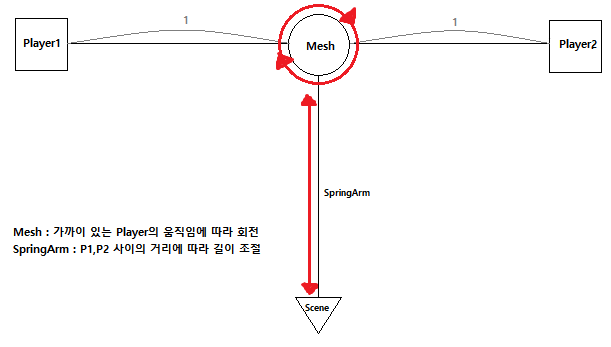
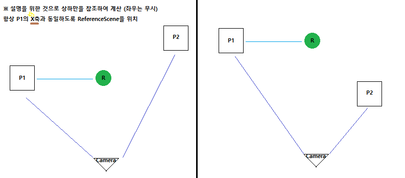
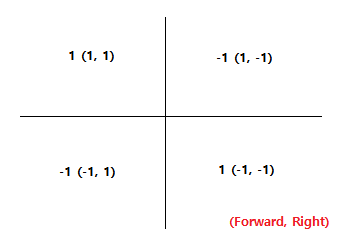
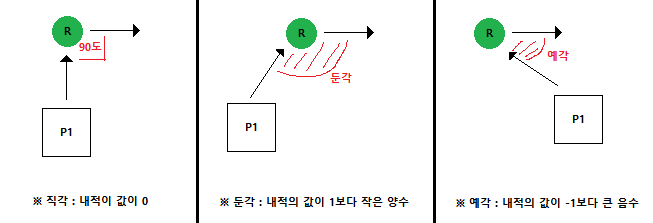
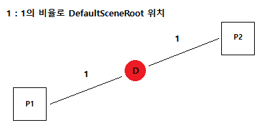

# 3D Fighting Game
- 3D Fighting Game (reproduction of Naruto Shippuden)
- 나루토 얼티밋스톰4를 기준으로 모작

## **Day_1**
> **<h3>Today Dev Story</h3>**
- ## <span style = "color:yellow;">캐릭터의 이동</span>
  - 캐릭터의 기본 이동은 카메라의 시점을 기준으로 상하좌우를 구분하여 이동 (방향키를 사용)
  - Camera는 존재하나 SpringArm은 존재하지 않고 BeginPlay 시점에 MainCameraManager클래스의 SpringArm에 Attach하여 사용
    - GetActorOfClass를 통해서 월드에 존재하는 원하는 클래스 타입을 검색하고 그 액터의 SpringArm에 AttachToComponent하여 부착
   
    <details><summary>C++ File</summary> 

    ```c++
    //PlayerCharacter.cpp
    APlayerCharacter::APlayerCharacter(){
    	PrimaryActorTick.bCanEverTick = true;

      CameraComp = CreateDefaultSubobject<UCameraComponent>(TEXT("CameraComp"));
      CameraComp->SetupAttachment(GetRootComponent());
      CameraComp->bUsePawnControlRotation = false;

      bUseControllerRotationYaw = false;
      bUseControllerRotationRoll = false;
      bUseControllerRotationPitch = false;

      /** 이동방향으로 자동회전 */
      GetCharacterMovement()->bOrientRotationToMovement = true;	
      GetCharacterMovement()->RotationRate = FRotator(0.f, 2000.f, 0.f);
    }
    void APlayerCharacter::BeginPlay(){
      Super::BeginPlay();

      /** 카메라를 부착하기 위한 과정 */
      AttachCamToManager();
    }
    void APlayerCharacter::SetupPlayerInputComponent(UInputComponent* PlayerInputComponent){
      Super::SetupPlayerInputComponent(PlayerInputComponent);

      /** 이동 */
      PlayerInputComponent->BindAxis("MoveForward", this, &APlayerCharacter::MoveForward);
      PlayerInputComponent->BindAxis("MoveRight", this, &APlayerCharacter::MoveRight);
    }
    void APlayerCharacter::MoveForward(float Value) {
      AddMovementInput(CameraComp->GetForwardVector(), Value);
    }
    void APlayerCharacter::MoveRight(float Value) {
      AddMovementInput(CameraComp->GetRightVector(), Value);
    }
    void APlayerCharacter::AttachCamToManager() {
      if (SpectatingViewpointClass) {
        AMainCameraManager* TargetCamera = Cast<AMainCameraManager>(UGameplayStatics::GetActorOfClass(this, SpectatingViewpointClass));

        // 액터가 있다면 뷰타겟을 변경
        if (TargetCamera) {
          FLatentActionInfo LatentInfo;
          CameraComp->AttachToComponent(TargetCamera->GetSpringArm(), FAttachmentTransformRules(EAttachmentRule::KeepWorld, false));
          LatentInfo.CallbackTarget = this;
          UKismetSystemLibrary::MoveComponentTo(CameraComp, FVector(0.f), FRotator(0.f), false, false, 0.3f, true, EMoveComponentAction::Type::Move, LatentInfo);
        }
      }
    }
    ```
    </details>
    <details><summary>Header File</summary> 

    ```c++
    //PlayerCharacter.h  
    private:
      /** Actor Move */
      void MoveForward(float Value);
      void MoveRight(float Value);

      /**  */
      void AttachCamToManager();
    protected:
      UPROPERTY(EditDefaultsOnly, Category = "Components")
      TSubclassOf<AActor> SpectatingViewpointClass;		//Find MainCameraManager Class...

      UPROPERTY(EditDefaultsOnly, Category = "Components")
      UCameraComponent* CameraComp;
    ```
    </details>

- ## <span style = "color:yellow;">메인 카메라의 이동</span>
  - 
  - AGameStateBase클래스를 상속받은 NarutoGameState클래스를 생성하고, SpringArm의 길이를 고정하는 로직구현
    - 매 틱마다 FindPlayers()메서드를 통해 지정한 클래스의 플레이어를 찾고 찾았다면 CalculateCamValue()메서드를 통해 추후 사용될 정보를 계산
    - 두 벡터 사이의 중간벡터를 위해서 선형 보간(VLerp())메서드를 사용하여 벡터 값인 CenterPos를 계산
    - 두 벡터 사이의 거리를 GetDistanceTo()메서드를 사용하여 float값인 PlayerDis를 계산하고 이를 사용하여 SpringArmLength를 계산
      - SpringArmLength = 최소거리 + ((사이의 거리 - 특정 값) * r값)이고, Clamp를 사용하여 최소/최대 넘지 않도록 설정
  - Actor클래스를 상속받은 __MainCameraManager클래스를__ 생성하고 이 클래스는 플레이어들의 시점이 되어줄 액터
    - 
    - 위 그림과 같은 로직으로 MeshComponent는 항상 두 플레이어 사이의 중심에 위치하고 SpringArm에는 Scene가 Attach되어 있는 구조
    - SceneComp에는 플레이어들의 Camera가 Attach되는 위치
    - 매 틱마다 GameState가 계산한 CenterPos, SpringArmLength를 통하여 MeshComp의 위치와 SpringArmComp의 길이를 조절

    <details><summary>C++ File</summary> 

    ```c++
    //NarutoGameState.cpp
    void ANarutoGameState::Tick(float DeltaSeconds) {
      Super::Tick(DeltaSeconds);
      FindPlayers();
    }
    void ANarutoGameState::FindPlayers(){
      /** 플레이어를 찾고 이미 찾았다면 필요한 값들을 계산 */
      if (Players.Num() < 2) UGameplayStatics::GetAllActorsOfClass(GetWorld(), PlayerClass, Players);
      else CalculateCamValues();
    }
    void ANarutoGameState::CalculateCamValues() {
      /** 두 벡터를 선형 보간하여 그 사이의 중간 벡터를 계산 */
      CenterPos = UKismetMathLibrary::VLerp(Players[0]->GetActorLocation(), Players[1]->GetActorLocation(), 0.5f);
      
      /** 두 벡터 사이의 거리를 계산하고 SpringArm의 거리를 지정 */
      PlayerDis = Players[0]->GetDistanceTo(Players[1]);
    	SpringArmLength = FMath::Clamp(MinDis + ((PlayerDis - CalDis) * CalIndex), MinDis, MaxDis);

      DrawDebugSphere(GetWorld(), CenterPos, 10.f, 10.f, FColor::Blue, false, 0.3f);
    }
    ```
    ```c++
    //MainCameraManager.cpp
    AMainCameraManager::AMainCameraManager(){
      PrimaryActorTick.bCanEverTick = true;

      MeshComp = CreateDefaultSubobject<UStaticMeshComponent>(TEXT("MeshComp"));
      RootComponent = MeshComp;

      SpringArmComp = CreateDefaultSubobject<USpringArmComponent>(TEXT("SpringArmComp"));
      SpringArmComp->SetupAttachment(GetRootComponent());
      SpringArmComp->TargetArmLength = 450.f;
      SpringArmComp->bDoCollisionTest = false;		//OffCollision
      SpringArmComp->bEnableCameraLag = true;
      SpringArmComp->CameraLagSpeed = 20.f;

      SceneComp = CreateDefaultSubobject<USceneComponent>(TEXT("SceneComp"));
      SceneComp->SetupAttachment(SpringArmComp);
    }
    void AMainCameraManager::BeginPlay(){
      Super::BeginPlay();
      GS = GetWorld()->GetGameState<ANarutoGameState>();
    }
    void AMainCameraManager::Tick(float DeltaTime){
      Super::Tick(DeltaTime);

      if (GS) {
        SetActorLocation(GS->GetCenterPos());
        SpringArmComp->TargetArmLength = GS->GetSpringArmLength();
      }
    }
    ```
    </details>

    <details><summary>Header File</summary> 

    ```c++
    //NarutoGameState.h
    private:
      UPROPERTY(VisibleAnywhere, Category = "ForCamera")
      FVector CenterPos;						//Intermediate vector between players (Used in MainCameraManager)

      UPROPERTY(VisibleAnywhere, Category = "ForCamera")
      float PlayerDis;						//Distance Between Players

      UPROPERTY(VisibleAnywhere, Category = "ForCamera")
      float SpringArmLength;					//The Length of SpringArm (Used in MainCameraManager)

      //Calculate of Value
      const float MinDis = 450.f;
      const float MaxDis = 5000000.f;
      const float CalDis = 500.f;
      const float CalIndex = 0.8;

      UPROPERTY(VisibleAnywhere, Category = "ForCamera")
      TArray<AActor*> Players;				//Players who found it
      
    protected:
      UPROPERTY(EditAnywhere, Category = "ForCamera")
      TSubclassOf<AActor> PlayerClass;		//Find Type

    public:
      // Find Players and calculate the vector
      void FindPlayers();
      void CalculateCamValues();

      FORCEINLINE FVector GetCenterPos() { return CenterPos; }
      FORCEINLINE float GetSpringArmLength() { return SpringArmLength; } 
    ```
    ```c++
    //MainCameraManager.h
    private:
      UPROPERTY(VisibleAnywhere, Category = "GameState")
      class ANarutoGameState* GS;

    protected:
      UPROPERTY(EditDefaultsOnly, Category = "Components")
      class UStaticMeshComponent* MeshComp;

      UPROPERTY(EditDefaultsOnly, Category = "Components")
      class USceneComponent* SceneComp;

      UPROPERTY(EditDefaultsOnly, Category = "Components")
      class USpringArmComponent* SpringArmComp;

    public:
      FORCEINLINE USpringArmComponent* GetSpringArm() {return SpringArmComp;}
    ```
    </details>

**<h3>Realization</h3>**
  - null

## **Day_2**
> **<h3>Today Dev Story</h3>**
- ## <span style = "color:yellow;">카메라 매니저의 설정</span>
  - 
  - 기존 로직은 3D에 적합하지 않고 2D 적합하다고 판정하여 새로운 로직으로 구현 (기존 MainCameraManger클래스 재구성)
  - 계산에 있어서는 항상 P1(Player1)을 기준으로 계산을 진행
  - 녹색구는 ReferenceScene의 위치, 적색구는 DefaultSceneRoot의 위치를 나타냄

  ___

  ### 1. 카메라가 참조할 ReferenceScene 제작 및 상하 위치 조정
  - 
  - 
  - SceneComponent타입의 ReferenceScene를 제작하고, 항상 ReferenceScene를 항상 P1과 같은 __X축에__ 있도록 설정
  - 추후 액터의 회전을 통해서 P1의 옆(좌/우)에 항상 상주하도록 설정 (위 사진에서는 녹색구가 ReferenceScene의 위치를 표현)
  - __원리 :__
    - CameraComp를 기준으로 어떤 플레이어가 더 가까이 위치하는지 계산하고, ReferenceScene의 X 좌표는 RootComponent의 __상대적인 좌표로 설정__
    - P1이 카메라와 더 가까이에 있을때의 X 좌표의 수식-> [P1과 P2사이의 거리 중심 * -1.f], P2가 더 가까이 있을때의 수식은 -> [P1과 P2사이의 거리 중심]
    - P1과 P2가 좌우로 멀어질때는 회전을 진행해야하기 때문에 P1IsForward값을 1.f(앞), -1.f(뒤)로 설정하고, 이 값을 참조하여 2번을 진행

    <details><summary>C++ File</summary> 

    ```c++
    //MainCameraManager.cpp
    void AMainCameraManager::SetReferenceScene() {
      float P1ToCamera_Distance = (Players[0]->GetActorLocation() - CameraComp->GetComponentLocation()).Size();		
      float P2ToCamera_Distance = (Players[1]->GetActorLocation() - CameraComp->GetComponentLocation()).Size();		
      float P1ToP2_HalfDistance = ((Players[0]->GetActorLocation() - Players[1]->GetActorLocation()).Size()) / 2.f;		

      /** 카메라와 더 가까운 플레이어에게 ReferenceScene의 X축 위치를 지정 */
      if (P2ToCamera_Distance > P1ToCamera_Distance) {
        //P1이 더 가까운 경우
        ReferenceScene->SetRelativeLocation(FVector(P1ToP2_HalfDistance * -1.f, 0.f, 0.f));
        IsForward = 1.f;
      }
      else {
        ReferenceScene->SetRelativeLocation(FVector(P1ToP2_HalfDistance, 0.f, 0.f));
        IsForward = -1.f;
      }
    }
    ```
    </details>

    <details><summary>Header File</summary> 
    
    ```c++
    //MainCameraManager.h
    private:
      //P1이 P2와 비교했는데 앞뒤에 있는지 비교 -> 앞(1)/뒤(-1)
      UPROPERTY(VisibleAnywhere, Category = "Environment_Variable")
      float IsForward;		

      void SetReferenceScene();
    ```
    </details>

  ___

  ### 2. P1과 ReferenceScene의 거리에 따른 DefaultSceneRoot 회전
  -  
  - P1과 ReferenceScene의 거리에 따라 DefaultSceneRoot의 Yaw를 수정하는데 이는 카메라의 회전을 의미
  - 이를 통해서 항상 ReferenceScene가 P1 좌우에 상주하도록 설정
  - __원리 :__
    - P1과 ReferenceScene의 사이의 거리가 MinimumRightDistance보다 커진다면 DefaultSceneRoot를 DistanceFarForce만큼 힘을 가함
    - 힘을 가할때는 방향을 알아야하는데, 방향은 첫번째 사진처럼 상하좌우의 값을 알아야한다. 그래서 기존에 구한 P1IsForward의 값과 P1IsLeft를 사용
      - P1IsLeft를 구하기 위해서 ReferenceScene와 방향벡터(P1과 ReferenceScene)간의 내적을 반환하여 ReferenceScene를 기준으로 P1이 좌우 어디에 위치하는지 알아낸다. 이때 왼쪽은 1, 오른쪽은 -1 (※두번째 사진 참고)

    <details><summary>C++ File</summary>    

    ```c++
    //MainCameraManager.cpp
    void AMainCameraManager::RotateDefaultScene() {
      float P1ToReference_Length = (Players[0]->GetActorLocation() - ReferenceScene->GetComponentLocation()).Size();

      //일정 거리보다 멀어지면 DefaultSceneRoot 회전
      if (P1ToReference_Length >= MinRotDistance) {
        //Reference와 방향백터간의 내적을 반환하여 -> Reference를 기준으로 P1의 좌우 위치 파악
        FVector P1ToRef_DirectionVec = UKismetMathLibrary::GetDirectionUnitVector(Players[0]->GetActorLocation(), ReferenceScene->GetComponentLocation());
        float P1ToRef_InnerVec = UKismetMathLibrary::Dot_VectorVector(ReferenceScene->GetRightVector(), P1ToRef_DirectionVec);
        float IsLeft = UKismetMathLibrary::SelectFloat(-1.f, 1.f, (P1ToRef_InnerVec <= 0.f));		//1 is Left, -1 is Right

        //거리에 따른 힘의 세기
        float DistanceFarForce = (P1ToReference_Length - MinRotDistance) / RotationDelay;
        float YawForce = ((IsForward * IsLeft) * DistanceFarForce) * UGameplayStatics::GetWorldDeltaSeconds(this);

        DefaultSceneRoot->AddWorldRotation(FRotator(0.f, YawForce, 0.f),false,false);
      }
    }
    ```
    </details>
    <details><summary>Header File</summary>

    ```c++
    //MainCameraManager.h
    private:
      //회전을 하게되는 최대 거리 (넘으면 회전)
      UPROPERTY(VisibleAnywhere, Category = "Environment_Variable")
      float MinRotDistance = 145.f;

      UPROPERTY(VisibleAnywhere, Category = "Environment_Variable")
      float RotationDelay = 4.f;

     	void RotateDefaultScene();
    ```
    </details>

  ___

  ### 3. SpringArm의 길이와 각도를 조정
  - 
  - DefaultSceneRoot는 항상 P1과 P2의 중심에 위치하고, SpringArmComp의 길이와 각도(Pitch)를 조정
  - __원리 :__
    - GlobalDistanceFactor는 P1과 P2 사이의 거리를 0 ~ 1사이의 값으로 지정 (비율)
    - 이 값을 활용하여 SpringArm의 Pitch를 지정하는데 P1과 P2가 멀어질수록 위로 회전, 또한 TargetArmLength를 지정
      - TargetArmLength는 (P1과 P2 사이의 거리 / 2) + GlobalDistanceFactor 비율에 따른 최소, 최대 거리이다.

    <details><summary>C++ File</summary>    

    ```c++
    //MainCameraManager.cpp
    void AMainCameraManager::SetCameraPosition() {
      //DefaultSceneRoot의 위치 지정 (P1과 P2의 중심위치)
      FVector DefaultLocation = (Players[0]->GetActorLocation() + Players[1]->GetActorLocation()) / 2.f;
      DefaultLocation.Z += Height;
      DefaultSceneRoot->SetWorldLocation(DefaultLocation);

      //P1과 P2사이의 거리를 0~1까지의 값으로 제한한 값을 반환
      float P1ToP2Distance = (Players[1]->GetActorLocation() - Players[0]->GetActorLocation()).Size() / 1200.f;
      GlobalDistanceFactor = UKismetMathLibrary::FClamp(P1ToP2Distance, 0.f, 1.f);

      //거리에 따라 SpringArm의 Pitch를 최소/최대(3~5)로 조절하여 위에서 내려다 보도록 조정
      float SpringPitch = UKismetMathLibrary::Lerp(MaxSpringArmRotation, MinSpringArmRotation, GlobalDistanceFactor) * -1.f;
      SpringArmComp->SetRelativeRotation(FRotator(SpringPitch, 0.f, 0.f));

      //SpringArm의 길이를 지정 
      FVector P1ToP2Vector = Players[1]->GetActorLocation() - Players[0]->GetActorLocation();
      P1ToP2Vector.Z = 0;
      float P1ToP2CenterLength = (P1ToP2Vector / 2.f).Size(); 
      float SpringArmLength = UKismetMathLibrary::Lerp(SpringArmBaseDistance, (SpringArmBaseDistance + SpringArmExtraDistance), GlobalDistanceFactor);

      SpringArmComp->TargetArmLength = P1ToP2CenterLength + SpringArmLength;
    }
    ```
    </details>
    <details><summary>Header File</summary>

    ```c++
    //MainCameraManager.h
    private:
      //SpringArm의 Pitch 최소, 최대 각도
      UPROPERTY(VisibleAnywhere, Category = "Environment_Variable")
      float MinSpringArmRotation = 3.f;
      
      UPROPERTY(VisibleAnywhere, Category = "Environment_Variable")
      float MaxSpringArmRotation = 5.f;

      //SpringArm의 최소, 최대 길이
      UPROPERTY(VisibleAnywhere, Category = "Environment_Variable")
      float SpringArmBaseDistance = 330.f;

      UPROPERTY(VisibleAnywhere, Category = "Environment_Variable")
      float SpringArmExtraDistance = 70.f;

      //P1과 P2 사이의 거리를 0~1의 비율로 변환
      UPROPERTY(VisibleAnywhere, Category = "Environment_Variable")
      float GlobalDistanceFactor;

      void SetCameraPosition();
    ```
    </details>

  ___
  
  ### 4. 조작 방식 변경
  - 기존 로직은 카메라의 방향에 따라 이동을 진행했는데, 카메라가 사라졌기 때문에 컨트롤러의 Yaw에 따른 이동
    - 기존 로직과 느낌은 비슷하나 구현에 차이가 존재

    <details><summary>C++ File</summary>    

    ```c++
    //PlayerCharacter.cpp
    void APlayerCharacter::MoveForward(float Value) {
      FRotator Rot = FRotator(0.f, GetControlRotation().Yaw,0.f);
      AddMovementInput(UKismetMathLibrary::GetForwardVector(Rot), Value);
    }
    void APlayerCharacter::MoveRight(float Value) {
      FRotator Rot = FRotator(0.f, GetControlRotation().Yaw, 0.f);
      AddMovementInput(UKismetMathLibrary::GetRightVector(Rot), Value);
    }
    ```
    </details>

**<h3>Realization</h3>**
  - 일직선 상에 있을때 자동으로 회전하는 로직 추가할 예정..
  - 공격하는데 일정 각도가 차이날때 자동으로 회전하는 로직 추가 예정...

## **Day_3**
> **<h3>Today Dev Story</h3>**
- ## <span style = "color:yellow;">카메라 매니저 기능 추가</span>
  - 
  - 카메라 시점을 시준으로 P1과 P2가 겹쳐저서 하나의 P가 보이지 않을때 자동을 회전하여 모두 화면상에 보이도록 설정
  - P1과 P2 모두 움직임이 없을때만 동작하며, 내적과 거리에 따른 회전 값을 설정하여 사용
  - SetViewAllPlayers()메서드에서는 두 P가 겹쳐있는지 판단
    - P1에서의 DefaultScene으로의 방향벡터, 내적을 도출하여 절대값을 씌우고, 그 값이 MinOverlapInnerVal(최소값)보다 작다면 겹쳐있다고 판단
    - 겹쳐있다면 bIsPlayersOverlap을 True로 전환하고 SetNonOverlap()메서드 실행
  - SetNonOverlap()메서드에서는 두 P가 겹쳐지지 않도록 DefaultScene에 일정 방향으로 힘을 주어 회전 (※ 기존 회전 로직과 유사)
    - P1과 DefaultScene의 거리 비율을 Max/MinOverRan 내의 값으로 지정하여 YawForce 연산시 사용
    - 만약 DeActiveRange보다 내적값이 커진다면 bIsPlayersOverlap을 Flase로 전환하여 종료

    <details><summary>C++ File</summary>    

    ```c++
    //MainCameraManager.cpp
    void AMainCameraManager::FindAndSet() {
      if (PlayerClass && Players.Num() < 2) {
        UGameplayStatics::GetAllActorsOfClass(this, PlayerClass, Players);
      }
      else if (IsLocallyControlled()) {
        SetReferenceScene();
        RotateDefaultScene();
        SetCameraPosition();
        SetViewAllPlayers();
      }
    }
    void AMainCameraManager::SetViewAllPlayers() {
      //두 플레이어 모두 움직임 없을때 검사
      if (Players[0]->GetVelocity().Size() <= 0.1f && Players[1]->GetVelocity().Size() <= 0.1f) {
        FVector P1ToRoot_DirectionVec = UKismetMathLibrary::GetDirectionUnitVector(Players[0]->GetActorLocation(), DefaultSceneRoot->GetComponentLocation());
        P1ToRoot_InnerVec = UKismetMathLibrary::Dot_VectorVector(DefaultSceneRoot->GetRightVector(), P1ToRoot_DirectionVec);

        float AbsInnerVal = FMath::Abs(P1ToRoot_InnerVec);
        if (AbsInnerVal < MinOverlapInnerVal && !bIsPlayersOverlap) bIsPlayersOverlap = true;

        if (bIsPlayersOverlap) SetNonOverlap();
      }
      else bIsPlayersOverlap = false;
    }
    void AMainCameraManager::SetNonOverlap() {
      float P1ToRootFactor = UKismetMathLibrary::FClamp((Players[0]->GetActorLocation() - DefaultSceneRoot->GetComponentLocation()).Size() / 800.f, 0.f, 1.f);
      float DeActiveRange = UKismetMathLibrary::Lerp(MaxOverlapInnerVal, MinOverlapInnerVal, P1ToRootFactor);

      float YawForce = ((IsForward * IsLeft) * (OverlapForce * (DeActiveRange * 7))) * UGameplayStatics::GetWorldDeltaSeconds(this);
      DefaultSceneRoot->AddWorldRotation(FRotator(0.f, YawForce, 0.f), false, false);

      //일정 내적값을 초과한다면 종료
      if (FMath::Abs(P1ToRoot_InnerVec) >= DeActiveRange)  bIsPlayersOverlap = false;
    }
    ```
    </details>
    <details><summary>Header File</summary>    

    ```c++
    //MainCameraManager.h
    private:
      UPROPERTY(VisibleAnywhere, Category = "Environment_Variable")
      float P1ToRoot_InnerVec;

      //Overlap시 회전할 힘
      UPROPERTY(VisibleAnywhere, Category = "Environment_Variable")
      float OverlapForce = -15.f;

      //Overlap을 판정
      UPROPERTY(VisibleAnywhere, Category = "Environment_Variable")
      bool bIsPlayersOverlap = false;

      //종료의 최소, 최대 기준 값을 결정하기 위한 내적 값
      UPROPERTY(VisibleAnywhere, Category = "Environment_Variable")
      float MaxOverlapInnerVal = 0.5f;

      UPROPERTY(VisibleAnywhere, Category = "Environment_Variable")
	float MinOverlapInnerVal = 0.07f;

      void SetViewAllPlayers();			//플레이어간 Overlap을 판정
      void SetNonOverlap();				//Overlap시 카메라를 회전하여 겹치지 않도록 수정
    ```
    </details>