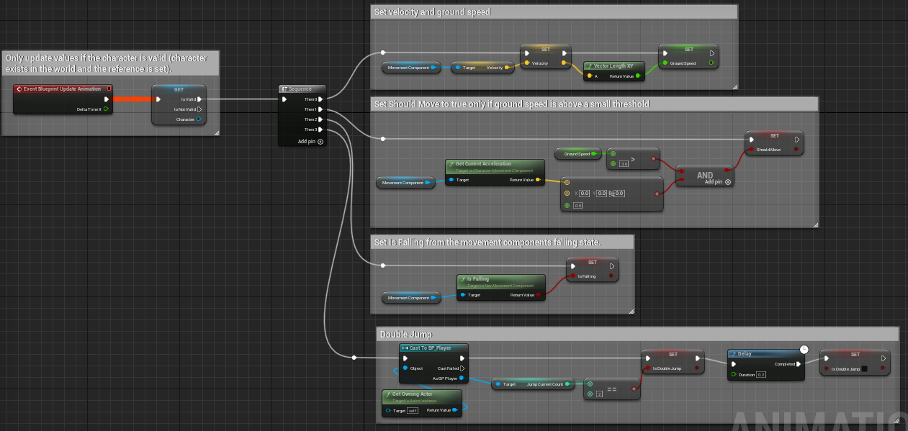

# 3D Fighting Game
- 3D Fighting Game (reproduction of Naruto Shippuden)
- 나루토 얼티밋스톰4를 기준으로 모작

## **Day_1**
> **<h3>Today Dev Story</h3>**
- ## <span style = "color:yellow;">메인 카메라의 이동</span>
  - 
  - 기존 본인이 제작한 "CameraManager" plugin을 서버 멀티플레이에서도 동작하도록 수정 및 개선
  - __플레이어__
    - 월드 상의 NcameraManager를 찾아 __"ClientSetViewTarget"하여__ 컨트롤러의 타겟을 카메라로 변경
    - CameraManager의 SetPlayer()메서드를 통해, 본인 객체를 __CamerManager가 참고하도록 설정__
  - __메인 카메라__
    - Player들의 정보가 저장되는 Players라는 TArray를 __Replicated하여__ 변경되면 서버에도 똑같이 반영
    - 그를 위해 __SetPlayer()메서드가__ Server에서 실행되는 __ServerSetPlayer()메서드__ 선언 후 구현
  - __문제점__
    - Server모드에서만 적용되는 문제 존재
    - 반응 속도가 느리다는 문제 (쉽게 해결 가능)

    <details><summary>C++ File</summary> 

    ```c++
    //NPlayer.cpp
    void ANPlayer::BeginPlay() {
      Super::BeginPlay();
      
      /** Find MainCameraManager & Set */
      if (CameraManagerClass) {
        ANCameraManager* TargetCamera = Cast<ANCameraManager>(UGameplayStatics::GetActorOfClass(this, ANCameraManager::StaticClass()));

        if (TargetCamera) {
          CameraManager = TargetCamera;
          APlayerController* ControllComp = Cast<APlayerController>(GetController());
          if (ControllComp) {
            PlayerControlComp = ControllComp;
            PlayerControlComp->bAutoManageActiveCameraTarget = false;
            PlayerControlComp->ClientSetViewTarget(CameraManager);
          }
        }
        else GEngine->AddOnScreenDebugMessage(-1, 5.0f, FColor::Red, TEXT("Error! MainCameraManager does not exist in the world!"));
      }

      if (CameraManager) CameraManager->SetPlayer(this);
    }
    ```
    ```c++
    //NCameraManager.cpp
    #include "Net/UnrealNetwork.h"

    ANCameraManager::ANCameraManager() {  
      SetReplicates(true);
      SetReplicateMovement(true);
    }
    void ANCameraManager::SetPlayer(AActor* Player) {
      if (!HasAuthority()) ServerSetPlayer(Player);

      UE_LOG(LogTemp, Warning, TEXT("New Player : %s"), *Player->GetName());
      Players.Push(Player);
    }
    void ANCameraManager::ServerSetPlayer_Implementation(AActor* Player) {
      SetPlayer(Player);
    }
    bool ANCameraManager::ServerSetPlayer_Validate(AActor* Player) {
      return true;
    }
    void ANCameraManager::GetLifetimeReplicatedProps(TArray< FLifetimeProperty >& OutLifetimeProps) const{
      Super::GetLifetimeReplicatedProps(OutLifetimeProps);

      DOREPLIFETIME(ANCameraManager, Players);
    }
    ```
    
    </details>

    <details><summary>Header File</summary> 

    ```c++
    //NCameraManager.h	
    public:
      void SetPlayer(AActor* Player);

      UFUNCTION(Server, Reliable, WithValidation)
      void ServerSetPlayer(AActor* Player);
    protected:
    	UPROPERTY(Replicated, EditInstanceOnly, Category = "Setting")
	    TArray<AActor*> Players;
    ```
    </details>

**<h3>Realization</h3>**
  - 메인카메라가 Server모드에서만 적용되는 문제 존재, 수정 필요..!
  - 반응 속도가 느리다는 문제 (쉽게 해결 가능)


## **Day_2**
> **<h3>Today Dev Story</h3>**
- ## <span style = "color:yellow;">애니메이션</span>
  - 
  - 애니메이션의 구성은 모두 Blueprint에서 제작했고, 점프, 속도등 관련해서 제작
  - 모든 애니메이션은 RootMotion을 사용하지 않음

- ## <span style = "color:yellow;">더블 점프</span>
  - 
  - 
  - 현재 개발한 것은 제자리에서의 이중 점프에 한정
  - __플레이어__
    - 더블 점프는 단순히 JumpMaxCount의 수를 변경하면 단순히 점프의 개수를 정할 수 있음
    - 또한 공중제어를 불가능하게 하고, 점프 높이 또한 변경
  - __월드__
    - 월드의 중력을 "-3800"으로 변경하여, 나루토 게임과 유사하게 제작
  - __문제점__
    - 점프는 방향키의 입력에 따라 이동하도록 해야 함
      - 즉, 이동속도에 따른 점프 거리가 정해지는것이 아닌, 방향키 입력에 따른 일정한 거리의 이동이 이루어져야함

    <details><summary>C++ File</summary> 

    ```c++
    ANPlayer::ANPlayer() {
      ...
      /* Jump Setting */
      JumpMaxCount = 2;
      GetCharacterMovement()->JumpZVelocity = 1400.f;
      GetCharacterMovement()->AirControl = 0.f;
    }
    ```
    </details>

- ## <span style = "color:yellow;">더블 점프_2</span>
  - 
  - 제자리 점프와 달려가면서 하는 점프간의 속도 차이가 발생
    - __이전 방법__ : 움직임을 멈추고, Jump(), 하지만 이 방법은 너무 개발자답지 못한 방식
    - __현재 방법__ : 기존 점프 Force에서 현재 이동 속도를 빼서 계산한 만큼 점프
  - 기존에는 카메라가 움직이지 않았지만, 멀티에서는 움직이기 때문에 점프 방향의 문제가 발생
    - 사용자의 시점에서의 좌우상하 판단....?


- ## <span style = "color:yellow;">무기에 따른 애니메이션</span>
  - 
    - 추가로 weapon에 따라 애니메이션이 달라지는 "KindOfWeapon"제작
    - 이를 위해서 Weapon클래스를 제작해야하고, Player에 장착된 Weapon의 종류에 따라 애니메이션을 다르게 처리해야한다.